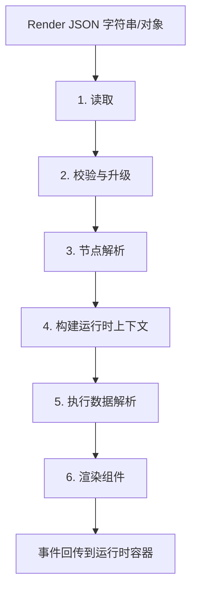

# Render JSON 低代码解析架构规范

Application 层的 `Schema`、`Registry`、`Resolver`、`Renderer` 基础边界统一遵循 [Application 开发规范](./application.md)。本规范只补充 Render JSON 从协议输入到运行时渲染的解析管线，不重复定义通用组件目录职责。

## 1. 目标

- Render JSON 是低代码前端的声明式输入，只描述“渲染什么、依赖什么、触发什么”，不包含可执行实现。
- 运行时必须固定执行 `读取 -> 校验与升级 -> 节点解析 -> 上下文构建 -> 数据解析 -> 组件渲染` 六阶段，不允许在 Renderer 内部绕过管线直接请求或执行业务动作。
- 解析层必须产出稳定的中间结果，保证协议演进、错误定位、缓存和测试都可以围绕统一产物展开。
- 页面级业务流程、接口编排、权限判断仍归具体页面模块；`src/application/` 只承载可复用的低代码运行时能力。

## 2. 适用范围与边界

- 本规范适用于由后端保存、流式协议下发或前端编辑器生成的 Render JSON。
- 当前 `ai-conversation-ui/src/application/` 中已存在 `schema/`、`registry/`、`resolver/`、`renderers/`、`component-manifest.ts`；新增能力应优先沿用该分层，而不是把逻辑散落到页面或 `.vue` 文件。
- `Registry` 负责稳定 key 到真实实现的映射；`Resolver` 负责数据请求与结构转换；`Renderer` 只负责展示和 `emit` 语义事件。
- Parser 只生成中间表示和执行计划，不直接创建 Vue 节点，不直接发请求。
- Render JSON 必须视为不可信输入，协议解析层必须先做校验，再允许进入后续阶段。

## 3. 总体解析流程



- 每个阶段都必须有明确输入、输出和错误模型。
- 前一阶段未通过时，后续阶段不得继续执行。
- 运行时容器应持有整页 Session，负责取消旧请求、丢弃过期结果、隔离节点级错误。

## 4. Render JSON 输入协议

- Render JSON 必须是可序列化 JSON 对象，不允许出现 Vue `Component`、`markRaw`、请求函数、回调函数或任意运行时实例。
- 根文档必须显式区分协议版本和组件版本，禁止继续用单个 `version` 同时表达两者。
- 节点必须至少具备稳定 `id` 和 `component`，并允许按需声明 `props`、`layout`、`datasource`、`bindings`、`events`、`actions`、`children`。
- `component`、`datasource.type`、事件 key、动作 key 都必须对应注册表中的稳定 key，不允许直接写页面私有实现名。
- 所有表达式必须是受限声明，不允许 `eval`、`new Function`、`javascript:` URL 或字符串形式函数。

建议的根协议：

```ts
interface RenderDocument {
  protocol: 'render-json'
  protocolVersion: string
  pageId: string
  revision?: string
  root: RenderNode
}

interface RenderNode {
  id: string
  component: string
  componentVersion?: string
  props?: Record<string, unknown>
  layout?: Record<string, unknown>
  datasource?: Record<string, unknown>
  bindings?: Record<string, unknown>
  events?: Array<Record<string, unknown>>
  actions?: Array<Record<string, unknown>>
  children?: RenderNode[]
}
```

- 文档内 `node.id` 必须唯一且稳定，禁止使用数组下标作为长期标识。
- 新增字段默认向后兼容；字段删除、重命名或语义变化必须升级 `protocolVersion`。
- 历史配置中的可执行字符串，例如 `'=function(){}'`，只能作为兼容迁移输入处理，不属于当前有效协议。

## 5. 校验与版本升级

校验与升级顺序必须固定：

1. 校验 JSON 语法和基础对象结构。
2. 校验协议标识、`protocolVersion`、最大节点数、最大深度、表达式长度和字段类型。
3. 按相邻版本逐级迁移到当前协议版本。
4. 对迁移结果重新执行当前版本校验。
5. 按节点检查组件版本、组件专属 schema 和事件契约。

约束如下：

- 迁移函数必须是纯函数、幂等、无副作用，不允许修改原始对象。
- 不允许用一个不可审计的大迁移跨多个版本直接改写结构；必须保留逐级迁移链。
- 高于当前支持版本时，必须报 `PROTOCOL_VERSION_UNSUPPORTED`；低于最低支持版本时，必须报 `PROTOCOL_VERSION_TOO_OLD`。
- 协议迁移和组件迁移必须分别记录结果，便于定位问题来自文档版本还是组件实现版本。
- 迁移报告至少包含 `from`、`to`、变更路径、兼容警告和失败原因。

## 6. 节点解析

节点解析阶段负责把规范化后的文档转成与 Vue 无关的执行计划。

建议产物：

```ts
interface RenderNodePlan {
  nodeId: string
  parentId?: string
  rendererKey: string
  layoutPlan?: Record<string, unknown>
  dataPlan?: Record<string, unknown>
  eventPlan: Array<Record<string, unknown>>
  children: RenderNodePlan[]
}
```

节点解析必须完成：

- 通过 `registry/` 查找 Renderer 定义、默认属性、别名映射和可选 `resolveData` 能力。
- 通过 Resolver 注册表查找数据解析器，不允许由 Renderer 自行决定数据源实现。
- 通过事件和动作注册表查找事件适配器、动作处理器和可选的鉴权策略。
- 解析父子节点、插槽和布局关系，明确节点渲染顺序和上下文继承链。
- 检测重复 `node.id`、非法 children、循环依赖、未知组件、未知数据源和未知动作。

节点解析不得完成：

- 不发起网络请求。
- 不创建 VNode。
- 不执行动作副作用。
- 不直接读取页面私有状态。

## 7. 运行时上下文

运行时上下文必须使用显式命名空间，不允许把所有变量平铺后按名称碰撞解析。

建议结构：

```ts
interface RenderRuntimeContext {
  user: Readonly<Record<string, unknown>>
  page: Readonly<{
    params: Record<string, unknown>
    variables: Record<string, unknown>
  }>
  globals: Readonly<Record<string, unknown>>
  parent?: Readonly<Record<string, unknown>>
  component: {
    nodeId: string
    state: Record<string, unknown>
  }
  signal: AbortSignal
}
```

约束如下：

- `user`、`page.params`、`globals` 必须只读；可变状态只允许留在 `page.variables` 或当前 `component.state`。
- 父组件上下文只能暴露显式允许下传的数据，子节点不得持有父组件实例或直接修改父组件状态。
- `component.state` 必须按 `nodeId` 隔离，并在节点卸载时销毁。
- 上下文中禁止注入 token、cookie、完整 Store、HTTP client、Router 实例等高风险对象。
- 表达式优先使用完整路径，例如 `user.id`、`page.params.id`、`globals.locale`；不要依赖裸字段猜测。
- 如果必须支持非命名空间简写，解析优先级必须固定为 `component.state -> page.variables -> parent -> page.params -> globals -> user`，并写入测试。

## 8. 数据解析

数据解析阶段必须统一完成四件事：解析上下文表达式、生成请求参数、获取数据、转换为 Renderer 需要的结构。

当前可复用实现包括：

- `db-query-list` 数据源。
- `direct-json` 数据源。
- registry 上通过 `resolveData` 挂接的解析入口。

后续扩展规则：

- 新数据源必须注册到统一 Resolver，而不是在具体 Renderer 中写请求逻辑。
- Resolver 必须先校验 datasource 配置，再生成标准请求参数。
- 数据请求必须支持 `AbortSignal`、超时、在途去重、过期响应丢弃和必要的缓存失效。
- 同级无依赖的数据计划可以并行执行；存在依赖关系时必须按拓扑顺序执行。
- 响应转换必须是纯函数，统一产出 `data` 和 `state`，不得把后端私有响应结构泄漏给 Renderer。

运行时状态至少统一为：

```ts
interface ApplicationRendererState {
  loading?: boolean
  error?: unknown
  empty?: boolean
}
```

- 解析表达式时禁止 `eval`、`new Function` 和任意动态 import。
- Render JSON 只能声明模型、过滤、排序、关系和绑定意图；不允许直接声明任意 URL、Header 或认证信息。
- 当前列表解析器已经使用 `model`、`filter_dict`、`filterExpr`、`page`、`page_size`、`ext.fields`、`ext.relations`、`ext.sorts`，新增数据源时应保持同样的“声明意图而非写死接口实现”的原则。

## 9. 组件渲染

组件渲染阶段必须在统一运行时入口完成属性合并、事件绑定和具体组件渲染。

属性合并顺序必须固定：

```text
registry.defaultProps
  <- JSON 静态 props
  <- normalizeProps 后的规范化结果
  <- resolver 输出的 data/state
  <- 运行时注入的受控事件处理器
```

渲染约束如下：

- 优先沿用统一入口 `{ schema, data, state }`，不要把解析结果任意展开成大量顶层 props。
- 数组默认整体替换，不自动拼接；`undefined` 不覆盖，`null` 表示显式覆盖。
- 必须过滤 `__proto__`、`prototype`、`constructor` 等污染键。
- Renderer 只负责展示、局部交互和 `emit` 语义事件，不直接请求后端，不直接执行动作。
- 每个节点必须有稳定的渲染 key，并能独立展示 `loading`、`empty`、`error` 状态。
- 节点级渲染失败应优先局部降级；只有根节点关键错误才中止整页。

## 10. 事件与动作

- Render JSON 中的 `events`、`actions` 只声明稳定 key、参数和触发条件，不写业务函数。
- 事件适配器负责把 Renderer 的 `emit` payload 转换为标准动作输入。
- 动作处理器负责鉴权、副作用执行、页面变量更新、缓存失效和必要的数据重载。
- 危险动作必须支持显式确认、幂等键和后端权限校验；前端只做交互约束，不替代后端鉴权。
- Registry 初始化后应冻结，避免运行时被远程 JSON 注入新的执行实现。

## 11. 异常、降级与可观测性

统一错误模型至少应包含：

- `code`
- `stage`
- `message`
- `jsonPath`
- `nodeId`
- `recoverable`
- `traceId`

推荐错误码：

- `JSON_PARSE_FAILED`
- `SCHEMA_INVALID`
- `PROTOCOL_VERSION_UNSUPPORTED`
- `PROTOCOL_VERSION_TOO_OLD`
- `MIGRATION_FAILED`
- `DUPLICATE_NODE_ID`
- `RENDERER_NOT_FOUND`
- `DATA_RESOLVER_NOT_FOUND`
- `ACTION_NOT_FOUND`
- `EXPRESSION_INVALID`
- `DATA_REQUEST_TIMEOUT`
- `RENDER_FAILED`

可观测性要求：

- 整页 Session 必须记录 `traceId`、文档版本、节点数、阶段耗时、缓存命中和失败节点。
- 节点级错误必须能定位到 `nodeId` 和 `jsonPath`，但生产日志中不得输出敏感上下文或完整请求体。
- 路由切换、页面卸载、文档 revision 变化时，必须取消旧 Session，旧异步结果不得写回新页面。

## 12. 扩展与维护要求

- 新增协议字段时，同时补 Schema 说明、迁移规则、fixture 和测试。
- 新增 Renderer 时，必须同步补充 `schema`、`registry`、`resolver`、`component-manifest`、示例和契约测试。
- 修改 Renderer props 或 schema 字段时，必须评估旧 JSON 是否需要组件级迁移。
- 新增 datasource 时，必须补配置校验、取消、缓存、安全限制和响应映射测试。
- 兼容 alias 只用于迁移和历史数据兜底，新的 Render JSON 必须写主 key，不继续写旧别名。
- 低代码运行时变更影响面大，至少执行一次前端构建或等价类型校验。

## 13. 测试要求

- 单元测试必须覆盖：非法 JSON、协议升级、组件版本检查、节点重复、表达式作用域、属性合并、请求参数生成、取消和过期响应。
- 集成测试必须覆盖：一份 Render JSON 跑通六阶段、多层父子节点、上下文继承、并行数据源、局部降级和动作触发后的数据刷新。
- 安全测试必须覆盖：XSS、危险 URL、原型污染、表达式注入、超深节点、超多节点和事件递归。
- 快照优先针对“迁移后的规范化文档”和“节点执行计划”，不要依赖 Vue VNode 快照。
