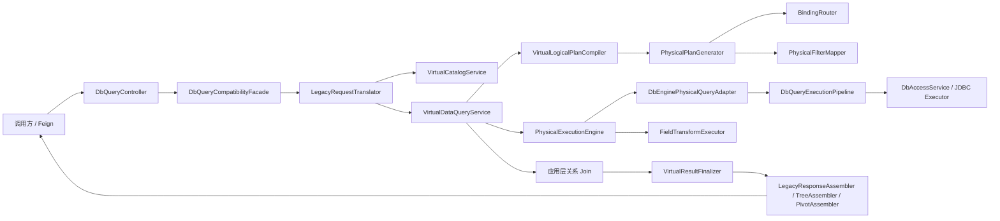
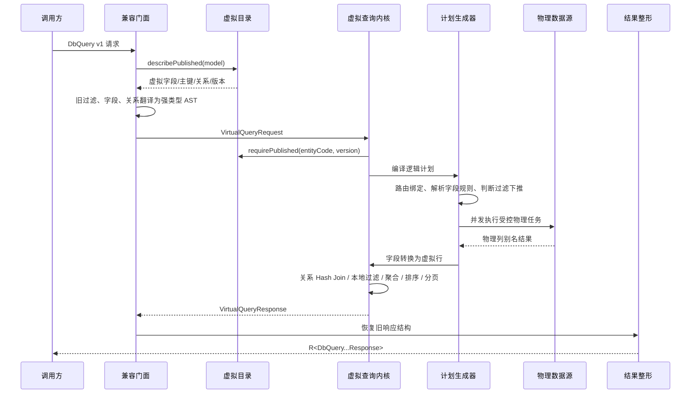

# DbQueryApi 实现原理、虚拟表映射与扩展设计

## 1. 文档目的

本文说明 `DbQueryApi` 六个查询接口在当前代码中的真实执行路径，重点回答以下问题：

- 请求中的 `model`、字段、过滤条件和关系，怎样解析为虚拟目录语义；
- 虚拟实体怎样通过绑定、字段转换规则映射到实际数据源、实体表和物理列；
- 哪些计算会下推数据库，哪些计算在应用内完成；
- `get/list/count/aggregate/tree/pivot` 的差异、边界和响应整形规则；
- 后续怎样在不绕过虚拟层的前提下增加实体权限、字段权限、行级权限、脱敏和审计；
- 如何结合现有三数据源联调数据理解典型请求的逐步执行过程。

本文基于当前仓库代码，而不是基于接口注释推测。文中的“当前”指本文编写时的实现。

## 2. 先给结论

`DbQueryApi` 目前是一个兼容接口。HTTP 路径和旧 DTO 保持不变，但真正执行查询的是统一的虚拟数据内核。

当前生效链路如下：



需要特别避免一个容易产生误解的点：

- `core/service/impl/DbQueryServiceImpl` 中还保留着一套直接拼接 SQL 的旧实现；
- 该类当前没有 `@Service`，仓库中也没有把它注册为 Bean 的配置；
- 当前注入 `DbQueryController` 的 `DbQueryService` 实现是带 `@Service` 的 `DbQueryCompatibilityFacade`；
- 后续功能应扩展虚拟查询链路，不应继续增强未生效的直接 SQL 实现。

## 3. 对外接口与入口

Feign 客户端声明了服务名 `dbEngine` 和前缀 `/dbEngine`。六个接口均为 POST：

| 操作 | 路径 | 核心语义 |
| --- | --- | --- |
| `queryGet` | `/dbEngine/api/v1/query.get` | 返回一条明细记录 |
| `queryList` | `/dbEngine/api/v1/query.list` | 返回明细列表和分页信息 |
| `queryCount` | `/dbEngine/api/v1/query.count` | 无维度/指标时为纯计数；有维度/指标时按聚合处理 |
| `queryAggregate` | `/dbEngine/api/v1/query.aggregate` | 分组、指标、HAVING、聚合排序 |
| `queryTree` | `/dbEngine/api/v1/query.tree` | 先查完整扁平列表，再在内存组树 |
| `queryPivot` | `/dbEngine/api/v1/query.pivot` | 先执行聚合，再在内存构建透视列 |

Controller 本身不承载业务逻辑，只用 `R.ok(...)` 包装 `DbQueryService` 的结果。

## 4. 虚拟目录怎样描述“虚拟表 → 实体表”

### 4.1 元数据对象

虚拟目录由六类主要元数据组成：

| 元数据表 | 作用 | 执行期对象 |
| --- | --- | --- |
| `vd_entity` | 虚拟实体稳定编码、状态、目录版本 | `CatalogSnapshot.entityCode/catalogVersion` |
| `vd_field` | 虚拟字段、逻辑类型、虚拟主键、启用状态 | `CatalogSnapshot.VirtualField` |
| `vd_binding` | 虚拟实体绑定到数据源和物理表 | `CatalogSnapshot.Binding` |
| `vd_field_transform_rule` | 物理字段和虚拟字段间的读取/写回转换规则 | `CatalogSnapshot.TransformRule` |
| `vd_field_transform_port` | 转换规则两端的物理端口和虚拟端口 | `CatalogSnapshot.Port` |
| `vd_relation` | 两个虚拟实体之间的字段映射和返回形态 | `CatalogSnapshot.Relation` |

`CatalogAssembler` 每次装配目录时，会将这些可变数据库记录组装成一次执行使用的不可变 `CatalogSnapshot`。已发布快照由 `VirtualCatalogService` 按 `entityCode:catalogVersion` 缓存。

### 4.2 `model` 不再等于物理表名

旧请求中的：

```json
{
  "model": "ods_trade_order_sales_order"
}
```

会被解释为虚拟实体编码 `entityCode`，而不是直接拼进 SQL 的物理表名。

解析顺序为：

1. `LegacyRequestTranslator` 调用 `VirtualCatalogGateway.describePublished(model, null)`；
2. `VirtualCatalogService` 校验实体存在、`status=PUBLISHED`、`enabled=true`；
3. 返回不含物理表信息的 `VirtualCatalogDescriptor`；
4. Translator 把描述中的当前 `catalogVersion` 写入 `VirtualQueryRequest`；
5. 真正执行时再次按 `entityCode + catalogVersion` 读取已发布快照。

第 4、5 步可以防止“翻译时使用一个目录版本、执行时又悄悄切换到另一个版本”。目录版本不一致会返回 `CATALOG_VERSION_CONFLICT`。

### 4.3 虚拟实体到物理表的绑定

`vd_binding` 决定一次虚拟查询实际访问哪里，主要字段包括：

- `source_key`：注册的数据源标识；
- `physical_table_meta_id`：已导入的物理表元数据 ID；
- `physical_table_name`：物理表名快照；
- `binding_group`：分片/副本分组；
- `binding_role`：`PRIMARY` 或 `REPLICA`；
- `readable/writable`：是否可读写；
- `routing_config`：`SINGLE/HASH/RANGE/LIST` 路由规则；
- `read_weight`：最终一致读选择副本时的权重。

`BindingRouter` 的主要规则是：

1. 按 `bindingGroup` 分组；
2. 每组必须存在可读主绑定；
3. 根据过滤条件中的分片字段判断绑定是否命中；
4. `STRONG` 和 `READ_YOUR_WRITES` 使用主绑定；
5. `EVENTUAL` 优先选择权重最高的可读副本；
6. 多个分片组可生成多个物理任务，但不能超过 `maxPhysicalTasks`，默认 16、最大 64。

### 4.4 虚拟字段到物理列的映射

字段映射有两条路径。

#### 4.4.1 显式转换规则

显式规则通过 `vd_field_transform_rule + vd_field_transform_port` 建立：

```text
一个或多个物理端口
        ↓ read transformer
一个或多个虚拟端口
```

当前内置转换器包括：

- `identity`：一对一原值映射；
- `type_cast`：类型转换；
- `enum_map`：枚举值映射；
- `coalesce`：多个物理值取首个非空值；
- `text_concat`：多个物理字段拼成一个虚拟字段；
- `json_extract`：从一个 JSON 物理字段拆出多个虚拟字段；
- `script`：受限、确定性的 Python-like 转换脚本；
- 写回侧还包括 `text_split`、`json_compose` 等对应能力。

查询只会选择本次请求实际需要的虚拟字段所依赖的转换规则，以及关系 Join、过滤、排序、分组所需的附加字段，不会无条件查询整张物理表的所有列。

#### 4.4.2 默认 `identity` 映射

如果某个虚拟字段没有显式可读规则，`DefaultFieldMappingResolver` 会尝试生成只读 `identity` 规则：

1. 从绑定的 `physicalTableMetaId` 读取物理列；
2. 对虚拟字段编码和物理列名去掉 `_`、`-`、空白并转小写；
3. 必须恰好匹配一个启用物理列；
4. 匹配成功才生成临时默认规则；零个或多个匹配都视为无法映射。

例如虚拟字段 `order_no` 可以默认匹配物理列 `order_no`；若同时存在多个归一化后相同的物理列，则不会猜测。

目录发布时，`CatalogValidator` 会验证每个可读绑定上的每个启用虚拟字段必须有且只有一个读取生产规则。因此正确发布的目录原则上不会在运行时才发现常规字段缺少映射。

### 4.5 物理列投影与回填

`PhysicalPlanGenerator` 将规则需要的物理列投影为内部别名：

```sql
SELECT `order_no` AS `__p123`, `total_amount` AS `__p124`
FROM `sales_order`
LIMIT 10001
```

其中数字来自物理字段元数据 ID。这样可以避免同名列冲突，也让字段转换只依赖稳定端口。

物理结果返回后，`FieldTransformExecutor`：

1. 按物理字段 ID 找到 `__p...` 值；
2. 以规则端口编码组成转换器输入；
3. 调用读取转换器；
4. 将转换结果按虚拟端口写回虚拟字段编码；
5. 最终得到只包含虚拟字段的行对象。

调用方不会收到物理表名、物理列名或 `__p...` 别名。

## 5. 字段、过滤、排序和分页的翻译规则

### 5.1 明细字段

`query.get/list` 使用 `ext.fields`，`query.tree` 使用顶层 `fields`。

- 未传字段时，默认返回主虚拟实体全部启用字段；
- 对 `get/list/tree`，未显式传 `relations` 时还会选择全部已发布的正向关系，并默认返回目标虚拟实体全部启用字段；
- 显式传字段时会去重并保持首次出现顺序；
- 主表字段格式为 `fieldCode`；
- 关系字段格式必须为 `relationAlias.fieldCode`，只支持一层点号；
- 明细字段不支持自定义别名；聚合维度和指标支持别名。

当前兼容行为是：不存在或未启用的投影字段、过滤字段和排序字段会记录 `warn` 后被忽略，而不是拒绝整个请求。若所有过滤字段都被忽略，查询可能退化为无过滤查询。权限功能上线时不能复用这种“静默忽略”作为安全策略，必须改为安全域内的 fail-closed 校验。

### 5.2 `filter_dict`

过滤值支持两种形式。

简写等值：

```json
"filter_dict": {
  "order_status": "PAID"
}
```

显式操作符：

```json
"filter_dict": {
  "total_amount": { "op": "gte", "value": 100 }
}
```

操作符映射如下：

| 旧操作符 | 虚拟操作符 | SQL 可下推时的语义 |
| --- | --- | --- |
| `eq` | `EQ` | `=`，值为 null 时转 `IS NULL` |
| `ne` / `neq` | `NE` | `<>`，值为 null 时转 `IS NOT NULL` |
| `gt` | `GT` | `>` |
| `gte` / `ge` | `GTE` | `>=` |
| `lt` | `LT` | `<` |
| `lte` / `le` | `LTE` | `<=` |
| `like` | `LIKE` | `%value%` |
| `prefix_like` | `STARTS_WITH` | `value%` |
| `suffix_like` | `ENDS_WITH` | `%value` |
| `in` | `IN` | 非空集合 |
| `not_in` | `NOT_IN` | 非空集合 |
| `is_null` | `IS_NULL` | 不读取 value |
| `is_not_null` | `IS_NOT_NULL` | 不读取 value |

数据库值使用 `PreparedStatement` 参数绑定；表名、列名和别名必须通过受控标识符校验并按数据库类型引用，不会把请求值直接拼进 SQL。

### 5.3 `filterExpr`

未传 `filterExpr` 时，所有 `filter_dict` 条件按 AND 组合。

传入表达式时，只支持：

- 条件 key；
- `and`；
- `or`；
- 圆括号；
- AND 优先级高于 OR。

例如：

```json
{
  "filter_dict": {
    "order_status": "PAID",
    "total_amount": { "op": "gte", "value": 100 },
    "user.user_status": "ACTIVE"
  },
  "filterExpr": "(order_status and total_amount) or user.user_status"
}
```

表达式引用的 key 集合必须等于 `filter_dict` 的 key 集合，不能引用不存在的 key，也不能漏掉条件。解析器目前没有 NOT，也没有独立条件别名；由于 `filter_dict` 是 Map，同一字段不能自然表达两个不同边界条件，例如同一个 `created_at` 同时 `gte` 和 `lte`。需要区间表达式时应后续升级过滤协议，而不是拼接 SQL 字符串。

### 5.4 过滤下推边界

只有满足以下条件的虚拟字段过滤才会下推为物理过滤：

- 读取转换器是 `identity`；
- 规则恰好有一个物理端口和一个虚拟端口；
- 整棵过滤树中的所有字段都可以这样映射。

若整棵过滤树可映射，物理 SQL 会带 `WHERE`。只要其中一个谓词不能安全映射，当前实现不会部分下推，而是读取候选数据、执行字段转换后在应用层执行整棵过滤树。

应用层过滤受 `maxScanRows` 约束，默认 10,000、最大 100,000。物理任务会请求 `maxScanRows + 1` 行用于探测截断；如果候选域不完整，系统抛出 `PLAN_BUDGET_EXCEEDED`，不会返回一个看似成功但不完整的结果。

### 5.5 排序和分页

当前物理查询计划没有生成 `ORDER BY`、物理 offset 分页或物理聚合。执行过程是：

1. 在预算内完整读取候选行；
2. 转换为虚拟字段；
3. 完成关系 Join、全局过滤和聚合；
4. 在应用内排序；
5. 在应用内分页；
6. 最后投影字段。

`query.list` 会在调用方排序后自动追加全部虚拟主键升序，确保分页顺序稳定。没有虚拟主键时，列表查询直接拒绝并返回 `PLAN_EXACTNESS_UNPROVABLE`。

页码小于 1 时归一为 1；`page_size` 小于 1 时使用 10；最大为 1,000。

## 6. 虚拟关系怎样执行

### 6.1 已发布关系

`vd_relation` 的一组记录共同描述一个关系编码的复合字段映射，例如：

```text
虚拟订单 user_id  -> 虚拟用户 id
虚拟订单 tenant_id -> 虚拟用户 tenant_id
```

关系可从源实体正向使用，也可从目标实体反向使用。反向使用时本地/远端字段方向交换。

`resultMode` 和 `reverseResultMode` 描述从各方向查询时的返回形态：

- `OBJECT`：目标结果作为单个嵌套对象；
- `COLLECTION`：目标结果作为数组，不复制主实体记录。

这两个值描述返回形态，不等价于数据库外键上的 1:1、1:N 或 N:N 定义。

### 6.2 请求关系

关系请求示例：

```json
{
  "key": "buyer",
  "model": "ods_trade_account_user_profile",
  "type": "left",
  "on": { "user_id": "id" },
  "filter": { "user_status": "ACTIVE" }
}
```

规则如下：

- `key` 是本次请求中的关系别名，也是响应 key；
- `model` 是目标虚拟实体编码；
- `type` 当前只支持 `left`；
- 若主、目标虚拟实体间只有一条匹配的已发布关系，可省略 `on`；
- 同一目标存在多条关系时，必须用 `on` 唯一匹配；
- `on` 与已发布关系不一致时拒绝请求；
- 没有已发布关系时，必须提供 `on`，系统创建本次请求内的临时关系；
- 临时关系若覆盖目标实体全部虚拟主键则推断为 `OBJECT`，否则为 `COLLECTION`；
- `filter` 只能引用目标虚拟实体自身字段。

`relation.filter` 在远端关系分支执行，保持 LEFT JOIN 的 ON 作用域。它只影响嵌套关系是否匹配，不会删除主实体。

顶层 `filter_dict` 中的 `buyer.user_status` 则属于 Join 完成后的全局 WHERE 语义，可能删除整条主实体记录。这两个位置不能混用。

### 6.3 应用层 Join

关系不是通过单条跨库 SQL JOIN 执行，而是：

1. 查询主虚拟实体；
2. 为每个关系查询目标虚拟实体所需字段和 Join key；
3. 按远端 key 建立 Hash 索引；
4. 依次把关系附加到主记录；
5. `OBJECT` 展开为 `alias.field` 临时字段；
6. `COLLECTION` 聚合成 `alias: [{...}]`；
7. 最终兼容层把 `alias.field` 还原为嵌套对象。

关系查询当前会在各自目标数据源中读取预算内的候选域，并没有根据主表 key 自动生成远端 `IN (...)` 半连接下推。因此关系表数据量变大时，`maxScanRows` 很容易成为首个容量边界。

关系限制包括：

- 仅支持一跳字段路径 `alias.field`，不自动多跳展开 N:N；
- `COLLECTION` 可以明细投影，也可用自身的 `relation.filter` 限制；
- `COLLECTION` 不能作为顶层标量过滤、排序、分组或聚合字段；
- `OBJECT` 若实际匹配多行并复制主实体，会通过虚拟主键检测并返回 `RELATION_CARDINALITY_UNSUPPORTED`；
- Join 和集合归组也受 `maxScanRows` 预算保护。

## 7. 六类接口的实现差异

### 7.1 `query.get`

- `id` 是虚拟主键简写，不是固定物理列 `id`；
- 只有虚拟实体恰好有一个主键字段时才能使用 `id`；
- `id` 条件与 `filter_dict/filterExpr` 通过 AND 合并；
- 翻译为 `QueryType.GET`、第 1 页、每页 1 条；
- 最终取排序后第一条记录；
- 无结果时 `record` 为 `{}`。

### 7.2 `query.list`

- 翻译为 `QueryType.LIST`；
- `exactTotal=true`；
- 自动追加虚拟主键作为排序兜底；
- 列表响应的 `summary` 按旧协议固定为空对象；
- 关系嵌套完成后才进行最终分页和投影。

精确总数有两种实现：

- 无 `OBJECT` 关系且无顶层关系字段过滤时，可额外执行不含关系的主实体 COUNT 分支；
- 有 `OBJECT` 关系或顶层关系字段过滤时，总数来自 Join/过滤完成后的结果行数；若 `OBJECT` 造成主实体重复则直接报错。

### 7.3 `query.count`

当 `dimensions` 和 `metrics` 都为空时是纯计数：

- 翻译为 `QueryType.COUNT`；
- 可下推时生成 `COUNT(1) AS __count`；
- 旧响应同时返回 `total`、`records[0].count` 和 `summary.count`。

只要提供维度或指标，`query.count` 就按聚合查询执行，与 `query.aggregate` 共享翻译逻辑。

### 7.4 `query.aggregate`

- 维度翻译为 `VirtualGroupBy(field, alias)`；
- 指标支持 `COUNT/SUM/MIN/MAX/AVG`；
- `COUNT` 可省略 field，默认统计全部行；
- 没有指标时自动补 `COUNT`，别名为 `count`；
- 维度和指标别名必须全局唯一；
- HAVING 和聚合排序只能引用已经生效的维度/指标别名；
- 当前聚合、HAVING、聚合排序和分页均在应用内执行，不会生成数据库 `GROUP BY`；
- 无分组的单行聚合会写入 `summary`，有分组时 `summary` 通常为空。

`ext.time_grain` 和 `ext.top_n` 当前对 count/aggregate 只记录告警并忽略，不参与结果计算。

### 7.5 `query.tree`

Tree 不是数据库递归查询，而是：

1. 强制补入 `idField`、`parentField`、`labelField`；
2. 翻译为第 1 页、最多 1,000 条的完整 LIST；
3. 要求虚拟响应 `total == records.size()`；
4. 检查节点 ID 非空且不重复；
5. 检查循环和最大深度；
6. 在内存连接父子节点。

默认字段：

- `id_field=id`；
- `parent_field=parent_id`；
- `label_field=name`；
- `root_value` 未指定时，`null`、空字符串、字符串 `"0"` 视为根；
- 找不到父节点的孤儿节点也会作为根；
- `max_depth` 默认 64，只用于校验，不用于裁剪查询。

当前边界：

- 超过 1,000 个节点导致未完整物化时拒绝组树；
- `metrics` 和 `having` 会被告警后忽略；
- DTO 中的 `children_field` 当前没有参与组装，响应仍固定使用 `children` 字段。

### 7.6 `query.pivot`

Pivot 的步骤为：

1. `rows + columns` 合并为聚合维度；
2. 执行 `QueryType.AGGREGATE`；
3. 要求全部聚合结果完整物化，最多 1,000 组；
4. 使用行维度组合创建输出行；
5. 使用列维度值以 `|` 拼接显示列名；
6. 多指标时列名为 `列维度组合:指标别名`；
7. 缺失单元格填 `fill_value`。

`rows`、`columns`、`metrics` 均必填。`time_grain` 和 `top_n` 当前明确拒绝。若两个不同结构化列 key 拼出相同显示字符串，会返回 `LEGACY_PIVOT_COLUMN_KEY_COLLISION`，避免静默覆盖。

## 8. 端到端执行时序



## 9. 请求案例与逐步分析

以下订单、用户、账户和明细数据来自仓库现有的三数据源联调包。示意 SQL 中的 `__p<id>` 代表运行时物理字段元数据别名，实际数字取决于当前环境导入结果。

### 9.1 案例一：按虚拟主键查询订单及跨源关系

请求：

```http
POST /dbEngine/api/v1/query.get
Content-Type: application/json

{
  "title": "manual: get order",
  "model": "ods_trade_order_sales_order",
  "id": 50001,
  "ext": {
    "fields": [
      "id",
      "order_no",
      "user.user_name",
      "account.account_no",
      "items.sku",
      "items.quantity"
    ],
    "relations": [
      { "key": "user", "model": "ods_trade_account_user_profile" },
      { "key": "account", "model": "ods_trade_user_account" },
      { "key": "items", "model": "ods_trade_order_sales_order_item" }
    ]
  }
}
```

执行过程：

1. `model` 解析为已发布订单虚拟实体；
2. `id=50001` 被转换为订单虚拟主键字段 `id EQ 50001`；
3. 三个关系通过目标 `model` 唯一匹配已发布关系：
   - `user_id -> user.id`，返回 `OBJECT`；
   - `account_id -> account.id`，返回 `OBJECT`；
   - `id -> items.order_id`，返回 `COLLECTION`；
4. 主查询至少补入关系本地 key 和主实体主键；
5. 因 `id` 为默认 identity 映射，主过滤可以下推，MySQL 物理 SQL 形态类似：

   ```sql
   SELECT `id` AS `__p<id>`,
          `order_no` AS `__p<order_no>`,
          `user_id` AS `__p<user_id>`,
          `account_id` AS `__p<account_id>`
   FROM `sales_order`
   WHERE `id` = ?
   LIMIT 10001
   ```

6. 用户、账户、明细分别在其绑定数据源执行目标查询；
7. 应用内按 Join key 建 Hash 索引；
8. `user/account` 写成单对象，`items` 归组为数组；
9. `LegacyResponseAssembler` 把 `user.user_name` 等扁平内部字段恢复成嵌套 JSON。

响应数据形态：

```json
{
  "record": {
    "id": 50001,
    "order_no": "SO-202607-001",
    "user": { "user_name": "Alice" },
    "account": { "account_no": "ACC-10001" },
    "items": [
      { "sku": "SKU-BOOK-001", "quantity": 1 },
      { "sku": "SKU-PEN-001", "quantity": 2 }
    ]
  }
}
```

### 9.2 案例二：列表过滤、表达式与关系 ON 过滤

请求：

```http
POST /dbEngine/api/v1/query.list
Content-Type: application/json

{
  "title": "paid large orders with active buyer",
  "model": "ods_trade_order_sales_order",
  "filter_dict": {
    "order_status": "PAID",
    "total_amount": { "op": "gte", "value": 100 }
  },
  "filterExpr": "order_status and total_amount",
  "page": 1,
  "page_size": 20,
  "ext": {
    "fields": ["id", "order_no", "total_amount", "buyer.user_name"],
    "relations": [
      {
        "key": "buyer",
        "model": "ods_trade_account_user_profile",
        "filter": { "user_status": "ACTIVE" }
      }
    ],
    "sorts": [
      { "field": "total_amount", "order": "desc" }
    ]
  }
}
```

执行过程：

1. 两个主过滤条件被解析成 `AND(EQ(order_status), GTE(total_amount))`；
2. 两个字段都是 identity 映射时，整棵过滤树下推为参数化 SQL；
3. `buyer.filter` 单独翻译为用户实体上的 `user_status=ACTIVE`，只作用于远端关系查询；
4. 非 ACTIVE 用户的订单仍保留，但 `buyer` 为 null，这就是 LEFT JOIN ON 语义；
5. 如果把 `buyer.user_status` 放入顶层 `filter_dict`，过滤会在 Join 后执行，非 ACTIVE 用户的整条订单会被删除；
6. 排序先按 `total_amount DESC`，Translator 再补 `id ASC` 保证稳定顺序；
7. 排序和分页在应用层完成；
8. 当前请求含 `OBJECT` 关系，`total` 来自 Join 后未分页行数，并会检查 buyer 关系是否意外复制订单。

### 9.3 案例三：纯计数

请求：

```http
POST /dbEngine/api/v1/query.count
Content-Type: application/json

{
  "title": "count paid orders",
  "model": "ods_trade_order_sales_order",
  "filter_dict": {
    "order_status": "PAID"
  }
}
```

执行过程：

1. `dimensions`、`metrics` 均为空，Translator 选择 `QueryType.COUNT`；
2. count/aggregate 默认不展开关系；
3. identity 过滤可下推，物理 SQL 形态类似：

   ```sql
   SELECT COUNT(1) AS `__count`
   FROM `sales_order`
   WHERE `order_status` = ?
   ```

4. 多分片任务的 `__count` 会求和；
5. 兼容响应重复提供三种旧协议字段。

响应数据形态：

```json
{
  "total": 2,
  "page": 1,
  "page_size": 10,
  "records": [{ "count": 2 }],
  "summary": { "count": 2 }
}
```

### 9.4 案例四：分组聚合与 HAVING

请求：

```http
POST /dbEngine/api/v1/query.aggregate
Content-Type: application/json

{
  "title": "aggregate paid amount by status",
  "model": "ods_trade_order_sales_order",
  "filter_dict": {
    "created_at": { "op": "gte", "value": "2026-07-01T00:00:00" }
  },
  "dimensions": [
    { "field": "order_status", "alias": "status" }
  ],
  "metrics": [
    { "func": "count", "alias": "order_count" },
    { "field": "total_amount", "func": "sum", "alias": "amount_sum" }
  ],
  "having": {
    "amount_sum": { "op": "gt", "value": 100 }
  },
  "sorts": [
    { "field": "amount_sum", "order": "desc" }
  ],
  "page": 1,
  "page_size": 10
}
```

执行过程：

1. 主过滤尽可能下推；
2. 物理层读取 `order_status`、`total_amount` 等所需明细列，不生成 `GROUP BY`；
3. 所有候选明细必须在 `maxScanRows` 内完整读取；
4. 应用内按 `order_status` 分桶；
5. 计算每桶 COUNT 和 SUM；
6. 对聚合结果执行 `amount_sum > 100`；
7. 按指标别名倒序，再分页；
8. `total` 表示 HAVING 后、分页前的分组数，不是明细订单数。

测试数据中，不加 HAVING 时结果包含：

```json
[
  { "status": "CREATED", "order_count": 1, "amount_sum": 80.00 },
  { "status": "PAID", "order_count": 2, "amount_sum": 249.50 }
]
```

加上示例 HAVING 后仅保留 `PAID` 分组。

### 9.5 案例五：树形查询

假设已发布虚拟实体 `org_department`，字段为 `id/parent_id/name/enabled`：

```http
POST /dbEngine/api/v1/query.tree
Content-Type: application/json

{
  "title": "enabled department tree",
  "model": "org_department",
  "filter_dict": {
    "enabled": true
  },
  "fields": ["id", "parent_id", "name"],
  "sorts": [
    { "field": "id", "order": "asc" }
  ],
  "ext": {
    "id_field": "id",
    "parent_field": "parent_id",
    "label_field": "name",
    "root_value": 0,
    "max_depth": 8
  }
}
```

执行过程：

1. 翻译为 LIST，并强制确保三个树字段进入投影；
2. 最多完整读取 1,000 条；
3. 为每条记录创建 `DbQueryTreeNode`；
4. 用 `id -> node` Map 检查重复并连接父子关系；
5. 父 ID 为 0 或父节点不存在时作为根；
6. 若出现循环或深度超过 8，整次请求失败，不返回部分树。

### 9.6 案例六：透视查询

假设订单虚拟实体还提供虚拟字段 `region` 和 `month`：

```http
POST /dbEngine/api/v1/query.pivot
Content-Type: application/json

{
  "title": "monthly sales pivot",
  "model": "orders",
  "rows": [
    { "field": "region", "alias": "row_region" }
  ],
  "columns": [
    { "field": "month", "alias": "column_month" }
  ],
  "metrics": [
    { "field": "amount", "func": "sum", "alias": "sales" }
  ],
  "having": {
    "sales": { "op": "gt", "value": 0 }
  },
  "ext": {
    "fill_value": 0
  }
}
```

若聚合明细为：

```json
[
  { "row_region": "CN", "column_month": "07", "sales": 100 },
  { "row_region": "CN", "column_month": "08", "sales": 120 },
  { "row_region": "US", "column_month": "07", "sales": 80 }
]
```

则透视结果为：

```json
{
  "columnKeys": ["07", "08"],
  "records": [
    { "row_region": "CN", "07": 100, "08": 120 },
    { "row_region": "US", "07": 80, "08": 0 }
  ]
}
```

## 10. 当前权限与审计能力

### 10.1 已有的物理执行扩展点

物理 SQL 执行统一经过 `DbQueryExecutionPipeline`，已有两个扩展接口：

- `List<DbExecutionPolicy>`：在方言渲染和执行前依次调用，可做数据源/物理表/操作类型级校验；
- `DbOperationAudit`：提供 `beforeExecute/afterSuccess/afterFailure` 三个回调。

`DbExecutionContextFactory` 目前会从 `SystemContext` 提取：

- `userId`；
- `username`；
- `roles`；
- `permissions`；
- `sourceKey`；
- 数据库类型；
- 物理表名 `model`；
- 操作类型。

当前实现只是占位：

- `LoggingDbExecutionPolicy` 只打印 debug 日志，不做授权；
- `LoggingDbOperationAudit` 只记录执行摘要，不持久化审计记录。

### 10.2 现有扩展点不够解决什么

物理策略看到的是数据源、物理表和已经渲染好的 SQL 计划，不能可靠理解：

- 调用方请求的是哪个虚拟实体和目录版本；
- 原始虚拟字段、关系别名和关系方向；
- 某字段用于投影、过滤、排序、Join 还是聚合；
- 行级策略应该怎样与用户过滤 AST 合并；
- 哪些字段应脱敏但仍可用于内部 Join；
- 一次逻辑请求拆成了哪些主查询、精确 COUNT 和远端关系任务。

因此不能通过解析最终 SQL 来补齐完整权限。物理策略适合作为纵深防御，虚拟实体/字段/行/关系权限必须放在虚拟查询计划生成之前。

### 10.3 当前上下文和关联 ID 风险

当前虚拟物理任务通过固定线程池和 `CompletableFuture` 执行，而 `DbExecutionContextFactory` 在物理工作线程里才读取 `SystemContext`。仓库代码中没有看到 `SystemContext/MDC` 向 `virtualDataTaskExecutor` 显式传播的实现。

这意味着：如果 Athena 的 `SystemContext` 是普通线程本地变量，物理策略和审计可能拿不到 Web 请求线程中的用户。后续权限上线前必须先做上下文快照和显式传递，不能假设线程池自动继承。

当前还存在三套未统一的 ID：

- `PhysicalPlanGenerator` 为物理命令生成 requestId；
- `DbExecutionContextFactory` 又生成自己的 requestId；
- `VirtualResultFinalizer` 在响应阶段再生成一个 requestId。

物理命令的 requestId 当前没有进入 `DbExecutionContext`。审计功能上线前应先统一逻辑请求 ID、planId、taskId 和 traceId。

## 11. 权限扩展设计

### 11.1 总原则

权限应以稳定的虚拟语义授权，不直接以物理表名作为业务权限资源：

```text
virtual entity + catalog version
    ├── action: get/list/count/aggregate/tree/pivot
    ├── field capability: read/filter/sort/group/aggregate/join
    ├── relation capability: traverse relation code and direction
    ├── row scope: mandatory FilterNode
    └── result protection: mask/redact
```

物理层仍保留数据源、表、操作类型白名单，形成纵深防御。

### 11.2 推荐新增上下文

建议在进入 `VirtualDataQueryService` 时同步捕获不可变 `VirtualQueryContext`：

```text
requestId / traceId / startedAt
userId / username / tenantId
roles / permissions
client/app/purpose（如有）
operation
entityCode / catalogVersion
```

该上下文由主线程创建，并显式写入每个 `PhysicalQueryCommand`，再进入 `DbExecutionContext`。不要在异步工作线程重新读取全局 ThreadLocal。

### 11.3 推荐策略阶段

建议增加虚拟查询策略链，而不是把所有权限塞进 Controller 或兼容 Translator：

1. **实体和动作授权**：判断用户能否对实体执行 LIST、COUNT、AGGREGATE 等动作；
2. **字段用途授权**：分别校验投影、过滤、排序、分组、聚合、Join key，不应只有一个笼统的“可读字段”；
3. **关系授权**：校验关系编码、方向、目标实体，以及临时 `on` 关系是否允许；默认建议禁止普通用户创建临时关系；
4. **行级策略注入**：把系统强制条件与用户条件用 AND 合并为新的不可变 AST；
5. **预算收紧**：按角色降低 `maxPhysicalTasks/maxScanRows/timeoutMs`，调用方只能申请更小预算，不能放大策略预算；
6. **物理计划复核**：确认最终任务只命中允许的数据源和物理表；
7. **结果保护**：在所有计算完成后、对外返回前执行遮罩或删除字段。

建议接口职责类似：

```java
public interface VirtualQueryPolicy {
    PolicyDecision evaluate(
            VirtualQueryContext context,
            CatalogSnapshot catalog,
            VirtualQueryRequest request
    );
}
```

`PolicyDecision` 至少包含：允许/拒绝、强制行过滤 AST、字段能力、允许关系、脱敏规则、预算上限和命中的策略 ID/版本。

### 11.4 行级权限的正确注入位置

行级条件必须在逻辑计划编译和绑定路由之前合并，原因是：

- 路由器可能依赖租户或分片字段过滤；
- 过滤能否下推要在字段规则解析后判断；
- COUNT、聚合和关系远端分支也必须使用同一数据范围；
- 在响应阶段过滤会导致 total、聚合和分页全部错误。

对于每个关系目标实体，也要单独执行目标实体策略并将其强制条件合并到远端请求。只保护主实体会通过关系字段泄露目标实体数据。

安全行级过滤若不能下推，应采用明确策略：

- 高敏实体建议 fail-closed，拒绝执行不能安全下推的权限谓词；
- 低敏且数据量受控的实体可允许本地过滤，但必须保证未经授权的数据不会进入日志、缓存、审计明细或异常内容；
- 后续可为可证明安全的转换器增加“谓词反向映射”能力，把虚拟条件转换为物理条件。

### 11.5 字段权限与脱敏

字段权限至少区分：

| 能力 | 示例 |
| --- | --- |
| `READ` | 字段可出现在响应中 |
| `FILTER` | 可按字段筛选 |
| `SORT` | 可按字段排序 |
| `GROUP` | 可作为维度 |
| `AGGREGATE` | 可作为 SUM/AVG 等指标 |
| `JOIN` | 可作为关系 key 或关系路径使用 |

例如手机号可允许后台运营 `FILTER`，但不允许普通用户 `READ`；金额可能允许 `AGGREGATE` 但不允许查看明细。

脱敏应在过滤、Join、聚合完成后执行，否则会破坏计算语义。不要原地修改内部执行行，建议对最终投影生成受保护副本。虚拟主键和 Join key 若需要脱敏，也只能在完成所有内部计算后处理。

### 11.6 兼容层的安全行为调整

当前 Translator 会静默忽略未知字段。引入权限后建议区分：

- 客户端请求不存在的字段：逐步迁移为明确参数错误；
- 客户端请求无权限字段：统一返回禁止访问，不泄露字段是否存在；
- 策略主动移除的字段：必须在审计中记录策略 ID，但不能只打印原始敏感请求；
- 内部自动补入的主键/Join key：允许内部使用，但不能绕过最终字段保护出现在响应。

## 12. 审计扩展设计

### 12.1 两层审计

建议区分两种事件：

1. **逻辑查询审计**：一条 DbQuery/VirtualQuery 请求一条主记录，面向安全审查和业务追溯；
2. **物理任务审计**：每个 sourceKey/table/task 一条子记录，面向数据库执行排障。

逻辑审计不能只依赖现有 `DbOperationAudit`，因为一次逻辑请求可能拆成主查询、精确 COUNT、多个分片和多个关系目标任务。

### 12.2 建议审计字段

逻辑审计建议包含：

- `requestId`、`traceId`、`planId`；
- 用户、租户、角色摘要、调用应用；
- 接口操作和 `traceLabel/title`；
- `entityCode`、`catalogVersion`；
- 请求字段及其用途，不记录字段值；
- 关系编码、别名、方向和目标实体；
- 命中的权限策略 ID/版本、行级策略 ID、脱敏策略 ID；
- 过滤结构摘要或带盐指纹，不默认保存原始值；
- 物理任务数、扫描行数、返回行数、执行耗时；
- 成功/拒绝/失败状态和稳定错误类别；
- 创建时间、完成时间。

物理任务审计建议包含：

- `requestId/planId/taskId`；
- `sourceKey`、物理表、数据库类型；
- 投影列数量、是否 COUNT、是否过滤下推；
- `maxRows/timeoutMs`；
- 扫描行数、返回行数、耗时、成功/失败。

禁止持久化 token、密码、Cookie、完整请求体、原始 SQL 参数、完整敏感结果。需要排障时可记录 SQL 模板指纹和参数类型列表。

### 12.3 审计接口演进

现有 `DbOperationAudit` 是单 Bean 注入，不便同时保留日志、数据库和消息审计。建议：

- 将 Pipeline 改为注入 `List<DbOperationAudit>`，或增加一个组合实现；
- 新增 `VirtualQueryAudit`，覆盖 received/authorized/planned/succeeded/failed；
- 逻辑主事件与物理子事件使用统一关联 ID；
- 高吞吐场景使用 Outbox 或可靠消息异步落库；
- 对强审计实体提供“审计不可用则拒绝查询”的 fail-closed 开关；普通查询可按策略降级。

按照仓库日志规范，高频普通查询过程日志应使用 debug/trace；安全审计事件应进入结构化审计通道，不应靠大量 info 文本日志代替。目前 `VirtualDataQueryService` 每次成功查询使用 info，后续引入正式审计时建议一并调整日志层级和职责。

## 13. 推荐实施顺序

### 阶段 0：先补执行身份和关联 ID

1. 在同步入口捕获 `VirtualQueryContext`；
2. 统一 requestId、traceId、planId、taskId；
3. 将上下文显式传入异步任务和 `DbExecutionContext`；
4. 增加并发任务下用户上下文不丢失的测试。

### 阶段 1：实体/动作权限和逻辑审计

1. 增加 `VirtualQueryPolicy` 链；
2. 覆盖六类 DbQuery 操作和内部 VirtualQuery 入口；
3. 对 COUNT/AGGREGATE 单独授权，避免通过统计推断数据存在性；
4. 建立逻辑审计主记录。

### 阶段 2：字段、关系和行级权限

1. 引入字段用途能力；
2. 对主实体和每个关系目标实体分别授权；
3. 在编译前合并强制行过滤；
4. 对无法安全下推的高敏行策略 fail-closed；
5. 默认限制临时关系 `on`。

### 阶段 3：脱敏、可靠审计和运维能力

1. 增加最终结果保护器；
2. 审计落库或 Outbox；
3. 提供按 requestId/traceId 查询逻辑计划和物理任务摘要的运维接口；
4. 审计留存、归档、访问权限和脱敏策略配置化。

## 14. 测试建议

权限和审计扩展至少应覆盖：

- 未登录、无实体权限、无操作权限；
- 字段可读但不可过滤，或可聚合但不可明细读取；
- 主实体行策略与用户过滤正确 AND 合并；
- 关系目标实体也应用行策略；
- COUNT、聚合、树、透视不会绕过权限；
- 反向关系和临时关系授权；
- 不可下推的安全谓词按配置拒绝；
- 分片并发任务中 user/tenant/trace 上下文完整；
- 失败、超时、预算超限也写入一次完整逻辑审计；
- 审计不包含 token、原始参数值和敏感结果；
- OBJECT 关系基数错误、COLLECTION 限制、树循环、透视列冲突等现有正确性保护不被破坏。

## 15. 当前实现边界清单

| 项目 | 当前状态 |
| --- | --- |
| 虚拟目录版本 | 已发布版本锁定并缓存 |
| 多数据源/分片 | 支持，多物理任务并发 |
| 副本读 | `EVENTUAL` 可选最高权重副本 |
| 字段转换 | 支持显式规则和默认 identity |
| 过滤下推 | 仅整棵 AST 都可 identity 映射时下推 |
| SQL 参数安全 | 值参数化；标识符白名单和方言引用 |
| 物理排序/分页 | 当前不支持，应用内执行 |
| 物理聚合 | 纯 COUNT 可下推；分组聚合应用内执行 |
| 跨源关系 | 应用层一跳 Hash Join |
| 远端半连接下推 | 当前没有，关系目标候选域按预算读取 |
| 树 | 应用内组树，最多完整物化 1,000 条 |
| 透视 | 应用内组装，最多完整物化 1,000 个聚合组 |
| `time_grain/top_n` | count/aggregate 忽略；pivot 拒绝 |
| `children_field` | DTO 存在，但当前不生效 |
| 权限 | 只有物理执行占位策略，没有真实授权 |
| 审计 | 只有摘要日志，没有逻辑查询持久化审计 |
| 异步上下文 | 仓库中未见向虚拟任务线程池显式传播 |
| 错误映射 | 虚拟/兼容错误统一包装为平台非法参数失败，类别拼入消息 |

## 16. 关键源码索引

- 对外契约：[DbQueryApi.java](../../../app/app-platform-db-engine/api/src/main/java/ai/platform/aiassit/db/engine/api/DbQueryApi.java)
- HTTP 入口：[DbQueryController.java](../../../app/app-platform-db-engine/data-virtualization-adapter/src/main/java/ai/platform/aiassit/db/engine/virtualization/adapter/controller/DbQueryController.java)
- 当前生效门面：[DbQueryCompatibilityFacade.java](../../../app/app-platform-db-engine/data-virtualization-adapter/src/main/java/ai/platform/aiassit/db/engine/virtualization/adapter/compat/DbQueryCompatibilityFacade.java)
- 旧协议翻译：[LegacyRequestTranslator.java](../../../app/app-platform-db-engine/data-virtualization-adapter/src/main/java/ai/platform/aiassit/db/engine/virtualization/adapter/compat/LegacyRequestTranslator.java)
- 过滤表达式解析：[LegacyFilterAstParser.java](../../../app/app-platform-db-engine/data-virtualization-adapter/src/main/java/ai/platform/aiassit/db/engine/virtualization/adapter/compat/LegacyFilterAstParser.java)
- 虚拟查询主流程：[VirtualDataQueryService.java](../../../commons-lib/data-virtualization/core/src/main/java/ai/platform/aiassit/data/virtualization/core/execution/VirtualDataQueryService.java)
- 目录快照：[CatalogSnapshot.java](../../../commons-lib/data-virtualization/core/src/main/java/ai/platform/aiassit/data/virtualization/core/catalog/CatalogSnapshot.java)
- 逻辑计划：[VirtualLogicalPlanCompiler.java](../../../commons-lib/data-virtualization/core/src/main/java/ai/platform/aiassit/data/virtualization/core/plan/VirtualLogicalPlanCompiler.java)
- 物理计划：[PhysicalPlanGenerator.java](../../../commons-lib/data-virtualization/core/src/main/java/ai/platform/aiassit/data/virtualization/core/plan/PhysicalPlanGenerator.java)
- 绑定路由：[BindingRouter.java](../../../commons-lib/data-virtualization/core/src/main/java/ai/platform/aiassit/data/virtualization/core/routing/BindingRouter.java)
- 字段转换：[FieldTransformExecutor.java](../../../commons-lib/data-virtualization/core/src/main/java/ai/platform/aiassit/data/virtualization/core/execution/FieldTransformExecutor.java)
- 物理 SQL 适配：[DbEnginePhysicalQueryAdapter.java](../../../app/app-platform-db-engine/data-virtualization-adapter/src/main/java/ai/platform/aiassit/db/engine/virtualization/adapter/physical/DbEnginePhysicalQueryAdapter.java)
- 受控 SQL 渲染：[ControlledSqlRenderer.java](../../../app/app-platform-db-engine/data-virtualization-adapter/src/main/java/ai/platform/aiassit/db/engine/virtualization/adapter/physical/ControlledSqlRenderer.java)
- 数据库策略与审计 Pipeline：[DbQueryExecutionPipeline.java](../../../app/app-platform-db-engine/core/src/main/java/ai/platform/aiassit/db/engine/core/execution/DbQueryExecutionPipeline.java)
- 现有联调说明：[Db Virtual 三数据源联调包](../../test/db-virtual/README.md)
- 现有请求及断言：[db-virtual-suite.json](../../test/db-virtual/db-virtual-suite.json)

