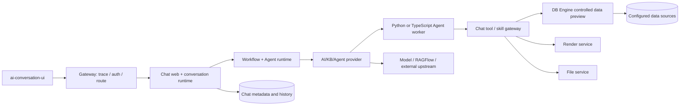
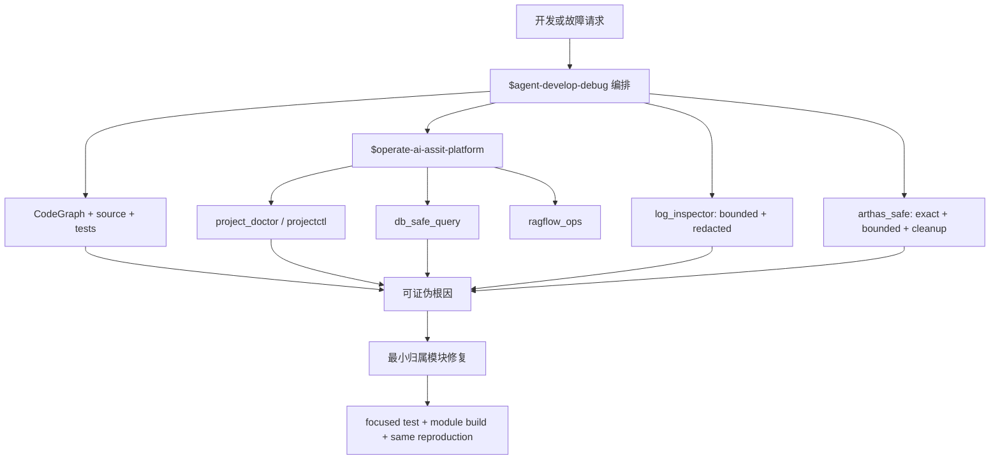

# agent-develop-debug 智能体开发调试 Skill 设计

日期：2026-08-25

状态：已实现并完成工具验证

## 1. 结论

新增项目级 `$agent-develop-debug`，作为 `ai-assit-platform` 的“开发调试编排层”。它不复制已有运维工具，而是把代码定位、问题复现、traceId 日志关联、数据库证据、Arthas 运行时诊断、最小修复和回归验证串成一个有安全边界的闭环。

现有 `$operate-ai-assit-platform` 继续负责环境体检、服务启停、原始日志、MySQL 安全访问和 RAGFlow 运维；新 Skill 新增脱敏日志检索与受控 Arthas 执行，并规定何时进入每个证据层。

## 2. 目标与非目标

### 2.1 目标

- 让 Agent 能从异常或需求出发，定位真实模块、调用路径和配置来源。
- 能直接查看受控日志，并按 `X-Trace-Id`、run/session/task/artifact ID 还原链路。
- 能默认只读地检查数据库，并在明确授权后创建或清理精确范围的开发测试数据。
- 能识别项目 JVM，通过 Arthas 查看线程、类、方法、Spring Bean/配置以及有限次 `trace`、`stack`、`watch`。
- 能在根因证据充分后修改代码，并完成聚焦测试、模块构建和相同路径复现。
- 对“已实现、已验证、部分完成、仅设计、受阻”作清晰区分。

### 2.2 非目标

- 不提供任意生产数据库写入、DDL、全表 DML 或跨库写入能力。
- 不提供任意 Arthas/OGNL 命令、热更新类、堆转储、环境变量导出或默认长期驻留的诊断服务。
- 不把一次编译成功等同于运行时验证。
- 不替代平台业务 API、Nacos、日志平台、链路平台或部署系统。
- 不在本次实现中启动业务 Java 服务、写业务数据库或对业务 JVM 执行 attach。

## 3. 当前项目整体设计

根 Maven Reactor 的有效业务应用是 Gateway、User、Chat、DB Engine、Render、File，前端为独立的 `ai-conversation-ui`。历史独立 AI Engine 已并入 Chat。

| 应用 | 端口/前缀 | 核心职责 | 主要持久化 |
| --- | --- | --- | --- |
| Gateway | `9764 /` | 路由、trace、请求环境守卫、鉴权/权限 | 无业务库 |
| User | `8082 /user` | 用户、权限、系统运行时配置 | `ai_assist_user` |
| Chat | `13103 /chat` | 对话、模型、知识库、工作流、Agent runtime/provider | `ai_assist_chat_v3` |
| DB Engine | `14102 /dbEngine` | 数据源、虚拟模型、受控预览/查询执行 | `ai_assist_db_engine` |
| File | `14103 /file` | 文件和对象存储访问 | 运行时确认 |
| Render | `14401 /render` | 页面/组件、内容、版本和渲染定义 | `ai_assist_render` |
| UI | `5173 /` | Vue 3/Vite 会话与应用渲染前端 | 无 |

### 3.1 主要业务链路



诊断时必须沿真实分支向下追踪。Gateway 返回 5xx 不代表根因在 Gateway；Chat 的通用 Provider 错误可能包装了 Worker、模型、RAGFlow、DB Engine 或 Render 的首个错误。

### 3.2 配置设计

配置事实按以下优先级核验：

1. 服务 `bootstrap.yml` 和 application 配置；
2. 当前可达 Nacos 的 `common.yaml` 与服务配置；
3. 仓库 `app/config/application-common.yaml` 仅作为回退；
4. User 系统配置表提供的运行时设置；
5. Chat 当前启用的客户端、模型、KB/Agent/provider 记录。

任何层都不得输出密码、JWT、provider key、`setting_value`、`auth_json`、cookie 或完整个人数据。

## 4. Skill 分层设计



### 4.1 编排层

`SKILL.md` 规定统一证据阶梯：

1. 静态代码和配置；
2. 最小真实复现；
3. 日志与 traceId；
4. 数据库和运行时设置；
5. Arthas JVM 状态；
6. 可证伪根因；
7. 最小修复与同路径回归。

只有在“实际类、方法、线程、Bean、有效配置或耗时”仍无法由前四层确定时，才进入 Arthas。

### 4.2 已有能力复用

- `project_doctor.py`：检查仓库、工具、模块漂移、依赖端口和安全配置摘要。
- `projectctl.py`：按依赖顺序启停、状态检查、日志和模块构建；只停止自己记录的进程。
- `db_safe_query.py`：默认只读；受控单语句 DML；精确 host/database/reason/commit 确认。
- `ragflow_ops.py`：RAGFlow 健康、Dataset/文档/检索和受控恢复操作。

### 4.3 新增日志能力

`log_inspector.py` 提供：

- 从 `projectctl.py` 解析真实托管日志，或读取明确传入的外部日志；
- 限制扫描行数与返回行数；
- 按 traceId、多个稳定 ID、级别或异常标记过滤；
- 合并上下文行；
- 默认屏蔽常见 Authorization/password/token/API key/URL userinfo；
- 支持 JSON 结果和经过脱敏的 follow。

脱敏只能作为最后一道保护，Agent 仍必须避免请求和展示任意完整业务对象或敏感 payload。

### 4.4 新增 Arthas 能力

`arthas_safe.py` 提供：

- 只列出 Gateway/User/Chat/DB Engine/Render/File 项目 JVM；
- 优先通过服务监听端口查找 PID，但仍要求进程命中精确 main class/module marker；同时按相同标记收集非默认端口实例；
- 多实例时必须显式选择已发现 PID；
- 支持 overview/thread/class-info/methods/trace/stack/watch/Spring property/Bean existence；
- class/method 禁止通配符，增强类数固定为 1，观察次数最多 5；
- 每次 attach/dry-run 必须显式声明环境；生产环境还必须二次确认；
- 使用 loopback 临时 telnet 端口，关闭 HTTP，设置批处理总超时；
- 禁止 dump/heapdump/类重定义/任意 OGNL/sysenv/sysprop/profiler/JFR/options；
- 每次批处理自动执行 `reset;stop`，超时/错误时通过 client 再尝试清理；
- 生产 attach 必须显式标记环境并二次确认；
- `watch` 参数、返回值和异常对象输出必须显式开启。

`tt` 因保留对象、可能引起内存压力且支持重放，不纳入默认执行器；只有单独评审、限次、限类并规划缓存清理后才能直接使用。

## 5. 数据库操作边界

读取路径：

```text
CodeGraph 定位 entity/mapper/service
  -> 确认 Nacos 有效数据源
  -> SHOW CREATE TABLE / DESCRIBE
  -> 有界 SELECT
  -> 对照日志和业务 ID
```

开发测试数据写入路径：

```text
明确环境与用户授权
  -> 精确目标行/关联行
  -> 预览 SQL 与清理 SQL
  -> --allow-write 预览
  -> exact host/database/reason
  -> --execute --commit
  -> API/页面验证
  -> 清理并复查
```

涉及密码哈希、业务事件、版本/快照、缓存、外部 Provider 同步的数据写入，必须优先走应用 API。

## 6. 目录与职责

```text
.codex/skills/agent-develop-debug/
├── SKILL.md
├── agents/openai.yaml
├── scripts/
│   ├── log_inspector.py
│   └── arthas_safe.py
└── references/
    ├── project-architecture.md
    ├── debug-playbook.md
    ├── log-and-trace-debugging.md
    └── arthas-runtime-debugging.md
```

该目录只保留 Agent 执行所需资源；本设计说明放在项目 `docs/plans`，不混入 Skill 上下文。

## 7. 验收标准

- Skill 元数据可被标准 validator 识别。
- 所有 Python 脚本可编译，`--help` 可执行且无项目外依赖。
- 日志工具能完成过滤、上下文、行数上限、JSON 和敏感字段脱敏验证。
- Arthas 工具不会列出无关 JVM，能在服务停止时安全完成 dry-run，能拒绝：
  - 未确认生产环境；
  - 非项目 PID；
  - 通配类/方法；
  - 超过次数上限；
  - 敏感 Spring 属性；
  - 未授权的 watch 值输出。
- 本机存在 Arthas 4.3.2；已使用隔离、无业务代码和数据的 Java fixture 完成真实 batch attach，并验证 `overview/thread/jvm/memory`、`reset;stop` 及端口清理。
- 未启动/停止项目业务服务，未 attach 项目业务 JVM，未连接或读写业务数据库。
- 执行 `codegraph sync`、`git diff --check` 并报告工作区变化。

## 8. 后续扩展点

- 在真实本地 Chat JVM 启动后补一轮 `class-info` 和非增强 overview 的 attach 验收。
- 根据团队日志平台增加只读适配器，但继续使用相同脱敏输出契约。
- 根据部署形态增加 SSH/Kubernetes 目标解析；远程执行必须复用服务器权限和环境确认，不得把生产凭证放进 Skill。
- 如需 `tt`、profiler/JFR 或动态修改日志级别，分别设计高风险命令策略和可验证清理流程，不直接放开任意 Arthas 命令。
