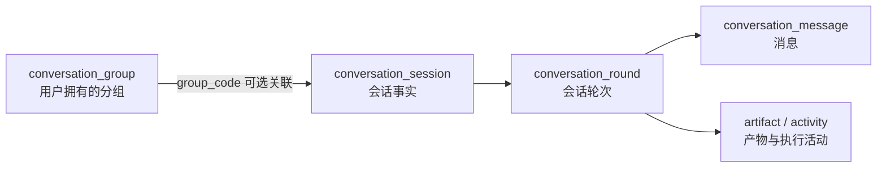
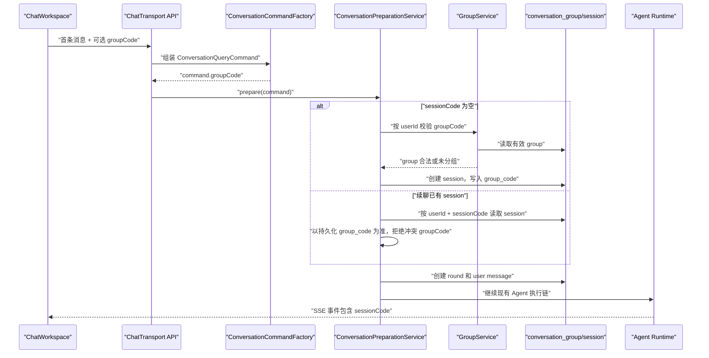

# Chat Session 分组设计方案

> 状态：已实现一期，待部署验收
> 日期：2026-08-07
> 范围：`app/app-platform-chat`、`ai-conversation-ui`
> 一期目标：只支持会话分组，不在本期实现分组提示词、文件和上下文注入。

## 1. 结论

建议把“分组”建模为一个独立的 `ConversationGroup`，而不是把组名直接塞进 `conversation_session`，也不在前端用本地字段临时聚合。

一期采用以下模型：

1. 新增 `conversation_group` 表，使用稳定的 `group_code` 作为业务标识。
2. `conversation_session` 增加可空的 `group_code`，一个 session 最多属于一个分组；`NULL` 表示未分组。
3. 分组与 session 都按当前登录用户隔离，不支持跨用户共享、嵌套分组和多级目录。
4. 删除分组只解除 session 的分组关系，不删除 session、round、message、artifact 或 activity。
5. 首条消息仍由现有 `ConversationPreparationService` 自动创建 session；新请求只需要额外携带可选的 `groupCode`。
6. 当前已有的 `/g/:groupId/c/:sessionId` 前端路由可以复用；其中 `groupId` 的值按 `groupCode` 处理，不新增一套数字组 ID。
7. 旧 session 不回填到默认分组，继续保持未分组；不影响不携带 `groupCode` 的旧客户端。

核心关系如下：



## 2. 当前实现基线

### 2.1 后端现状

- `ConversationSessionEntity` 对应 `conversation_session`，当前已有 `sessionCode`、`userId`、`businessType`、`sessionName`、`pinned` 和审计/软删除字段。
- 新会话不是由独立的 create API 产生，而是在 [ConversationPreparationService](../../../../app/app-platform-chat/modules/core-ai-chat/src/main/java/ai/platform/aiassit/conversation/service/impl/ConversationPreparationService.java) 发现 `command.sessionCode` 为空时创建。
- 当前用户的会话列表、搜索、重命名、置顶和删除由 [ConversationManageController](../../../../app/app-platform-chat/web/src/main/java/ai/platform/aiassit/conversation/controller/impl/ConversationManageController.java) 暴露；controller 会覆盖请求中的 `userId`，以登录上下文为准。
- [ConversationSessionServiceImpl](../../../../app/app-platform-chat/data/data-conversation/src/main/java/ai/platform/aiassit/conversation/data/service/impl/ConversationSessionServiceImpl.java) 已经针对 `userId` 做了显式 session 表过滤，因为公共历史查询对象会被 round/message 等子表复用。
- 新版流式入口是 `/api/chat/rounds/stream` 和 `/api/chat/sessions/{sessionCode}/rounds/stream`。请求经过 [ConversationCommandFactory](../../../../app/app-platform-chat/web/src/main/java/ai/platform/aiassit/conversation/support/ConversationCommandFactory.java) 转成内部 `ConversationQueryCommand`，再进入准备、执行、SSE/重连链路。
- round、message、artifact、activity 都通过 `sessionCode` 或 `roundCode` 关联 session；目前没有 group 维度，也不需要把 `group_code` 扩散到这些表。

### 2.2 前端现状

- [ChatWorkspaceView.vue](../../../../ai-conversation-ui/src/modules/ai-chat/views/ChatWorkspaceView.vue) 当前加载一份会话列表，并在前端按 `pinned` 分成置顶/普通两组。
- [ai-chat API](../../../../ai-conversation-ui/src/modules/ai-chat/api/index.ts) 已有会话列表、重命名、置顶、删除和详情调用，但没有分组 API。
- [ai.ts](../../../../ai-conversation-ui/src/router/routes/ai.ts) 已经存在 `/g/:groupId/c/:sessionId`，但页面目前只读取 `sessionId`；还需要补充分组首页和真实的 group 状态管理。
- 当前发送新消息时只提交 `sessionCode`、`modelId` 和 message。发送到没有 `sessionCode` 的入口时，服务端自动创建 session。

### 2.3 数据脚本现状

当前 session 表定义在 [chat_data_schema_init.sql](../../../../app/app-platform-chat/config/db-schema/1.0.0/chat_data_schema_init.sql)，另有 `config/chat` 下的生成 DDL。实现时应按仓库当时的最新 schema 版本新增迁移，不直接改写已发布的 `1.0.0` 文件；生成 DDL 和手工维护的 schema/迁移脚本要保持一致。

## 3. 一期业务语义

| 规则 | 一期约定 |
| --- | --- |
| 分组归属 | `user_id + group_code`，只允许当前用户访问 |
| session 归属 | 一个 session 最多一个 group；`group_code = NULL` 表示未分组 |
| 分组命名 | `group_name` 必填，去除首尾空格，长度上限 128；`group_code` 才是稳定身份 |
| 分组排序 | 一期按创建/更新时间排序，不增加手工排序字段 |
| 新 session | 发送首条消息时携带 `groupCode`，服务端校验后写入 session |
| 续聊 | 以已有 session 的持久化 `group_code` 为准；客户端不能通过聊天请求顺便改组 |
| 移动 session | 使用单独的 move/assign API，目标 group 为空时移到“未分组” |
| 删除 group | 事务内把成员 session 的 `group_code` 清空，再软删除 group；不删除聊天历史 |
| 页面助手 | `PAGE_ASSISTANT` 会话继续保持独立，不允许加入普通聊天分组 |
| 共享能力 | 一期不做共享、成员、权限、嵌套、跨用户访问 |

不建议给 group 增加 `businessType`。当前页面助手和普通聊天已经由 session 的业务类型隔离，group 只表示用户组织方式，不承担业务路由。

## 4. 数据模型

### 4.1 `conversation_group`

新增实体建议放在 `data/data-conversation`，继承现有 `LogicalDeleteEntity`，复用 id、version、审计字段和软删除能力。

| 字段 | 类型 | 约束 | 含义 |
| --- | --- | --- | --- |
| `group_code` | `VARCHAR(64)` | 非空、单列唯一 | 分组业务编码，例如 `group-xxxx` |
| `user_id` | `BIGINT` | 非空、默认 0 | 分组所有者 |
| `group_name` | `VARCHAR(128)` | 非空 | 分组展示名称 |
| `id/version/create_time/update_time/created_by/updated_by/deleted` | 复用基类 | 按现有约定 | 持久化和审计字段 |

建议索引：

- `uk_group_code (group_code)`；
- `idx_group_user (user_id)`。

### 4.2 `conversation_session`

增加：

| 字段 | 类型 | 约束 | 含义 |
| --- | --- | --- | --- |
| `group_code` | `VARCHAR(64)` | 可空 | 所属分组；为空表示未分组 |

建议增加 `idx_session_user_group (user_id, group_code)`。一期不强制数据库外键：当前工程的业务关联主要使用稳定编码和 service 层校验，而 group 采用软删除，外键会增加删除和历史兼容处理的复杂度。

实体层必须同步增加 `@JdbcColumn`、`@TableField`、DTO 和 VO 字段，列名保持 `group_code` / `groupCode` 一致。不要在 session 表中预埋 `prompt`、`file_ids`、`context_json` 等未来字段。

### 4.3 查询对象的边界

现有 `ConversationHistoryQueryRequest` 会被 session、round、message、activity 等多个 service 复用。若把 `groupCode` 加入该对象，应像 `userId` 一样标记为 `@IgnoredQuery`，只在 `ConversationSessionServiceImpl.buildQuery` 中显式追加 `conversation_session.group_code` 条件；不能让通用查询器把它误当作 round/message 表字段。

更稳妥的实现方式是为 session 列表增加专用查询对象；如果一期希望控制改动量，则沿用现有 `@IgnoredQuery + session service 显式过滤` 模式即可。

## 5. API 方案

沿用当前 `/api/v1/chat/conversation` 管理前缀，在现有 `IConversationManageController` 增加 `group/*` 子路径。请求体不接受 `userId`，controller 统一从 `SystemContext` 注入当前用户。

| 方法 | 路径 | 请求 | 返回 |
| --- | --- | --- | --- |
| POST | `/api/v1/chat/conversation/group/list` | `{}` | `ConversationGroupVO[]` |
| POST | `/api/v1/chat/conversation/group/create` | `{ "groupName": "数据分析" }` | 创建后的 `ConversationGroupVO` |
| POST | `/api/v1/chat/conversation/group/rename` | `{ "groupCode": "...", "groupName": "..." }` | 更新后的 `ConversationGroupVO` |
| POST | `/api/v1/chat/conversation/group/delete` | `{ "groupCode": "..." }` | `boolean` |
| POST | `/api/v1/chat/conversation/group/assign` | `{ "sessionCode": "...", "groupCode": "..." }` | 更新后的 `ConversationSessionVO` |

`groupCode` 为空或 JSON `null` 的 assign 请求表示移到未分组。group list 只返回当前用户的有效分组，不返回已软删除分组。

现有接口扩展：

- `/conversation/list` 的查询请求增加可选 `groupCode`，用于服务端筛选；返回的 `ConversationSessionVO` 增加 `groupCode`。
- 旧 `/api/v1/chat/completions` 请求 DTO 和新版 `ChatTransportRequest` 都增加可选 `groupCode`，保证旧入口、新版 SSE 和 WebSocket 的行为一致。
- `/api/chat/stream/reconnect` 不需要新增 group 字段；运行已经绑定 session，重连继续以 run/session 的服务端状态为准。

### 5.1 关键校验

1. create/rename/delete/list/assign 均按当前用户查询；客户端传入的用户 ID 不参与归属判断。
2. assign 必须同时校验 session 属于当前用户、目标 group 属于当前用户且未被软删除。
3. groupCode 不存在或不属于当前用户时，统一按资源不存在/不可访问处理，避免泄露其他用户数据。
4. `PAGE_ASSISTANT` session 不允许 assign 到普通 group。
5. groupName 为空、超长或只包含空白时，返回参数错误。
6. 删除 group 与清空成员 session 在同一个事务中完成；删除后成员历史仍可通过未分组列表访问。

## 6. 新会话执行链改造



落地时的具体传播点：

- `ConversationQueryRequest`、`ChatTransportRequest`、`ConversationQueryCommand` 增加 `groupCode`。
- `ConversationCommandFactory.fromLegacy`、`fromProtocol` 负责复制该字段；`fromSettingsAssistantProtocol` 对非空 groupCode 直接拒绝。
- `ConversationPreparationService.createSession` 校验 group 后写入 `ConversationSessionDTO.groupCode`。
- 继续已有 session 时不能根据请求中的 groupCode 更新 session；如果请求显式传入且与持久化值不一致，返回冲突/不可访问错误。
- 流式事件、run snapshot、重连协议继续只使用 sessionCode/roundCode；group 是持久化组织信息，不参与事件游标和运行恢复。

## 7. 后端改动分层

### 7.1 `data/data-conversation`

- 新增 `ConversationGroupEntity`、`ConversationGroupDTO`、`ConversationGroupConvert`、`ConversationGroupMapper`、`ConversationGroupDataService` 和实现类。
- `ConversationSessionEntity`、`ConversationSessionDTO` 增加 `groupCode`。
- `ConversationSessionServiceImpl` 增加 group 过滤；如果删除 group 需要批量解绑，给 `ConversationSessionMapper` 增加按 `userId + groupCode` 清空字段的最小自定义 SQL。
- 不修改 round/message/artifact/activity 的实体和表结构。

### 7.2 `modules/core-ai-chat`

- 新增 `ConversationGroupService` 应用服务，负责当前用户校验、创建、改名、删除和 session assign；底层 CRUD 仍由 data service 承担。
- 扩展 `ConversationService.listConversations` 的 groupCode 查询条件，但不把 group 管理逻辑堆进 `ConversationPreparationService`。
- 在 `ConversationPreparationService` 中只保留“新 session 绑定 group”的运行时校验和写入；组删除、移动等管理动作走 group 应用服务。
- 增加请求 DTO、返回 DTO 与相关单测。分组契约仅供 Chat Web 使用，不放入 `app-platform-chat/api`，避免把页面管理协议误当成跨服务内部 API。

### 7.3 `web`

- 扩展 `IConversationManageController` 和 `ConversationManageController` 的 group 子路径。
- 扩展 `IApiResConvert` 对 group DTO 到 VO 的映射。
- 为 `ChatTransportRequest` 增加 groupCode；新版 SSE、旧版 completions、WebSocket 都复用同一个字段传播逻辑。
- controller 继续只做当前用户解析和轻量请求编排，所有 ownership、事务和跨表操作放到 service。

## 8. 前端改动方案

### 8.1 状态与请求

在 `ai-chat/types/index.ts` 增加：

- `ChatGroupItem { groupCode, groupName, createTime?, updateTime? }`；
- `ChatSessionItem.groupCode`；
- group list/create/rename/delete/assign 的 payload 类型；
- `ChatConversationQueryPayload.groupCode`；
- `ChatQueryPayload.groupCode` 和 `ChatTransportRequest.groupCode`。

在 `ai-chat/api/index.ts` 增加对应请求函数。页面初次加载时获取 group list 和会话 list；一期可一次加载全部 session，按 `groupCode` 在前端分组，保留 payload 级 groupCode 筛选为后续分页做准备。

### 8.2 页面交互

- 侧边栏一级展示分组，增加一个固定的“未分组”虚拟分组；二级展示 session。
- 保留置顶能力，但置顶只影响同一分组内部排序，不改变 session 的 groupCode。
- 增加新建、改名、删除分组操作；删除前提示“会话保留并移到未分组”。
- 在 session 更多菜单增加“移动到分组”，支持移动到任一用户分组或未分组。
- 当前 session 所在组使用 `/g/:groupId/c/:sessionId`，未分组仍使用 `/c/:sessionId`。
- 增加 `/g/:groupId` 作为“选中分组但尚未创建 session”的入口；首条消息发送时把 route 中的 groupId 转成 `groupCode`。
- 新 session 的首个 `run.accepted`/`round` 事件返回 sessionCode 后，路由应保留 group 前缀，避免刷新后丢失分组上下文。
- `currentGroupId` 已存在于页面代码中，应把它从“只读路由参数”提升为发送和列表筛选的真实状态。

一期不在聊天输入框中展示“提示词/文件”配置入口；group 只作为组织标签展示。

## 9. 后续提示词和文件扩展

分组表一期只保存身份和名称，后续扩展建议保持以下边界：

```text
conversation_group
  -> group prompt/version
  -> group file reference
  -> future group tools or knowledge-base binding
```

后续版本建议：

1. 新增独立的 group context 子表或版本表保存提示词，不把大文本直接追加到 `conversation_group` 主表；提示词需要版本、启停、修改人和内容摘要。
2. 文件只保存已有文件服务/对象存储的受控引用，不保存大文件二进制，不接受模型或前端直接提供的任意 URL。
3. 在 `ConversationPreparationService` 完成 session 解析后，由 `ConversationGroupContextService` 加载当前 group 的有效 prompt/file references，再交给 Agent request builder；权限校验、文件可读性和工具授权仍由服务端负责。
4. group context 变更只影响后续 round，不回写历史消息；执行时应记录 context version/hash，保证历史运行可解释和可复现。
5. 平台/安全约束优先于 group prompt；group prompt 不能绕过 Agent Snapshot、工具授权、数据权限或文件权限。
6. group 的显式上下文与 RAGFlow 的派生记忆分开：前者是用户配置，后者是召回结果，不能把两者混为一个 `context_json` 字段。

这样一期的 `group_code` 会成为后续 context、文件和知识库绑定的稳定入口，但不会为了“预留”而提前实现提示词注入或文件召回。

## 10. 分期实施

### Phase 1：数据与后端管理能力

1. 新增 group entity/DTO/mapper/service 和 schema migration。
2. 为 session 增加 groupCode，并完成 session list 的 group 过滤和返回。
3. 增加 group list/create/rename/delete/assign API。
4. 将新会话请求的 groupCode 贯通到 `ConversationPreparationService`。
5. 完成用户隔离、页面助手隔离和删除分组不删历史的单测。

### Phase 2：前端分组体验

1. 增加 group API/type 和页面状态。
2. 复用已有 `/g/:groupId/c/:sessionId`，补充 `/g/:groupId`。
3. 实现侧边栏分组、未分组、创建/改名/删除和 session 移动。
4. 新会话发送 groupCode，流式事件完成后保留分组路由。
5. 执行前端构建和 API/组件单测。

### Phase 3：部署与验收

1. 按最新 schema 版本执行新表创建和 `conversation_session.group_code` 迁移。
2. 验证旧 session 全部仍可打开，且默认显示在未分组。
3. 验证新建分组、分组内新会话、续聊、移动、取消分组、删除分组。
4. 验证两个用户之间不能读取、移动或删除对方的 group/session。
5. 验证流式首轮、SSE 重连、WebSocket 入口不因 groupCode 引入行为回归。

## 11. 测试与验收清单

### 后端

- group CRUD 的当前用户过滤、空名称、超长名称、重复请求和不存在资源。
- session assign 到合法 group、移到未分组、跨用户 group、跨用户 session。
- 删除 group 后 session 仍能在 `/conversation/list` 和详情接口中访问。
- 新 session 携带 groupCode 时确实写入 session；不携带时仍能正常创建未分组 session。
- 已有 session 携带不一致 groupCode 时被拒绝，且不会改写其持久化 groupCode。
- `PAGE_ASSISTANT` session 无法加入普通 group，普通列表仍不展示页面助手会话。
- group 查询条件不会污染 round/message 等使用同一历史查询对象的 service。

### 前端

- 初次加载能显示用户分组和未分组 session。
- 从 group 首页发送第一条消息后，session 创建、列表刷新和路由都保留 group。
- 在不同 group 间移动 session 后，原组和目标组列表都正确更新。
- 删除 group 后 session 出现在未分组，当前打开的 session 仍可继续访问。
- `/c/:sessionId`、`/g/:groupId/c/:sessionId` 刷新和 SSE 重连都不会丢失 session。
- 运行 `npm run build`；后端按项目约定执行 `mvn -pl app/app-platform-chat -am clean compile -DskipTests` 及相关单测。

## 12. 一期明确不做的事情

- 不新增 group prompt、文件上传、文件解析、知识库绑定或自动上下文注入。
- 不把提示词、文件 ID 或任意 JSON 直接加到 session 主表。
- 不为每个 group 创建独立 Agent、RAGFlow Memory 或运行线程。
- 不修改现有 round/message/artifact/activity 表的关联模型。
- 不删除或批量重命名历史 session，不自动创建“默认分组”。
- 不做共享分组和复杂 ACL；如果未来要共享，应新增成员/授权模型，不能只放开 group_code 查询。
