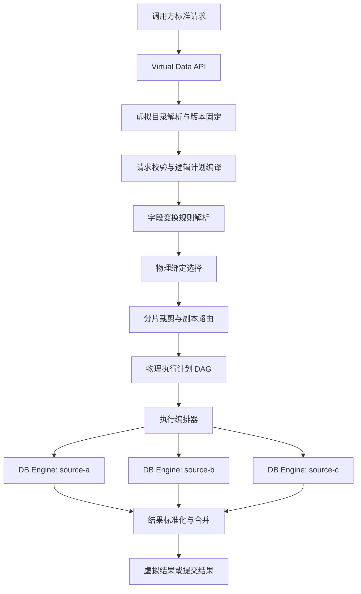
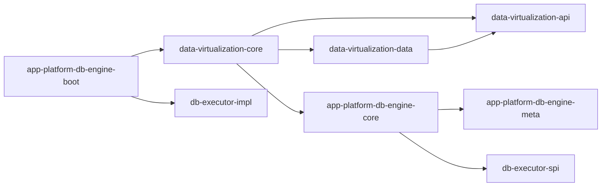
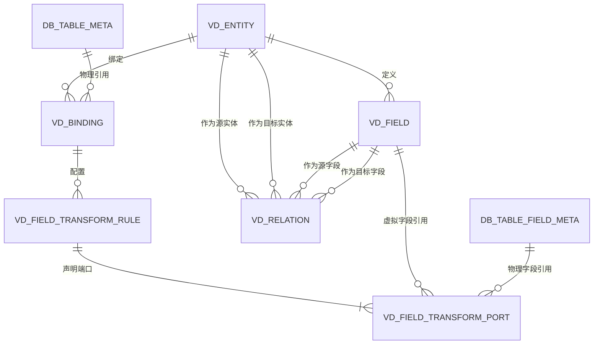
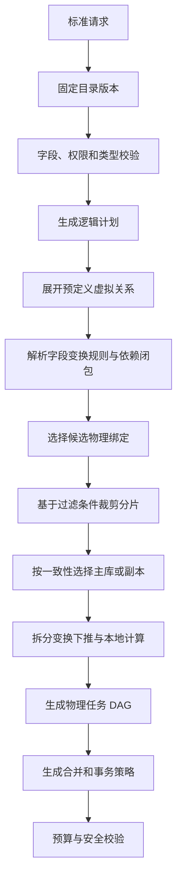

# 跨数据源虚拟数据模型与执行编排方案

> 状态：已实施，待业务环境验收
> 日期：2026-07-13
> 目标：在现有真实数据库元数据与单数据源执行能力之上，引入独立的虚拟数据定义层，为跨数据库查询、路由、分片、副本、语义适配、结果合并和后续事务编排提供稳定边界。
> 验收说明：见 [cross-source-virtual-data-model-acceptance.md](cross-source-virtual-data-model-acceptance.md)

## 1. 结论

新增独立聚合模块：

```text
app/app-platform-data-virtualization/
├── api
├── data
└── core
```

首期不新增独立运行进程，由现有 `app-platform-db-engine/boot` 装配 `data-virtualization-core`。这样代码与数据模型已经独立，但不立即增加部署、注册中心、鉴权透传和远程调用成本。未来确实需要独立扩缩容时，再增加 `boot` 子模块。

职责边界如下：

- `app-platform-db-engine/meta`：继续维护真实数据源、真实表、真实字段、真实索引以及真实表关联；每条数据都对应物理世界中的对象。
- `app-platform-data-virtualization/data`：维护虚拟实体、虚拟字段、物理绑定、字段变换规则、规则端口和虚拟关系。
- `app-platform-data-virtualization/core`：提供字段变换规则管理层，并把标准虚拟请求编译成逻辑计划，完成变换依赖解析、物理绑定选择、分片裁剪、副本路由、物理任务生成、执行编排与结果合并。
- `app-platform-db-engine/core` 与执行器：继续作为单个 `sourceKey` 下的物理执行能力，不感知虚拟实体，不承担跨源规划。

首期只落六张虚拟数据配置表，不为分片、副本和每一种语义差异继续拆表：

1. `vd_entity`
2. `vd_field`
3. `vd_binding`
4. `vd_field_transform_rule`
5. `vd_field_transform_port`
6. `vd_relation`

## 2. 背景与现状判断

### 2.1 当前模型的真实含义

现有 `app/app-platform-db-engine/meta` 中：

- `DbDataSourceEntity` 对应一个真实数据接入源。
- `DbTableMetaEntity` 对应一个真实表。
- `DbTableFieldMetaEntity` 对应真实表字段。
- `DbTableIndexMetaEntity` 对应真实索引字段。
- `DbTableRelationMetaEntity` 对应真实表之间的一组字段映射。

这套模型适合作为“物理目录”，不应该混入虚拟字段、跨库关系、路由规则和合并策略，否则同一张元数据表会同时描述事实与运行策略，边界会迅速失控。

### 2.2 当前执行链路的能力边界

现有代码已经提供以下可复用能力：

- `DbAccessService.query(sourceKey, request)` 能按明确的 `sourceKey` 选择数据库执行器。
- `DbAccessProviderRegistry` 能按数据源类型和数据库类型选择 Provider。
- `DbSqlDialectRegistry` 和 `DbQueryExecutionPipeline` 已经形成单数据库的方言渲染、策略、审计和执行链路。
- MySQL、JDBC、MongoDB 等 Provider 能完成物理查询和更新。

当前限制也很明确：

- `DbExecutionContextFactory` 默认通过 `DefaultDbSourceKeyResolver` 解析一个数据源。
- `DbQueryPlan` 只表达单物理模型和一段 statement。
- `DbQueryServiceImpl` 直接把请求中的 `model` 当成真实表，并在一次 SQL 中完成关联。
- 物理执行器的 `execute` 每次打开并关闭独立连接，没有跨多个物理任务共享的事务会话。

因此，新模块应复用物理执行能力，但不能直接复用现有 `DbQueryServiceImpl` 作为虚拟模型编译器。

## 3. 目标与非目标

### 3.1 目标

- 以稳定的虚拟实体编码替代调用方直接使用真实表名。
- 一个虚拟实体可以绑定一个或多个数据源中的真实表。
- 支持一个物理字段拆分为多个虚拟字段、多个物理字段合并为一个虚拟字段，以及一般的 N:M 字段变换。
- 同一个虚拟字段可以在不同物理绑定中使用不同的输入字段和变换规则。
- 区分读取变换与写回变换，不假设所有读取规则都可逆。
- 支持按请求条件进行分片裁剪和副本选择。
- 支持根据预定义的虚拟关系跨数据源查询。
- 将标准请求编译成可解释、可审计、可执行的计划 DAG。
- 对多物理任务的结果进行字段归一、合并、排序、聚合和分页。
- 明确单库事务、跨库写入和失败补偿的能力边界，不伪装成已经具备分布式事务。

### 3.2 首期非目标

- 不允许调用方提交任意 SQL。
- 不实现任意 N 表、任意条件的分布式 Join。
- 不实现 XA/2PC 分布式事务。
- 不实现自动成本优化器和自动索引推荐。
- 不为每一种分片、语义转换或副本策略单独建表。
- 不把虚拟配置写回现有 `db_table_*_meta` 表。

## 4. 领域术语

| 术语 | 含义 |
|---|---|
| 物理目录 | 真实数据源、表、字段、索引和物理关系的元数据 |
| 虚拟实体 | 调用方看到的稳定逻辑表/业务实体 |
| 虚拟字段 | 虚拟实体对外暴露的标准字段 |
| 物理绑定 | 一个虚拟实体与一张真实表的绑定关系 |
| 字段变换规则 | 描述一组物理字段与一组虚拟字段之间的有向转换规则 |
| 变换端口 | 字段变换规则引用的物理或虚拟输入/输出字段 |
| 字段变换器 | 由注册表管理、实际执行拆分、合并、类型转换或语义转换的受控实现 |
| 虚拟关系 | 两个虚拟实体字段之间的逻辑关联 |
| 目录快照 | 某个已发布虚拟实体版本的不可变运行时视图 |
| 逻辑计划 | 仅表达虚拟实体语义的操作计划 |
| 物理计划 | 已确定数据源、真实表、方言任务、依赖和合并方式的计划 |
| 物理任务 | 在单一 `sourceKey` 上执行的最小任务 |

## 5. 总体架构



架构分为两个平面：

### 5.1 控制面

负责虚拟实体配置、字段变换规则管理、规则预览与校验、发布、停用和目录缓存失效。控制面不执行用户查询。

### 5.2 数据面

负责读取已发布的不可变目录快照，把标准请求编译为计划并执行。数据面不直接修改虚拟配置。

## 6. Maven 模块与依赖方向

### 6.1 目录结构

```text
app/app-platform-data-virtualization/
├── pom.xml
├── api/
│   └── src/main/java/ai/platform/aiassit/data/virtualization/api/
├── data/
│   ├── src/main/java/ai/platform/aiassit/data/virtualization/data/
│   └── src/main/resources/db/schema/
└── core/
    └── src/main/java/ai/platform/aiassit/data/virtualization/core/
```

### 6.2 子模块职责

#### `api`

- 标准查询和写入请求 DTO。
- 过滤表达式、排序、分页、聚合、关系引用和一致性提示。
- 标准响应、执行摘要和 Explain 响应。
- 跨模块共享的枚举和内部 API 契约。
- 不依赖 `data`、`core` 或 DB Engine 实现。

#### `data`

- 六张虚拟配置表的 Entity、DTO、Mapper、Convert 和基础 Service。
- 配置查询和发布事务所需的少量组合查询。
- 数据层只维护配置，不编译计划、不执行数据库操作。
- Entity 默认继承 `AuditableEntity`，DTO 默认继承 `AuditableDTO`。

#### `core`

- 管理端 Controller 和内部执行 Controller。
- 虚拟目录聚合、配置校验和发布。
- 字段变换器注册、规则管理、规则预览、依赖血缘和能力校验。
- 请求编译、计划生成、路由、编排、合并和事务策略。
- 物理目录访问适配器和 DB Engine 执行适配器。
- 不直接编写特定数据库 JDBC 代码。

### 6.3 推荐依赖图



强制依赖规则：

- DB Engine 不得反向依赖 Data Virtualization。
- Data Virtualization 不得把自身 Entity 暴露给 DB Engine。
- 虚拟层通过端口调用物理目录和物理执行能力。
- 如果未来独立部署，只替换端口适配器，不改 Planner、Router 和 Orchestrator。

## 7. 物理目录与虚拟目录的边界

### 7.1 物理目录继续保留在 DB Engine Meta

`DbTableRelationMetaEntity` 的定位应限定为：真实数据库中发现的外键关系，或经过人工确认的真实物理表字段关系。它不能承担跨数据源虚拟实体关系。

### 7.2 虚拟关系只存在于新模块

虚拟关系以虚拟实体和虚拟字段 ID 建立，与物理表是否存在外键、是否存在索引无关。Planner 在完成物理绑定选择之后，再把虚拟关系翻译为对应物理字段条件。

### 7.3 禁止复制物理目录

虚拟绑定保存物理对象引用和执行所需快照，不重新复制完整的字段类型、索引和统计信息。物理目录仍是事实来源。

### 7.4 物理对象身份约束

首期沿用现有物理目录的身份规则：`sourceKey + tableName`。如果同一个 `sourceKey` 将来需要同时管理多个 catalog/schema 中的同名表，应先给物理目录补充 `catalogName/schemaName`，再同步扩展虚拟绑定；不能只在虚拟层单方面引入一套物理身份规则。

## 8. 首期数据模型

所有表默认包含：

- `id`
- `create_time`
- `created_by`
- `update_time`
- `updated_by`
- `version`

状态、类型等枚举字段使用 `INT`，Java 枚举实现项目统一的 `IEnum` 并通过 `DefaultEnumTypeHandler` 持久化。

下文 JSON 示例为了可读性使用枚举名称；实现时仍按项目枚举规范序列化稳定 `code`，不能持久化 Java 枚举类名。



### 8.1 `vd_entity`：虚拟实体

| 字段 | 类型 | 说明 |
|---|---|---|
| `entity_code` | `VARCHAR(64)` | 对外稳定编码，全局唯一 |
| `entity_name` | `VARCHAR(128)` | 展示名称 |
| `description` | `VARCHAR(512)` | 说明 |
| `status` | `INT` | `DRAFT`、`PUBLISHED`、`DISABLED` |
| `catalog_version` | `BIGINT` | 每次发布递增 |
| `enabled` | `BOOLEAN` | 是否启用 |

关键约束：

- 唯一索引：`uk_vd_entity_code(entity_code)`。
- 只有 `PUBLISHED + enabled=true` 的实体可以进入执行链路。

### 8.2 `vd_field`：虚拟字段

| 字段 | 类型 | 说明 |
|---|---|---|
| `entity_id` | `BIGINT` | 所属虚拟实体 |
| `field_code` | `VARCHAR(64)` | 对外稳定字段编码 |
| `field_name` | `VARCHAR(128)` | 展示名称 |
| `logical_type` | `INT` | 标准逻辑类型 |
| `nullable` | `BOOLEAN` | 标准空值语义 |
| `primary_key` | `BOOLEAN` | 是否为虚拟主键组成部分 |
| `ordinal_position` | `INT` | 展示与序列化顺序 |
| `default_value` | `VARCHAR(512)` | 标准默认值，可空 |
| `enabled` | `BOOLEAN` | 是否启用 |
| `remark` | `VARCHAR(512)` | 备注 |

关键约束：

- 唯一索引：`uk_vd_field(entity_id, field_code)`。
- 逻辑类型首期至少包括：字符串、布尔、整数、长整数、十进制、日期、时间戳、JSON、二进制。

### 8.3 `vd_binding`：虚拟实体到真实表的绑定

一条记录绑定一张真实表。多个绑定通过 `binding_group` 表达一个逻辑分片及其副本集合。

| 字段 | 类型 | 说明 |
|---|---|---|
| `entity_id` | `BIGINT` | 虚拟实体 ID |
| `binding_code` | `VARCHAR(64)` | 实体内唯一绑定编码 |
| `binding_group` | `VARCHAR(64)` | 主绑定与副本的分组编码 |
| `binding_role` | `INT` | `PRIMARY` 或 `REPLICA` |
| `physical_table_meta_id` | `BIGINT` | 物理表元数据 ID，不建立跨模块数据库外键 |
| `source_key` | `VARCHAR(64)` | 执行路由所需数据源标识 |
| `physical_table_name` | `VARCHAR(128)` | 发布时的真实表名快照 |
| `readable` | `BOOLEAN` | 是否允许读取 |
| `writable` | `BOOLEAN` | 是否允许写入 |
| `read_weight` | `INT` | 同组副本读权重 |
| `write_priority` | `INT` | 写路由优先级 |
| `routing_config` | `JSON` | 强类型分片匹配配置 |
| `enabled` | `BOOLEAN` | 是否启用 |
| `remark` | `VARCHAR(512)` | 备注 |

关键索引与约束：

- 唯一索引：`uk_vd_binding(entity_id, binding_code)`。
- 查询索引：`idx_vd_binding_entity(entity_id, enabled)`。
- 物理反查索引：`idx_vd_binding_physical(source_key, physical_table_name)`。
- 每个 `entity_id + binding_group` 必须且只能存在一个可写 `PRIMARY`。
- `REPLICA` 首期必须为只读。
- 路由匹配规则只配置在组内 `PRIMARY` 上；`REPLICA` 继承同组路由，避免副本重复配置后发生漂移。

`routing_config` 不使用 `Map<String, Object>`，定义为明确对象，例如：

```java
public class BindingRoutingConfig {
    private Integer version;
    private RoutingStrategy strategy;
    private List<String> shardFields;
    private HashRouteConfig hash;
    private RangeRouteConfig range;
    private ListRouteConfig list;
}
```

示例：

```json
{
  "version": 1,
  "strategy": "HASH",
  "shardFields": ["tenantId"],
  "hash": {
    "modulus": 4,
    "remainder": 0
  }
}
```

### 8.4 `vd_field_transform_rule`：字段变换规则

一条记录表示某个物理绑定下的一组字段变换规则。规则允许多个物理端口和多个虚拟端口，因此可以统一表达 1:1、1:N、N:1 和 N:M 映射。

| 字段 | 类型 | 说明 |
|---|---|---|
| `binding_id` | `BIGINT` | 所属物理绑定 |
| `rule_code` | `VARCHAR(64)` | 绑定内稳定规则编码 |
| `rule_name` | `VARCHAR(128)` | 展示名称 |
| `transform_mode` | `INT` | `READ_ONLY`、`WRITE_ONLY`、`BIDIRECTIONAL` |
| `read_transformer_code` | `VARCHAR(64)` | 物理字段生成虚拟字段的变换器编码，可空 |
| `read_transformer_version` | `INT` | 读取变换器实现版本，可空 |
| `write_transformer_code` | `VARCHAR(64)` | 虚拟字段写回物理字段的变换器编码，可空 |
| `write_transformer_version` | `INT` | 写回变换器实现版本，可空 |
| `read_config` | `JSON` | 强类型读取变换配置 |
| `write_config` | `JSON` | 强类型写回变换配置 |
| `enabled` | `BOOLEAN` | 是否启用 |
| `remark` | `VARCHAR(512)` | 备注 |

关键约束：

- 唯一索引：`uk_vd_transform_rule(binding_id, rule_code)`。
- `READ_ONLY` 必须配置读取变换器且不能配置写回能力。
- `WRITE_ONLY` 必须配置写回变换器。
- `BIDIRECTIONAL` 必须同时通过读取和写回校验，不能因为存在读取变换器就推断规则可逆。
- 一个可读虚拟字段在同一绑定中只能有一个启用的读取生产者。
- 同一个物理字段可以被多个读取规则消费，以表达同一存储值的多种虚拟语义。
- 一个物理字段在同一绑定中只能有一个启用的写回生产者，避免规则覆盖冲突。

`read_config` 和 `write_config` 不是通用扩展字段，而是由 `transformerCode + transformerVersion` 确定类型的规则对象。例如：

```java
public interface FieldTransformConfig {
    Integer getConfigVersion();
}

public class JsonExtractConfig implements FieldTransformConfig {
    private Integer configVersion;
    private Map<String, String> outputPaths;
    private NullHandlingPolicy nullHandling;
}

public class TextConcatConfig implements FieldTransformConfig {
    private Integer configVersion;
    private List<String> inputPorts;
    private String delimiter;
    private NullHandlingPolicy nullHandling;
}
```

对应 JSON 只包含该变换器允许的参数：

```json
{
  "configVersion": 1,
  "outputPaths": {
    "email": "$.email",
    "mobile": "$.mobile"
  },
  "nullHandling": "KEEP_NULL"
}
```

每个变换器必须提供专属配置类型和受控反序列化器，并拒绝未知字段；不能把任意表达式、Java 类名或 SQL 塞入配置。

### 8.5 `vd_field_transform_port`：字段变换端口

端口表保存变换规则依赖的核心字段引用，用于发布校验、双向血缘、物理字段影响分析和运行时依赖闭包计算。字段引用不放在 JSON 中。

| 字段 | 类型 | 说明 |
|---|---|---|
| `rule_id` | `BIGINT` | 所属字段变换规则 |
| `field_side` | `INT` | `PHYSICAL` 或 `VIRTUAL` |
| `port_code` | `VARCHAR(64)` | 规则内端口编码，供变换器按名称取值 |
| `virtual_field_id` | `BIGINT` | 虚拟字段 ID，仅虚拟端口填写 |
| `physical_field_meta_id` | `BIGINT` | 物理字段元数据 ID，仅物理端口填写 |
| `physical_column_name` | `VARCHAR(128)` | 物理字段名发布快照，仅物理端口填写 |
| `ordinal_position` | `INT` | 端口顺序 |
| `required_on_write` | `BOOLEAN` | 写回时是否必须提供该虚拟端口 |
| `remark` | `VARCHAR(512)` | 备注 |

关键约束：

- 唯一索引：`uk_vd_transform_port(rule_id, field_side, port_code)`。
- 虚拟反查索引：`idx_vd_transform_port_virtual(virtual_field_id)`。
- 物理反查索引：`idx_vd_transform_port_physical(physical_field_meta_id)`。
- `PHYSICAL` 端口必须且只能填写物理字段引用。
- `VIRTUAL` 端口必须且只能填写虚拟字段引用。
- 读取方向固定为 `PHYSICAL -> readTransformer -> VIRTUAL`。
- 写回方向固定为 `VIRTUAL -> writeTransformer -> PHYSICAL`。

典型表达方式：

```text
一个物理字段拆成多个虚拟字段：
contact_json -> json_contact_split -> email + mobile

同一个存储值拆成多种业务语义：
legacy_code -> enum_map(order_semantics) -> order_status
legacy_code -> enum_map(risk_semantics) -> risk_flag

多个物理字段合成一个虚拟字段：
first_name + last_name -> person_name_compose -> full_name
```

### 8.6 `vd_relation`：虚拟实体关系字段映射

一条记录表示一组虚拟字段映射；联合关系通过相同 `relation_code` 的多行分组。首期不拆关系头表和字段明细表。

| 字段 | 类型 | 说明 |
|---|---|---|
| `relation_code` | `VARCHAR(64)` | 源实体内稳定关系编码 |
| `relation_name` | `VARCHAR(128)` | 展示名称 |
| `source_entity_id` | `BIGINT` | 源虚拟实体 |
| `source_field_id` | `BIGINT` | 源虚拟字段 |
| `target_entity_id` | `BIGINT` | 目标虚拟实体 |
| `target_field_id` | `BIGINT` | 目标虚拟字段 |
| `enabled` | `BOOLEAN` | 是否启用 |
| `remark` | `VARCHAR(512)` | 备注 |

关键索引与约束：

- 唯一索引：`uk_vd_relation_mapping(source_entity_id, relation_code, source_field_id)`。
- 正向查询索引：`idx_vd_relation_source(source_entity_id, enabled)`。
- 反向查询索引：`idx_vd_relation_target(target_entity_id, enabled)`。
- 同一 `relation_code` 下的所有记录必须拥有相同的源实体和目标实体。
- 源字段与目标字段必须存在可用的逻辑类型比较规则。

## 9. 配置发布与目录快照

运行时不能边查边拼装多张 CRUD 表，应在发布时生成不可变目录快照。

### 9.1 生命周期

```text
DRAFT -> 校验 -> PUBLISHED -> DISABLED
```

### 9.2 发布校验

发布必须在一个本地事务中完成，并校验：

1. 实体编码和字段编码唯一。
2. 至少存在一个启用、可读的主绑定。
3. 每个绑定引用的物理表和字段真实存在且已启用。
4. 每个可查询虚拟字段在候选绑定中都有且只有一个启用的读取生产规则。
5. 每个字段变换规则至少存在一个物理端口和一个虚拟端口。
6. 规则引用的变换器已经注册，端口数量、逻辑类型和配置符合变换器声明。
7. 写回规则不存在多个规则同时生产同一个物理字段的冲突。
8. 非可逆规则必须标记为 `READ_ONLY`；声明为可写的规则必须通过写回样例校验。
9. 物理类型能够经过读取规则转换为标准逻辑类型。
10. 分片字段存在、可读，并且能被对应读取规则下推或安全求值。
11. 同一个绑定组只有一个可写主绑定。
12. 虚拟关系的源、目标实体和字段有效且类型兼容。
13. 字段变换依赖和虚拟关系不允许形成无法执行的循环依赖。

### 9.3 版本与缓存

- 每次发布递增 `catalog_version`。
- 运行时缓存键为 `entityCode + catalogVersion`。
- 一个请求从开始规划到执行完成始终持有同一个目录快照。
- 发布成功后发送本地或分布式失效事件。
- 首期不增加目录历史表；如后续需要回滚，再增加独立快照表，不在主表堆 JSON 历史。

## 10. 标准请求模型

虚拟层请求不得携带 `sourceKey`、真实表名、真实字段名或 SQL。

### 10.1 查询请求

```java
public class VirtualQueryRequest {
    private String entityCode;
    private Long catalogVersion;
    private List<String> fields;
    private FilterNode filter;
    private List<String> relationCodes;
    private List<VirtualSort> sorts;
    private VirtualPage page;
    private ConsistencyLevel consistency;
    private QueryHints hints;
}
```

过滤条件使用强类型 AST，而不是 `filterExpr` 字符串：

```json
{
  "entityCode": "customerOrder",
  "fields": ["orderId", "tenantId", "amount"],
  "filter": {
    "type": "AND",
    "children": [
      {
        "type": "PREDICATE",
        "field": "tenantId",
        "operator": "EQ",
        "value": 1001
      },
      {
        "type": "PREDICATE",
        "field": "createdAt",
        "operator": "GTE",
        "value": "2026-07-01T00:00:00+08:00"
      }
    ]
  },
  "page": {
    "number": 1,
    "size": 20
  },
  "consistency": "EVENTUAL"
}
```

### 10.2 写入请求

```java
public class VirtualCommandRequest {
    private String entityCode;
    private VirtualCommandType commandType;
    private List<Map<String, Object>> records;
    private FilterNode filter;
    private TransactionMode transactionMode;
    private String idempotencyKey;
}
```

首期限制：

- `INSERT/UPDATE/DELETE` 只能路由到一个可写主绑定。
- 缺少完整分片键、导致多分片写入时默认拒绝。
- 不允许调用方请求 `ATOMIC` 跨数据源提交。

### 10.3 API 路径

管理端接口：

```text
/api/v1/virtual-data/entities
/api/v1/virtual-data/fields
/api/v1/virtual-data/bindings
/api/v1/virtual-data/field-transform-rules
/api/v1/virtual-data/field-transformers
/api/v1/virtual-data/field-transform-rules/validate
/api/v1/virtual-data/field-transform-rules/preview
/api/v1/virtual-data/field-transform-rules/lineage
/api/v1/virtual-data/relations
/api/v1/virtual-data/publish
```

内部执行接口：

```text
/internal/v1/virtual-data/query
/internal/v1/virtual-data/command
/internal/v1/virtual-data/explain
```

## 11. 计划模型

### 11.1 逻辑计划

逻辑计划只包含虚拟语义：

```java
public class VirtualLogicalPlan {
    private String entityCode;
    private Long catalogVersion;
    private VirtualOperationType operationType;
    private List<VirtualProjection> projections;
    private FilterNode filter;
    private List<VirtualJoin> joins;
    private List<VirtualAggregate> aggregates;
    private List<VirtualSort> sorts;
    private VirtualPage page;
}
```

### 11.2 物理执行计划

```java
public class PhysicalExecutionPlan {
    private String planId;
    private Long catalogVersion;
    private List<PhysicalTask> tasks;
    private List<FieldTransformPlan> fieldTransformPlans;
    private MergePlan mergePlan;
    private TransactionPlan transactionPlan;
    private ExecutionBudget budget;
}
```

每个 `PhysicalTask` 至少包含：

- `taskId`
- `sourceKey`
- `bindingId`
- `dbType`
- `operationType`
- `physicalTableName`
- 已完成字段变换依赖解析的物理语义计划
- 查询前下推变换、查询后本地变换或写回变换步骤
- 参数列表
- 前置依赖任务 ID
- 超时与最多返回行数

计划是 DAG，不使用隐式递归调用表达执行顺序。

### 11.3 计划节点类型

首期需要：

- `SCAN`
- `FILTER`
- `PROJECT`
- `TRANSFORM`
- `JOIN`
- `AGGREGATE`
- `SORT`
- `LIMIT`
- `INSERT`
- `UPDATE`
- `DELETE`
- `MERGE`

## 12. 规划流程



规划器必须保持确定性：相同目录版本、相同请求和相同路由健康快照应生成等价计划。

## 13. 路由设计

### 13.1 单绑定

只有一个可用主绑定时直接路由，不产生扇出。

### 13.2 分片裁剪

- 分片键 `EQ`：最多命中一个 HASH/LIST 分片。
- 分片键 `IN`：命中有限多个分片。
- RANGE 条件：命中区间相交分片。
- 缺少分片条件：查询可以扇出，但必须受最大分片数和最大扫描行数约束；写入默认拒绝。

### 13.3 副本路由

- `STRONG`：只读 PRIMARY。
- `EVENTUAL`：可按权重选择健康 REPLICA。
- `READ_YOUR_WRITES`：在请求上下文带写入水位，无法证明副本追平时回退 PRIMARY。
- 首期健康状态来自运行时探测，不持久化到绑定定义中。

### 13.4 路由端口

```java
public interface BindingRouter {
    RoutingDecision route(CatalogSnapshot snapshot, VirtualLogicalPlan plan, RoutingContext context);
}
```

`RoutingDecision` 必须记录选择原因，供 Explain、审计和故障排查使用。

## 14. 跨数据源关联

### 14.1 下推优先

当两个虚拟实体最终落在同一 `sourceKey` 且 Provider 支持对应 Join 时，将关系下推到单个物理任务。

### 14.2 应用层 Join

跨数据源时由编排器执行：

1. 根据过滤条件和估算规模选择小表侧。
2. 先执行小表侧任务并构建哈希表。
3. 将可下推的关联键集合传给大表侧任务。
4. 对结果执行 Hash Join。
5. 最后执行投影、排序和分页。

首期约束：

- 只支持配置过的等值关系。
- 只支持两实体 `INNER JOIN` 和 `LEFT JOIN`。
- 小表侧结果超过预算时终止，不自动转为无界内存 Join。
- 禁止调用方临时提交真实表和字段组成的 Join 条件。

## 15. 字段变换规则管理层

字段变换规则层位于虚拟目录与物理计划之间，统一管理“字段如何读取、是否可写、如何写回、哪些操作可以下推”。它不是简单的类型转换工具类集合，而是控制面配置和数据面执行共享的正式领域层。

### 15.1 管理职责

- 注册平台允许使用的字段变换器及其版本。
- 管理每个物理绑定下的字段变换规则和端口。
- 校验端口数量、字段类型、读取方向和写回方向。
- 提供规则预览，使用样例输入验证读取结果和写回结果。
- 提供物理字段到虚拟字段、虚拟字段到物理字段的双向血缘查询。
- 在物理字段变更时计算受影响虚拟实体、规则和已发布目录版本。
- 声明过滤、排序、聚合和写回的下推能力。
- 为 Planner 生成不可变 `FieldTransformPlan`。

### 15.2 变换器注册表

首期不建设可执行脚本平台。变换器由受控代码实现并注册，配置只引用稳定 `transformerCode`。

```java
public interface FieldTransformer {
    String code();
    int version();
    TransformerCapabilities capabilities();
    void validate(FieldTransformDefinition definition);
    Map<String, Object> read(Map<String, Object> physicalPorts, FieldTransformConfig config);
    Map<String, Object> write(Map<String, Object> virtualPorts, FieldTransformConfig config);
}
```

`TransformerCapabilities` 至少声明：

- 是否支持读取。
- 是否支持写回。
- 是否支持部分写回。
- 是否支持谓词重写与过滤下推。
- 是否支持排序和聚合下推。
- 支持的数据库家族和逻辑类型组合。
- 是否必须在应用层执行。

首期内置变换器建议包括：

- `identity`：字段直连。
- `type_cast`：受控类型转换。
- `json_extract` / `json_compose`：JSON 字段拆分和组合。
- `text_concat` / `text_split`：文本组合与拆分。
- `enum_map`：枚举语义映射。
- `timezone_convert`：时区归一。
- `decimal_scale`：精度和舍入。
- `coalesce`：多个候选字段归并。
- `conditional_pick`：根据受控条件选择字段语义。

### 15.3 读写方向

读取规则与写回规则必须独立配置：

```text
读取：PHYSICAL ports -> readTransformer -> VIRTUAL ports
写回：VIRTUAL ports -> writeTransformer -> PHYSICAL ports
```

典型限制：

- `first_name + last_name -> full_name` 可以读取，但没有可靠拆分器时必须为 `READ_ONLY`。
- `contact_json -> email + mobile` 可以读取；只有配置 `json_compose` 或安全 PATCH 变换器后才允许写回。
- 多个虚拟字段共同生成一个物理字段时，默认要求所有 `required_on_write=true` 的端口同时提交。
- 部分更新只能由声明 `PARTIAL_WRITE` 能力的变换器处理，否则拒绝。
- 读取旧值后再拼装写回属于 read-modify-write，只有具备本地事务或乐观锁保护时才能启用。

### 15.4 规则预览与发布

规则管理层提供不落真实业务数据的预览能力：

1. 调用方提交物理端口样例，预览虚拟输出。
2. 调用方提交虚拟端口样例，预览物理写回结果。
3. 返回使用的变换器版本、端口解析、类型变化和告警。
4. 预览成功不代表规则可发布，发布仍需完成物理目录、冲突、血缘和下推能力校验。

变换器升级必须使用新版本编码或兼容版本声明；已发布目录快照继续固定原变换器版本，不能被运行中替换。

### 15.5 Planner 中的变换语义

Planner 根据请求的虚拟字段计算变换依赖闭包：

1. 找到虚拟字段在候选绑定中的唯一读取生产规则。
2. 展开规则的所有物理输入端口。
3. 只投影实际需要的物理字段。
4. 根据变换器能力决定数据库下推或应用层执行。
5. 将读取变换放在结果合并之前，保证各数据源先归一成虚拟类型。

对虚拟计算字段执行过滤、排序或聚合时：

- 变换器支持语义重写时，Planner 生成可下推物理表达式。
- 不支持下推但允许本地执行时，必须增加扫描行数和内存预算检查。
- 本地执行会破坏分页、排序或聚合语义且无法安全补偿时，直接拒绝计划。
- 禁止静默退化为无预算全表扫描。

### 15.6 血缘与影响分析

基于 `vd_field_transform_port` 的结构化索引，规则管理层必须支持：

```text
物理字段 -> 变换规则 -> 虚拟字段 -> 虚拟关系 -> 下游虚拟实体
虚拟字段 -> 变换规则 -> 物理字段 -> sourceKey/真实表
```

当物理字段被删除、改名、禁用或类型发生不兼容变化时，相关已发布虚拟实体进入告警状态；系统不能自动覆盖虚拟字段定义。

## 16. 物理执行适配

虚拟核心通过端口依赖 DB Engine：

```java
public interface PhysicalDataAccessPort {
    PhysicalQueryResult query(PhysicalTask task);
    PhysicalCommandResult execute(PhysicalTask task);
    PhysicalSourceCapabilities capabilities(String sourceKey);
}
```

`DbEnginePhysicalDataAccessAdapter` 负责：

- 把 `PhysicalTask` 转成 DB Engine 可识别的计划。
- 按明确 `sourceKey` 获取数据库类型和方言。
- 调用 `DbAccessService.query(sourceKey, QueryRequest)` 或后续语义化执行入口。
- 把 `QueryResult` 转换成虚拟层统一结果块。

需要同步调整 DB Engine 的两个点：

1. `DbExecutionContextFactory` 增加显式 `sourceKey` 入参，不能只依赖默认数据源解析器。
2. `DbQueryPlan` 或新的物理计划 DTO 显式保存 `sourceKey`，使审计、方言渲染和执行使用同一数据源。

不建议虚拟层调用现有 `DbQueryServiceImpl`，因为它把 `model` 直接解释为真实表，并假设单 SQL、单数据源。

## 17. 执行编排

### 17.1 调度规则

- 按 DAG 依赖调度任务。
- 无依赖的跨源查询任务可受控并行。
- 每个请求限制最大并发数、最大物理任务数、最大返回行数和总超时。
- 支持请求取消，并向未完成任务传播取消信号。
- 查询任务只在明确可重试的网络错误上重试。
- 写任务默认不自动重试，除非提供幂等键且 Provider 能证明幂等。

### 17.2 建议核心组件

```text
VirtualCatalogService
VirtualCatalogPublisher
VirtualRequestValidator
FieldTransformRuleService
FieldTransformerRegistry
FieldTransformPlanner
FieldTransformExecutor
VirtualLogicalPlanCompiler
PhysicalPlanGenerator
BindingRouter
ReplicaSelector
ExecutionOrchestrator
PhysicalTaskExecutor
ResultNormalizer
ResultMerger
VirtualTransactionCoordinator
PlanExplainService
```

## 18. 结果标准化与合并

物理结果必须先执行对应读取变换规则并归一为虚拟字段和虚拟逻辑类型，再进入合并器。

首期合并策略：

- `SINGLE`：单任务直接返回。
- `CONCAT`：多分片结果拼接。
- `SORT_MERGE`：各分片有序结果归并。
- `AGGREGATE_MERGE`：合并 COUNT/SUM/MIN/MAX，AVG 使用 SUM + COUNT 合并。
- `HASH_JOIN`：跨源等值 Join。
- `DISTINCT`：在预算内去重。

分页规则：

- 单绑定直接下推分页。
- 多分片排序分页时，各分片读取 `offset + limit`，全局归并后再截断。
- 设置最大深分页阈值；超过阈值建议使用基于排序键的游标分页。
- 总数统计必须生成独立 COUNT 计划，不能使用当前页行数推断。

## 19. 写入与事务边界

### 19.1 当前物理执行限制

现有 MySQL/JDBC `execute` 每次打开并关闭独立连接，因此尚不能支持多个任务共享同一个本地事务，更不能直接支持跨数据源原子事务。

### 19.2 首期事务策略

| 场景 | 首期策略 |
|---|---|
| 单绑定、单物理命令 | 使用当前 DB Engine 执行能力 |
| 单数据源、多物理命令 | 暂不承诺整体原子，需升级事务会话后支持 |
| 多数据源查询 | 并行执行与结果合并，无写事务 |
| 多数据源写入，要求原子 | 拒绝 |
| 多数据源写入，允许尽力而为 | 后续阶段提供显式 `BEST_EFFORT` |

### 19.3 后续事务 SPI

```java
public interface PhysicalExecutionSession extends AutoCloseable {
    PhysicalQueryResult query(PhysicalTask task);
    PhysicalCommandResult execute(PhysicalTask task);
    void commit();
    void rollback();
}
```

后续演进顺序：

1. 单数据源共享连接与本地事务。
2. 幂等写入和补偿动作。
3. Saga/补偿事务。
4. 只有在业务明确要求且数据库生态允许时，再评估 XA/2PC。

## 20. 权限与安全

- 权限检查基于虚拟实体和虚拟字段，不向调用方暴露真实表权限模型。
- Planner 在生成物理计划前注入行级过滤条件。
- 禁止配置任意 SQL、任意 Java 类名和任意脚本表达式。
- 所有物理值必须参数绑定，标识符必须来自已发布目录快照。
- Explain 默认隐藏敏感参数和数据源凭证。
- 每个请求必须有执行预算，防止无分片键全库扇出。
- 字段转换器和路由策略通过受控注册表加载。

## 21. 可观测性

每次执行至少记录：

- `requestId`
- `planId`
- `entityCode`
- `catalogVersion`
- 选中的 binding、sourceKey 和路由原因
- 物理任务数、成功数、失败数和取消数
- 各任务耗时、返回行数、受影响行数
- 使用的字段变换规则、变换器编码与版本
- 字段变换的执行位置（数据库下推或应用层）及耗时
- 合并策略和合并耗时
- 是否发生副本回退或重试
- 最终事务策略与提交结果

提供 `/internal/v1/virtual-data/explain`，只生成计划不执行，用于配置验证、路由排查和性能分析。

## 22. 错误分类

建议建立稳定错误类别：

- `CATALOG_NOT_FOUND`
- `CATALOG_VERSION_CONFLICT`
- `CATALOG_NOT_PUBLISHED`
- `FIELD_NOT_FOUND`
- `FIELD_NOT_MAPPED`
- `TYPE_CONVERSION_UNSUPPORTED`
- `FIELD_TRANSFORMER_NOT_FOUND`
- `FIELD_TRANSFORM_INVALID`
- `FIELD_TRANSFORM_WRITE_UNSUPPORTED`
- `FIELD_TRANSFORM_CONFLICT`
- `FIELD_TRANSFORM_PUSHDOWN_UNSUPPORTED`
- `RELATION_NOT_FOUND`
- `ROUTE_NOT_FOUND`
- `ROUTE_FANOUT_LIMIT_EXCEEDED`
- `NO_WRITABLE_BINDING`
- `PLAN_BUDGET_EXCEEDED`
- `PHYSICAL_TASK_FAILED`
- `MERGE_FAILED`
- `DISTRIBUTED_ATOMIC_WRITE_UNSUPPORTED`

内部异常应保留具体物理任务上下文，对外响应隐藏真实 SQL、连接信息和敏感参数。

## 23. 缓存策略

### 23.1 目录缓存

- 缓存已发布的 `CatalogSnapshot`。
- 以 `entityCode + catalogVersion` 为键。
- 发布成功后主动失效，TTL 只作为兜底。

### 23.2 计划缓存

首期只缓存不包含具体参数值的计划模板。缓存键至少包含：

- 实体编码和目录版本。
- 操作类型。
- 投影、过滤结构、排序和关系集合的结构哈希。
- 一致性和计划提示。
- 字段变换规则版本及变换器实现版本。

分片选择依赖参数值，必须在每次请求时重新计算。

## 24. 包结构建议

```text
data-virtualization-api
└── ai.platform.aiassit.data.virtualization.api
    ├── dto
    ├── enums
    ├── expression
    └── client

data-virtualization-data
└── ai.platform.aiassit.data.virtualization.data
    ├── entity
    ├── dto
    ├── req
    ├── mapper
    ├── convert
    └── service

data-virtualization-core
└── ai.platform.aiassit.data.virtualization.core
    ├── controller
    ├── catalog
    ├── validation
    ├── plan
    │   ├── logical
    │   └── physical
    ├── routing
    ├── transform
    │   ├── management
    │   ├── registry
    │   ├── planning
    │   ├── runtime
    │   └── lineage
    ├── execution
    ├── merge
    ├── transaction
    ├── security
    ├── observability
    └── adapter
        ├── catalog
        └── dbengine
```

## 25. 与现有代码的演进关系

### 25.1 保留

- 数据源配置与 Provider 注册。
- 物理表、字段、索引和关系元数据。
- 各数据库执行器。
- 单数据源方言渲染、审计和访问策略。

### 25.2 调整

- 给物理执行上下文增加显式 `sourceKey`。
- 将可复用的物理计划渲染和执行能力抽成虚拟层可调用端口。
- 给 DB Engine 增加物理能力描述，例如是否支持 Join、聚合下推、事务和批量参数。

### 25.3 不复用

- 不复用 `DbQueryServiceImpl` 的“model 即真实表”假设。
- 不把调用方提交的 `DbQueryRelation` 直接当作跨源关系定义。
- 不使用 `extJson` 承载整个虚拟模型。

### 25.4 从物理目录快速创建虚拟实体

控制面可提供“从真实表创建虚拟实体”能力：

1. 选择 `DbTableMetaEntity`。
2. 生成一个 `vd_entity`。
3. 按真实字段生成 `vd_field`。
4. 生成一个 `vd_binding`。
5. 每组同名字段生成一条 `identity` 类型的 `vd_field_transform_rule`。
6. 为规则分别生成一个物理端口和一个虚拟端口；字段引用写入 `vd_field_transform_port`。
7. 默认规则为 `BIDIRECTIONAL`，但只有读取与写回类型校验均通过时才允许发布。
8. 将 `DbTableRelationMetaEntity` 作为虚拟关系建议，但必须人工确认后才发布。

物理目录后续变化只触发差异提示，不能自动覆盖已发布虚拟语义。

## 26. 分阶段实施计划

### 阶段 0：模块骨架与契约

交付：

- 新聚合模块及 `api/data/core`。
- 六张配置表和基础 CRUD。
- 强类型枚举与 `routing_config`、`read_config`、`write_config` 配置对象。
- 字段变换器注册表契约，以及 `identity` 变换器。
- 物理目录访问端口和 DB Engine 执行端口。

验收：

- Maven 依赖无环。
- DB Engine 不依赖虚拟模块。
- 能从一张真实表创建并发布一个虚拟实体。

### 阶段 1：单绑定虚拟查询

交付：

- 目录发布、快照和缓存。
- 标准 Filter AST。
- 单绑定 list/get/count/aggregate。
- 字段变换规则管理、端口校验、预览和双向血缘查询。
- 受控提供 `identity`、`type_cast`、`json_extract`、`text_concat` 和 `enum_map` 读取变换器。
- 首期仅允许 `identity` 和经过验证的 `type_cast` 写回；其他变换默认 `READ_ONLY`。
- Explain、权限、审计和执行预算。

验收：

- 调用方请求中不出现真实表名和 `sourceKey`。
- 相同目录版本和请求生成等价计划。
- 字段名称和类型差异能够正确转换。
- 能表达并读取“一个物理字段生成多个虚拟字段”和“多个物理字段合成一个虚拟字段”。
- 非可逆读取规则不能被误用于写回，规则预览能显示端口、类型和变换结果。

### 阶段 2：多数据源读取

交付：

- HASH/RANGE/LIST 分片裁剪。
- 副本路由和一致性级别。
- 并行物理任务、排序合并、聚合合并和全局分页。
- 预定义两实体跨源等值 Join。

验收：

- 能按分片键只命中目标数据源。
- 无分片键查询受扇出预算保护。
- 根据目标虚拟实体可以反向查询所有虚拟关系。
- 任一物理任务失败时，错误包含 planId/taskId 且不泄露敏感信息。

### 阶段 3：受限写入与本地事务

交付：

- 单绑定 INSERT/UPDATE/DELETE。
- 分片键完整性校验。
- 写回变换器、必填虚拟端口和物理字段写冲突校验。
- 不支持安全部分写回的组合字段更新必须明确拒绝。
- DB Engine 事务会话 SPI。
- 单数据源多任务本地事务。
- 幂等键。

验收：

- 写请求无法路由到唯一主绑定时被拒绝。
- 写回规则不可逆、端口缺失或多个规则写入同一物理字段时被拒绝。
- 单数据源多任务能够统一提交或回滚。

### 阶段 4：跨源写入编排

交付：

- 显式 `BEST_EFFORT`。
- Saga 补偿定义和执行记录。
- 失败恢复与人工干预入口。

验收：

- 不支持的 `ATOMIC` 请求明确拒绝。
- 每个跨源写任务都有幂等和补偿状态记录。

## 27. 测试策略

### 27.1 单元测试

- 目录发布校验。
- Filter AST 校验与编译。
- HASH/RANGE/LIST 分片裁剪。
- 副本选择和回退。
- 1:1、1:N、N:1 和 N:M 字段变换依赖闭包。
- 读取规则与写回规则的独立校验。
- 非可逆规则、必填端口、部分写回与物理字段写冲突校验。
- 变换器谓词重写、下推判定和本地执行预算。
- 物理字段与虚拟字段双向血缘、变更影响分析。
- 计划 DAG 拓扑排序与循环检测。
- 排序、聚合、分页和 Hash Join 合并。
- 事务策略矩阵。

### 27.2 集成测试

- MySQL 单绑定查询。
- MySQL + PostgreSQL/JDBC 跨源合并。
- 同一虚拟字段在不同绑定中使用不同物理字段与变换规则。
- 一个 JSON 物理字段拆成多个虚拟字段。
- 多个物理字段合成一个只读虚拟字段。
- 可逆规则正常写回，不可逆规则和不完整组合字段写入被拒绝。
- 分片路由命中一个、多个和全部分片。
- 主库不可用、副本回退。
- 物理任务超时、取消和部分失败。

### 27.3 契约测试

- API DTO 向后兼容。
- Provider 能力声明与实际执行一致。
- 变换器编码、配置版本与能力声明保持兼容。
- 目录版本固定期间发布新版本不影响在途请求。

### 27.4 性能测试

- 绑定数量、分片数量和关系数量增长下的规划耗时。
- 字段变换规则数量和端口数量增长下的依赖闭包计算耗时。
- 应用层字段变换的吞吐、内存与超时预算。
- 多分片并发、归并排序和聚合内存上限。
- 小表侧 Hash Join 的预算阈值。
- 深分页保护策略。

## 28. 风险与控制

| 风险 | 控制措施 |
|---|---|
| 虚拟层变成另一个 SQL 引擎 | 首期限制操作类型、关系数量和下推策略 |
| JSON 配置失控 | 只允许明确命名、强类型、带版本的配置对象 |
| 读取规则不可逆却被用于写入 | 读写变换器独立配置，发布和执行时双重校验写回能力 |
| 多条规则竞争写入同一物理字段 | 发布时强制唯一写回生产者，生成物理计划时再次检测冲突 |
| 计算字段无法下推导致全表扫描 | 变换器声明下推能力；本地计算受行数、内存和超时预算约束 |
| 变换器升级改变已发布语义 | 目录快照固定变换器版本，非兼容升级使用新编码或新版本 |
| 无分片键导致全库扫描 | 扇出数、行数、内存和超时预算 |
| 跨源 Join 内存过大 | 小表阈值、Hash Join 预算和提前终止 |
| 副本读到旧数据 | 一致性级别、健康与水位检查、主库回退 |
| 物理表变化破坏虚拟模型 | 发布时校验、目录版本固定、差异告警 |
| 多库写入被误认为原子 | API 显式事务模式，不支持时直接拒绝 |
| 模块循环依赖 | DB Engine 永远不反向依赖虚拟模块 |

## 29. 首期推荐实施范围

建议第一轮只实现：

1. `api/data/core` 模块骨架。
2. 六张配置表。
3. 从真实表生成虚拟实体草稿。
4. 发布校验和不可变目录快照。
5. 字段变换规则、端口、注册表、预览和双向血缘管理。
6. `identity`、`type_cast`、`json_extract`、`text_concat`、`enum_map` 的受控读取能力；写回仅开放已验证的可逆变换。
7. 单绑定 list/get/count 查询。
8. 明确 `sourceKey` 的物理执行适配。
9. Explain、审计和执行预算。

第一轮不实现任意表达式引擎、分布式 Join、分布式写入和事务协调。先证明“调用方只依赖虚拟实体，虚拟字段能够通过受控规则稳定拆分、合并并映射到不同真实表”这一核心闭环，再进入多数据源路由、合并和复杂写回。
