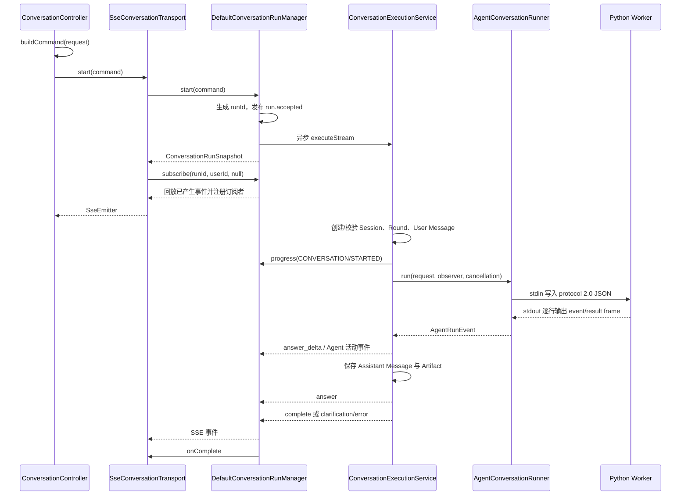
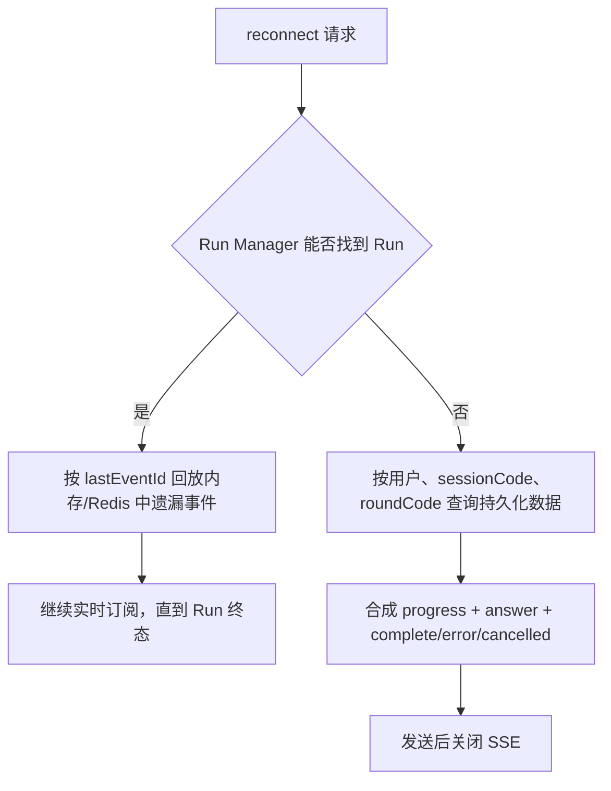

# IConversationController 与 completionsStream 实现说明

> 状态：当前实现说明
>
> 适用接口：`/api/v1/chat/**` 兼容接口、`/api/chat/**` 的 `chat-event.v2` 接口
>
> 最后核对：2026-07-22

## 1. 接口定位

`IConversationController` 定义在 Chat 服务 Web 层，由 `ConversationController` 实现。接口本身只声明 HTTP 契约，实际业务通过
Service、Run Manager 和 SSE Transport 分层完成。

| 接口                                     | Controller 实现       | 核心职责                                  |
|----------------------------------------|---------------------|---------------------------------------|
| `GET /api/v1/chat/models/enable`       | `enabledModels`     | 查询当前启用的模型配置，不返回客户端凭证。                 |
| `POST /api/v1/chat/detail`             | `detail`            | 从登录上下文写入 `userId`，按用户隔离查询会话、轮次、消息与产物。 |
| `POST /api/v1/chat/completions`        | `completions`       | 构造内部 Command，同步执行完整会话链路并返回最终结果。       |
| `POST /api/v1/chat/completions/stream` | `completionsStream` | 构造 Command，创建异步 Run，立即建立 SSE 订阅。      |
| `POST /api/v1/chat/stream/reconnect`   | `reconnectStream`   | 按 `runId` 或会话轮次重新订阅；Run 不存在时回放持久化结果。  |

关键源码：

- `web/.../controller/IConversationController.java`
- `web/.../controller/impl/ConversationController.java`
- `web/.../support/ConversationCommandFactory.java`
- `web/.../transport/sse/SseConversationTransport.java`

## 2. completionsStream 架构

### 2.1 分层职责

```mermaid
flowchart LR
    Client["调用方"] --> Gateway["Gateway / Chat context-path"]
    Gateway --> Controller["ConversationController"]
    Controller --> Factory["ConversationCommandFactory"]
    Controller --> Transport["SseConversationTransport"]
    Transport --> RunManager["ConversationRunManager"]
    RunManager --> Executor["异步 Run Executor"]
    Executor --> Conversation["ConversationExecutionService"]
    Conversation --> AgentRunner["DefaultAgentConversationRunner"]
    AgentRunner --> Provider["AiAgentProvider"]
    Provider --> Process["AiAgentProcessExecutor"]
    Process --> Python["Python OpenAI Agents Worker"]
    Python --> Process
    Process --> Conversation
    Conversation --> RunManager
    RunManager --> Transport
    Transport --> Client
```



各层边界：

- Controller：解析用户身份和 Trace，禁止客户端直接控制 `userId`、模型凭证和运行策略。
- Command Factory：把外部 `ConversationQueryRequest` 转为稳定的 `ConversationQueryCommand`。
- Run Manager：生成 `runId`、异步执行、分配事件序号、缓存最近事件、处理取消与订阅。
- Conversation Execution：创建会话/轮次/用户消息，构造 Agent 输入，保存回答、活动和 Artifact。
- Agent Runtime：解析模型连接、启动 Python Worker、转发 Worker 事件、做 Artifact Acceptance 和审计。
- SSE Transport：只负责将 Run 事件编码为 SSE；它不承担模型调用和业务编排。

### 2.2 为什么先创建 Run 再订阅

`SseConversationTransport.start` 先调用 `runManager.start(command)`，再使用返回的 `runId` 订阅。这样执行生命周期与单次
HTTP 连接解耦：

- 浏览器断线不会自动取消 Agent Run。
- 新连接可携带 `lastEventId` 只回放遗漏事件。
- 取消接口可按 `runId` 中断执行线程和 Python 子进程。
- Local/Redis Coordinator 可以把查找、订阅和取消扩展到多节点。

当前默认运行配置：本地模式、最多缓存 512 个回放事件、终态 Run 保留 30 分钟；可切换 Redis 模式。

## 3. 具体执行流程

### 3.1 请求到内部 Command

兼容接口请求 DTO 只允许以下业务输入：

```json
{
  "sessionCode": "可选，空表示新会话",
  "modelId": 12,
  "message": "分析最近订单量波动",
  "attachments": [],
  "tools": [],
  "ext": {}
}
```

`ConversationCommandFactory.fromLegacy` 补齐：

- `userId`：来自 `SystemContext`，未登录直接失败。
- `traceId`：优先读取 `traceId`、`X-Trace-Id`，否则生成 UUID。
- `scene`：固定为 `ai-chat-query`。
- `businessType`：默认 `CUSTOM`。
- `agentEntryCode`：固定为 `HOME_CHAT`。
- `sessionName`：按用户消息截取前 24 个字符。
- 模型连接：只按 `modelId` 查询服务端启用配置，客户端不能提交 Base URL 或 API Key。

请求中的 `tools` 只是兼容提示，不能扩大 Python Agent Snapshot 已授权的能力。

### 3.2 Run 创建与异步执行



关键顺序：

1. `run.accepted` 在提交异步线程前产生，因此订阅建立较晚也会从 Run 缓存中收到。
2. `run.started` 表示异步任务真正开始执行。
3. `ConversationPreparationService` 校验消息、创建或加载会话、创建轮次并先保存用户消息。
4. 初始化 `progress` 事件首次带回新生成的 `sessionCode` 和 `roundCode`。
5. 历史消息最多取最近 40 条、累计最多 60,000 字符，并排除本轮刚保存的当前用户消息，避免重复。
6. Python 的 `assistant.message.delta` 被统一转成内部 `answer_delta`，并维护当前完整回答快照。
7. 最终结果先保存 Assistant Message、Artifact 和 Agent Snapshot，再发布 `answer`、`complete`。
8. 需要补充输入时发布 `clarification`，不发布成功 `complete`。
9. 异常会把轮次标记为失败、保存失败消息并发布 `error`；Run Manager 随后结束订阅。

当前默认 Confidence Policy 开启了证据优先守卫，Python Root Agent 和被委派 Agent 都会设置
`emit_output_deltas=false`，避免未经守卫校验的草稿直接展示。守卫先复用主 Agent 已取得的授权知识库证据，再按需补检和重新整理回答；证据充分时才执行最终评分。证据不足不会伪造 `0` 分，仍可交付已经完成的回答，但相关事件和 `providerMeta.confidence` 对象都省略数值字段 `confidence`。

因此默认配置下 SSE 仍持续输出 Run、Tool、Skill、Thinking、Confidence 等活动事件，但回答正文通常在守卫完成后通过最终
`answer` 快照一次性到达。`answer_delta` 协议和前端追加逻辑仍然有效，适用于关闭守卫的运行策略、其他 Runtime 或显式产生增量的实现。

## 4. SSE 通信协议

### 4.1 `/completions/stream` 直接协议

响应类型为 `text/event-stream`，每个事件格式如下：

```text
id: 4
event: answer_delta
data: {"protocolVersion":"1.0","runId":"run_xxx","eventId":"4",...}

```

`event:` 与 JSON 中的 `eventType` 相同；无 `eventType` 时 SSE 名称回退为 `message`。主要 Envelope 字段：

| 字段                            | 语义                                            |
|-------------------------------|-----------------------------------------------|
| `protocolVersion`             | 当前为 `1.0`。                                    |
| `runId`                       | HTTP 连接之外稳定存在的运行实例标识。                         |
| `eventId`                     | Run 内单调递增的序号，用于去重和断点续传。                       |
| `timestamp`                   | 后端发布事件的毫秒时间戳。                                 |
| `eventType`                   | 一级事件分发键。                                      |
| `progressType`                | `progress` 的二级分类，如 `PLAN`、`AGENT`、`ACTIVITY`。 |
| `source` / `phase` / `status` | 事件来源、执行阶段和业务状态。                               |
| `requestId`                   | Trace/请求关联标识。                                 |
| `sessionCode` / `roundCode`   | 会话和轮次标识。                                      |
| `delta`                       | 回答增量，只应用于 `answer_delta`。                     |
| `answer`                      | 当前或最终完整回答。                                    |
| `message`                     | 面向展示或诊断的简短信息，不应被当作结构化协议解析。                    |
| `ext`                         | Agent、Tool、Skill、Artifact 等事件的结构化扩展。          |

兼容 Transport 使用无限 `SseEmitter` 超时，但不发送心跳。它适合服务间兼容调用，不是当前浏览器主协议。

### 4.2 当前前端使用的 `chat-event.v2`

当前 `ai-conversation-ui` 使用 `fetch + ReadableStream` POST：

- 新会话：`POST /api/chat/rounds/stream`
- 已有会话：`POST /api/chat/sessions/{sessionCode}/rounds/stream`
- 重连：`POST /api/chat/stream/reconnect`

`ProtocolSseConversationTransport` 订阅相同 Run，但先通过 `ChatTransportProtocolAdapter` 转成：

```json
{
  "eventId": "5",
  "eventType": "assistant.message.delta",
  "schemaVersion": "chat-event.v2",
  "runId": "run_xxx",
  "requestId": "trace_xxx",
  "sessionCode": "session_xxx",
  "roundCode": "round_xxx",
  "timestamp": "2026-07-21T10:00:00Z",
  "payload": {
    "message": {
      "id": "assistant-message-round_xxx",
      "role": "assistant",
      "append": true,
      "content": [
        {
          "type": "text",
          "text": "订单量"
        }
      ]
    }
  }
}
```

新版 Transport 每 15 秒发送 `:heartbeat` 注释；前端 30 秒无任何字节时主动取消 Reader。心跳没有 `data`，不会进入业务事件分发。

## 5. eventType 前后端映射

### 5.1 核心会话事件

| 内部 `eventType`                      | 产生位置/语义                   | `chat-event.v2` 投影                                                                                               | 当前前端处理                                                                                       |
|-------------------------------------|---------------------------|------------------------------------------------------------------------------------------------------------------|----------------------------------------------------------------------------------------------|
| `run.accepted`                      | Run 已创建、尚未保证执行线程开始        | `run.accepted`                                                                                                   | 保存 `runId`，状态设为 `connecting`；若用户已点击停止则立即调用停止接口。                                              |
| `run.started`                       | 异步线程进入执行                  | `run.started`                                                                                                    | 进入 `thinking`，显示“正在思考”。                                                                      |
| `progress` + `CONVERSATION/STARTED` | 会话、轮次、用户消息准备完成            | 依次生成 `session.initialized`、`round.initialized`、`assistant.started`、`thinking.started`；源 `eventId` 分别追加 `.1`～`.4` | Envelope 顶层字段更新路由、会话和轮次；`assistant.started`/`thinking.started` 进入思考态。                        |
| 其他 `progress`                       | 业务进度                      | `thinking.updated`                                                                                               | 保持思考态；若 `progressType=ACTIVITY`，同步活动时间线。                                                     |
| `answer_delta`                      | Python 回答增量               | `assistant.message.delta`，`append=true`                                                                          | 去掉占位文案后追加 `payload.message.content`，状态设为 `streaming`。                                        |
| `answer`                            | 最终回答快照                    | `assistant.message.delta`，`append=false`；适配器在 `ext.codeRef` 存在时会额外生成 `artifacts.build`                           | 用完整快照替换临时回答；Artifact 按 code upsert。当前标准 `answer` 生产者只附带 Agent Trace，通常不触发 `artifacts.build`。 |
| `clarification`                     | Agent Acceptance 要求用户补充输入 | `assistant.input_required`                                                                                       | 展示澄清问题，状态设为 `waiting_input`，输入框重新聚焦。                                                         |
| `error`                             | 会话执行失败的规范终态               | `round.failed`                                                                                                   | 读取结构化 `payload.error`，状态设为 `failed`；错误详情会脱敏并限制长度。                                            |
| `complete`                          | 整轮成功                      | `thinking.completed`、`round.completed`                                                                           | `round.completed` 用最终快照收口，状态设为 `completed`。                                                  |
| `run.cancelled`                     | 主动停止或执行响应取消               | `round.cancelled`                                                                                                | 展示“对话已取消”，状态设为 `cancelled`。                                                                  |

注意：`ConversationEventTypes` 列出的六个业务类型不是线上可能出现的全部值。Run Runtime 和 Python Agent 活动事件会直接进入同一个
`eventType` 字段。

### 5.2 Agent、Tool、Skill 与 Artifact 事件

以下事件默认保持原名称通过 `chat-event.v2`，Payload 由 `source/phase/status/message + ext` 组成：

| 事件族              | 当前可出现的事件                                                                             | 前端行为                                                                           |
|------------------|--------------------------------------------------------------------------------------|--------------------------------------------------------------------------------|
| Agent            | `agent.changed`、`agent.delegated`、`agent.delegation.completed`                       | 转成 `kind=agent` 活动，按 `agentCode` 或活动 ID 更新协作时间线。                               |
| Tool             | `tool.started`、`tool.completed`、`tool.failed`                                        | 转成 `kind=tool`；展示工具名、输入/输出摘要和成功/失败状态。                                          |
| Handoff          | `handoff.requested`、`handoff.completed`                                              | 转成 `kind=handoff` 活动。当前本地定义主要使用 Agent-as-Tool，Handoff 基础设施已存在。                 |
| Skill            | `skill.loaded`                                                                       | 转成 `kind=skill`；展示已按需读取的 Skill 和资源路径。                                          |
| Artifact         | 持久化后的 `artifact.created`、`artifact.repair.requested`；适配器还支持 `artifacts.build`       | `artifact.created` 携带完整可展示记录并实时更新产物列表；Provider 的不完整发现事件不对浏览器暴露。`artifacts.build` 保留兼容。 |
| Acceptance Check | `check.started`、`check.completed`                                                    | 转成 `kind=check`，显示校验状态和摘要。                                                     |
| Thinking         | `thinking.analysis.started/completed`、`thinking.conclusion.completed`                | 后端保留结构化请求分析和结论摘要；事件含 Activity 结构时进入前端思考时间线。                                    |
| Confidence       | `confidence.evidence_check.*`、`confidence.retrieval.*`、`confidence.reanalysis.*`、`confidence.assessment.started/completed/skipped` | 转成思考活动；只有最终 `assessment.completed` 中真实存在数值 `confidence` 时才展示百分比，`assessment.skipped` 保持未评分。 |

Python Worker 的 `round.failed`/`round.cancelled` 也可能先作为通用 Agent 事件透传，随后会话层再发布规范 `error`/
`run.cancelled` 终态。客户端应以结构化终态 Payload 和最终 Run 状态为准，并按 `eventId` 去重。

### 5.3 Confidence 证据检查、评分与跨端透传

Confidence 事件采用“先确认评分条件、后做一次最终评分”的时序：

1. `confidence.evidence_check.started/completed` 检查主 Agent 已取得的知识库证据是否可复用、是否充分。该阶段只输出 `evidenceStatus`、`reusedEvidence`、`evidenceHitCount` 等字段，不输出分数。
2. 证据不足时，按策略发布 `confidence.retrieval.*`，并可发布一次 `confidence.reanalysis.*` 来基于累计证据重新整理回答。这两个阶段也不评分。
3. 证据充分时发布 `confidence.assessment.started`，最终成功才发布 `confidence.assessment.completed`，其中 `scoreStatus=SCORED` 且可包含 `confidence` 和三个评分维度。
4. 非事实型任务、证据不足或最终评分维度不完整时发布 `confidence.assessment.skipped`。`scoreStatus` 为 `NOT_APPLICABLE` 或 `INSUFFICIENT_EVIDENCE`，Payload 不得包含 `confidence`。

常见事件序列：

```text
# 复用主 Agent 的充分证据
confidence.evidence_check.started
confidence.evidence_check.completed
confidence.assessment.started
confidence.assessment.completed

# 补检后仍不具备评分条件
confidence.evidence_check.started
confidence.evidence_check.completed
confidence.retrieval.started
confidence.retrieval.completed
confidence.assessment.skipped
```

`chat-event.v2` 的未评分事件示例（省略与本语义无关的 Trace、Agent 和时间字段）：

```json
{
  "eventId": "18",
  "eventType": "confidence.assessment.skipped",
  "schemaVersion": "chat-event.v2",
  "runId": "run_xxx",
  "sessionCode": "session_xxx",
  "roundCode": "round_xxx",
  "payload": {
    "source": "AI_AGENT",
    "phase": "RUNNING",
    "status": "success",
    "message": "最终可信度评估",
    "activityCode": "confidence-assessment:enterprise-work-assistant",
    "activityType": "CONFIDENCE_ASSESSMENT",
    "confidenceKind": "GROUNDED",
    "scoreStatus": "INSUFFICIENT_EVIDENCE",
    "evidenceHitCount": 0,
    "outputSummary": "最终可信度暂不评分：当前没有足以支持回答事实主张的有效知识证据。"
  }
}
```

这里没有 `confidence` 是协议语义，不是字段丢失。前端只有在 Payload 中读取到 `0..1` 的数值
`confidence` 时才换算成百分比；`assessment.skipped` 只展示未评分原因。

新增事件不需要 Java 专用适配，现有桥接链路是开放扩展结构：

- `AiAgentProvider.toAgentRunEvent` 保留 Python `eventType`，并把任意 `ext` 字段复制到 `AgentRunEvent.ext`。
- `DefaultConversationExecutionServiceImpl.handleAgentEvent` 对回答 Delta 之外的事件按原名称发布，同时把同一份 `ext` 交给 `AgentConversationHistoryRecorder.saveActivity`。
- `AgentConversationHistoryRecorder` 按 `activityCode` 合并 started/completed/skipped 生命周期，并把扩展字段原样合并到 `detailJson`。
- `ChatTransportProtocolAdapter.genericPayload` 对未特殊映射的事件保留原 `eventType`，并把 `ext` 展开到 `chat-event.v2.payload`。

因此 `confidence.evidence_check.*` 和 `confidence.assessment.skipped` 可以直接透传、持久化并由前端消费；Java 不需要增加事件枚举、字段 DTO 或白名单。Java 最终权威事件中的
`execution.result.completed.ext.answerConfidence` 只会复制已经存在的最终数值分数；未评分时该字段同样省略。

## 6. 前端流消费与恢复

前端 `consumeChatTransportStream` 的处理步骤：

1. 读取 `ReadableStream` 字节，使用 UTF-8 Decoder 拼接缓冲区。
2. 以空行切分 SSE Frame，解析 `id:`、`event:` 和多行 `data:`。
3. 优先使用 JSON 的 `eventId`，回退使用 SSE `id`。
4. 通过跨重连共享的 `seenEventIds` 去重。
5. 持续保存 `runId/sessionCode/roundCode/lastEventId`。
6. 只把 `round.completed`、`round.failed`、`round.cancelled`、`assistant.input_required` 视为协议终态。
7. EOF 前未收到终态时抛出 `ChatStreamInterruptedError`，而不是误判成功。
8. 重连仍失败时查询 `/api/chat/runs/{runId}`；若 Run 已结束，再查询会话详情并按稳定编码合并，校准最终持久化状态。

`EventSource` 不适用于这里，因为浏览器原生 `EventSource` 只支持 GET，而当前协议必须 POST JSON 请求体并携带鉴权请求头。

## 7. 重连实现

兼容接口请求：

```json
{
  "runId": "run_xxx",
  "lastEventId": "8",
  "sessionCode": "session_xxx",
  "roundCode": "round_xxx"
}
```

处理分支：



限制与边界：

- 查找和订阅始终校验当前 `userId`，不能重连到其他用户的 Run。
- Local 模式只能在拥有 Run 的节点恢复；Redis Coordinator 用于跨节点查找、发布和取消。
- 兼容 `/api/v1/chat/stream/reconnect` 的持久化回放会发送完整合成快照，不按 `lastEventId` 过滤。
- `chat-event.v2` 使用 `ChatProtocolEventCursor` 处理一个内部事件投影成多个 `.1/.2` 子事件的游标。
- 持久化回放只能恢复初始化、最终回答和终态，不能重建全部 Tool/Skill/Thinking 中间活动；完整活动应从会话详情和活动持久化数据查询。

## 8. 案例分析

### 8.1 新会话正常回答

用户提交“分析最近订单量波动”：

1. 后端返回 `run.accepted`，前端保留临时 Assistant 消息。
2. `run.started` 后进入思考态。
3. `progress(CONVERSATION/STARTED)` 带回新 `sessionCode`，前端把 `/` 路由替换为 `/c/{sessionCode}`。
4. Python Root Agent 及被委派 Agent 分析并执行请求；若调用授权知识库，Emitter 的进程内 Collector 同时保留真实 Tool 证据供对应守卫复用。默认 Confidence Guard 开启时，原始正文 Delta 被抑制，但 Thinking、Tool、Skill 和 Confidence 活动仍持续到达。
5. 守卫先发布 `confidence.evidence_check.*`；证据不足时补检并可重新整理回答，最终发布带 Grounded 分数的 `confidence.assessment.completed`，或发布不含分数的 `confidence.assessment.skipped`。
6. 守卫关闭或其他 Runtime 产生 `assistant.message.delta` 时，会话层将其统一成 `answer_delta`，前端逐段追加。
7. Python 完成守卫流程后，会话层保存最终消息并发布 `answer`；未评分不会阻止已完成回答交付。
8. `complete` 投影成 `thinking.completed` 和 `round.completed`，前端用最终完整内容覆盖临时内容。

这样即使某个 Delta 丢失，最终 `answer`/`round.completed` 快照仍能校正显示内容。

### 8.2 主 Agent 委派数据分析 Agent

当企业工作助手调用 `ask_data_analysis`：

1. Python 发布 `agent.delegated`，前端创建协作 Agent 活动。
2. 子 Agent 延迟构建并通过 SDK `Runner.run_streamed` 执行。
3. 子 Agent 使用 Tool 时产生 `tool.started`、`tool.completed` 或 `tool.failed`。
4. 完成后发布 `agent.delegation.completed`。
5. 主 Agent 核验子 Agent 输出，再形成最终回答；子 Agent 输出不会绕过主 Agent 直接成为会话终态。

### 8.3 网络中断但 Run 仍在执行

假设前端已收到 `eventId=10` 后断网：

1. SSE 订阅被关闭，但 Run 不取消。
2. 前端用同一 `runId` 和 `lastEventId=10` 调用重连接口。
3. Run Manager 从事件队列中发送序号大于 10 的事件，然后继续实时推送。
4. `seenEventIds` 防止边界事件重复应用。
5. 如果终态 Run 已超过保留时间，则走持久化快照回放。

## 9. 异常与安全边界

- 登录身份来自服务端安全上下文，不接受请求体中的用户身份。
- 会话、轮次、Run 查找都按 `userId` 隔离。
- 模型 API Key 只通过子进程环境变量传入，不进入 Worker stdin 或 SSE。
- Python Worker 错误、Gateway 错误和前端详情均对 Bearer Token、`sk-*` Key 等做脱敏。
- Run 缓存有条数与 TTL 限制，不是无限事件日志。
- SSE 断线不是业务取消；只有停止接口或取消信号才终止 Run。
- `message` 是显示/诊断文案；前端业务判断必须使用 `eventType/status/payload/ext`。

## 10. 源码索引

- `app/app-platform-chat/web/src/main/java/ai/platform/aiassit/conversation/controller/IConversationController.java`
- `app/app-platform-chat/web/src/main/java/ai/platform/aiassit/conversation/controller/impl/ConversationController.java`
- `app/app-platform-chat/web/src/main/java/ai/platform/aiassit/conversation/transport/sse/SseConversationTransport.java`
-
`app/app-platform-chat/web/src/main/java/ai/platform/aiassit/conversation/transport/sse/ProtocolSseConversationTransport.java`
- `app/app-platform-chat/web/src/main/java/ai/platform/aiassit/conversation/protocol/ChatTransportProtocolAdapter.java`
-
`app/app-platform-chat/modules/core-conversation-runtime/src/main/java/ai/platform/aiassit/conversation/runtime/impl/DefaultConversationRunManager.java`
-
`app/app-platform-chat/modules/core-ai-chat/src/main/java/ai/platform/aiassit/conversation/service/impl/DefaultConversationExecutionServiceImpl.java`
-
`app/app-platform-chat/modules/core-workflow/src/main/java/ai/platform/aiassit/conversation/workflow/dto/ConversationQueryStreamEvent.java`
- `ai-conversation-ui/src/modules/ai-chat/api/index.ts`
- `ai-conversation-ui/src/modules/ai-chat/views/ChatWorkspaceView.vue`
- `ai-conversation-ui/src/modules/ai-chat/composables/useChatRun.ts`
