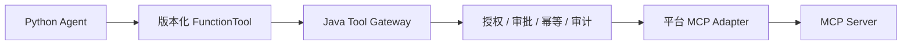

# Python Agent 架构与扩展指南

> 状态：当前实现说明 + 明确标注的演进建议
>
> 运行时：OpenAI Agents Python SDK `0.18.2`、Python `>=3.11`
>
> 最后核对：2026-07-21

## 1. 架构定位

当前 Python Agent 不是一个独立常驻 HTTP 服务，而是 Chat JVM 为每次 Agent 执行启动的本地 Worker 子进程：

```mermaid
flowchart LR
    Conversation["ConversationExecutionService"] --> Runner["DefaultAgentConversationRunner"]
    Runner --> Runtime["AiAgentProvider / AgentRuntime SPI"]
    Runtime --> Process["AiAgentProcessExecutor"]
    Process -->|"stdin: protocol 2.0 JSON"| Worker["agent_provider/main.py"]
    Worker --> Compiler["compile_snapshot"]
    Compiler --> Factory["AgentFactory"]
    Factory --> SDK["OpenAI Agents SDK Runner"]
    SDK -->|"SDK stream events"| Emitter["EventEmitter"]
    Emitter -->|"stdout: JSON Lines"| Process
    Process --> Runner
```



### 1.1 Java 与 Python 的职责分工

| Java Run Plane | Python Agent Plane |
| --- | --- |
| 登录身份、Trace、会话和轮次 | Agent Prompt 和本地 Agent Catalog |
| 模型配置、Base URL、API Key | Agent Graph 编译和循环/深度校验 |
| Run 调度、取消、SSE 与重连 | OpenAI Agents SDK 对话执行 |
| 历史消息、活动、回答、Artifact 持久化 | Agent-as-Tool、Handoff、Tool 调用 |
| 临时平台 Token、Tool/Skill Gateway | Skill 元数据注入与按需加载 |
| Artifact Acceptance、修复轮次、审计 | SDK 事件到平台事件的映射、置信度守卫 |

`DefaultAgentConversationRunner.pythonRuntimeSnapshot()` 只创建 `python-agent-runtime/python-local` 占位 Snapshot。`AiAgentProcessExecutor` 明确写入 `agentDefinitionSource=PYTHON_LOCAL`，Python 编译器随后用本地 Catalog 替换 Java 传入的 Agent 定义。因此当前实现中：

- Java 数据库或 Java Snapshot 不能覆盖 Python Prompt、Tool、Skill 和协作拓扑。
- `agentEntry` 只是 Python Catalog 的入口选择器。
- 未知入口会 fail closed，不会回退到一个宽权限默认 Agent。

## 2. Worker 协议与运行流程

### 2.1 输入

JVM 通过 stdin 一次写入完整 JSON，敏感凭证只放环境变量：

```json
{
  "protocolVersion": "2.0",
  "model": "gpt-model-name",
  "messages": [{"role": "user", "content": "..."}],
  "run": {
    "runId": "agent-run-xxx",
    "requestId": "trace-xxx",
    "sessionCode": "session-xxx",
    "roundCode": "round-xxx",
    "userId": 10001,
    "input": "用户当前问题",
    "context": {
      "agentEntry": "HOME_CHAT",
      "knowledgeBases": []
    },
    "maxTurns": 12,
    "timeoutMs": 120000
  },
  "agentDefinitionSource": "PYTHON_LOCAL",
  "snapshotHash": "python-local",
  "confidencePolicy": {}
}
```

Worker 的主要步骤：

1. `normalize_payload` 兼容旧输入并规范化为协议 2.0。
2. `compile_snapshot` 根据 `agentEntry` 读取 Python 本地 Agent 定义和 Skill Capability。
3. 编译器校验 Agent 数量、引用、Tool、Skill Hash、协作环和最大深度。
4. `AgentFactory` 立即构建 Root Agent；Agent-as-Tool 的专业 Agent 在实际委派时延迟构建。
5. `Runner.run_streamed` 执行并把 SDK 原生事件映射成平台事件。
6. Confidence Guard 对最终回答做评估，必要时检索已授权知识库并重新分析。
7. Worker 输出最终 `result` Frame，JVM 完成 Artifact Acceptance、审计和持久化。

当前 Java 默认下发 `enabled=true`、`scoring.enabled=true`、阈值 `0.9`、最多 3 次重分析的 Confidence Policy。该策略启用时，SDK 原始回答 Delta 不会对外发送；通过守卫后的文本只作为最终 `finalOutput` 返回。这意味着“流式 Agent”默认主要流式呈现执行活动，而不是未经校验的正文 Token。

### 2.2 输出

stdout 是一行一个 JSON Frame：

```json
{"type":"event","eventType":"tool.started","status":"RUNNING","ext":{"callId":"call-1"}}
{"type":"event","eventType":"assistant.message.delta","status":"RUNNING","delta":"分析结果"}
{"type":"result","data":{"status":"SUCCESS","finalOutput":"...","artifacts":[]}}
```

stderr 只用于进程诊断。`AiAgentProcessExecutor` 会并行读取 stdout/stderr，收到 `error` Frame、非零退出码、超时或空结果时终止本轮并生成失败事件。

## 3. Agent 定义与扩展

### 3.1 当前 Agent 模型

`AgentDefinition` 是 Python 本地不可变定义：

```python
AgentDefinition(
    code="data-analysis",
    version=1,
    name="数据分析 Agent",
    description="...",
    prompt="...",
    model_ref="model://default-quality",
    tool_refs=("knowledge_base_search_tool",),
    capabilities=("data-analysis",),
    skill_refs=(),
    agent_tools=(),
)
```

当前 Root 是 `enterprise-work-assistant`，它通过以下 Agent-as-Tool 调用专业 Agent：

- `ask_data_analysis`
- `ask_dashboard_application_builder`
- `ask_document_analysis`
- `ask_knowledge_policy`
- `ask_workflow_forms`

Agent-as-Tool 的子 Agent 延迟创建；Handoff 目标必须在父 Agent 启动前创建。当前本地定义使用 Agent-as-Tool 为主，Handoff 编译和 SDK 接入能力已存在。

### 3.2 新增专业 Agent

推荐步骤：

1. 在 `agent_provider/agents/definitions/` 新建定义文件，完整声明 Prompt、模型引用、Tool、Skill 和能力说明。
2. 在 `definitions/__init__.py` 导出定义。
3. 把定义加入 `agents/catalog.py` 的 `_ROLES`，使 `definition_for` 可以解析。
4. 若由主 Agent 委派，在父 Agent 的 `agent_tools` 中增加 `AgentDelegation`，Tool Name 应稳定且使用 snake_case。
5. 若它是新的直接入口，在 `local_agent_documents` 中增加入口到 Root Code 的映射；不要使用静默默认回退。
6. 增加编译器、Factory 和事件测试，至少覆盖引用解析、实际委派、Tool/Skill 授权和失败路径。

编译期限制：

- Agent Graph 最多 16 个 Agent。
- `maxAgentDepth` 最大为 4。
- Graph 不允许协作环。
- 协作目标必须已经位于本轮冻结 Graph 中。
- `tool_refs` 和 `skill_refs` 默认 required，找不到时 Worker 启动失败。

### 3.3 案例：增加“合同审查 Agent”

```python
CONTRACT_REVIEW_AGENT = AgentDefinition(
    code="contract-review",
    version=1,
    name="合同审查 Agent",
    description="识别合同条款风险并形成审查意见。",
    prompt="只基于用户提供的合同和已授权制度资料审查，不得声称完成法律审批。",
    model_ref="model://default-quality",
    tool_refs=("knowledge_base_search_tool",),
    capabilities=("contract-review", "knowledge-retrieval"),
    skill_refs=("skill://contract-review/v1",),
)
```

还需要把它注册到 Catalog，并在主 Agent 增加指向 `agent://contract-review/v1` 的 `AgentDelegation`。只创建 Python 文件但不注册 Catalog，不会自动获得执行权限。

## 4. Skill 架构与扩展

### 4.1 Skill 包结构

每个内置 Skill 是 `agent_provider/skills/{skill-code}/` 下的版本化资源包：

```text
contract-review/
├── SKILL.md
├── manifest.json
├── references/
│   └── review-rules.md
├── assets/
│   └── output-schema.json
└── scripts/
    └── validate_clause.py
```

`manifest.json` 至少包含：

```json
{
  "code": "contract-review",
  "version": 1,
  "name": "Contract Review",
  "description": "Contract review workflow and resources.",
  "files": [
    {"path": "SKILL.md", "mediaType": "text/markdown"},
    {"path": "references/review-rules.md", "mediaType": "text/markdown"}
  ]
}
```

约束：

- `code` 必须是小写 kebab-case，并与目录名一致。
- `version` 必须是正整数。
- `files` 必须显式列出所有可加载资源，且必须包含 `SKILL.md`。
- Registry 冻结每个文件的 size、SHA-256 和整个 Manifest 的 `contentHash`。
- Skill 目录存在不等于启用；Agent 必须通过 `skill_refs` 显式授权。

### 4.2 渐进加载

编译器只把 Skill 的 `ref/name/description/contentHash` 元数据加入 Agent 指令。模型确有需要时才调用自动注册的 `load_skill_resource`：

1. 校验请求 Skill 是否分配给当前 Agent。
2. 规范化相对路径并阻止 `..`、绝对路径和越界访问。
3. 优先读取内联资源或本地冻结目录，否则调用 Skill Gateway。
4. 校验 Manifest 中的 size 和 checksum。
5. 单个资源最大 256 KiB。
6. 发布 `skill.loaded` 事件用于前端时间线和审计。

`scripts/` 当前只是可加载资源目录。Skill Loader 不会自动执行脚本；如果需要确定性执行，应把逻辑实现为受控 Tool，并对输入、权限、超时和输出做独立校验。

### 4.3 新增 Skill

1. 创建 Skill 目录、`SKILL.md`、`manifest.json` 和必要资源。
2. 在 Manifest 中列全文件，不手工填写 checksum 也可以，由 Registry 冻结时生成。
3. 在目标 `AgentDefinition.skill_refs` 中加入 `skill://{code}/v{version}`。
4. 若发布新版本，新建版本化内容并同步修改引用；不要原地改变旧版本语义。
5. 运行 Skill Registry/Catalog/Loader 测试，覆盖 Hash 不匹配、路径越界、未授权读取和资源过大。

## 5. Tool 架构与扩展

### 5.1 内置 Python Tool

当前内置 Tool 包括：

- `knowledge_base_search_tool`
- `data_preview_query_tool`
- `data_format_validate_tool`
- `render_component_catalog_tool`
- `render_json_validate_tool`
- `web_search_tool`

其中部分 Tool 是纯函数，部分使用本轮 `run` 构建并携带 JVM 签发的临时 Token 调用 Chat 内部接口。

新增内置 Tool 需要同步修改多个注册点：

1. 在 `agent_provider/tools/` 实现 `@function_tool`；若依赖用户/Run 上下文，提供 `build_xxx_tool(run, function_tool)`。
2. 在 `tools/__init__.py` 导出。
3. 在 `AgentFactory` 导入并加入 `_tool_registry`，Run-bound Tool 增加专门构建分支。
4. 在 `compiler/snapshot.py` 的 `BUILTIN_TOOL_NAMES` 增加名称。
5. 在目标 Agent 的 `tool_refs` 中授权。
6. 为成功、参数错误、权限失败、超时、敏感信息脱敏和取消增加测试。

只实现函数而未加入 Compiler Allowlist，`tool_refs` 会在编译期失败；只加入 Registry 但未分配给 Agent，也不会进入 SDK Agent。

### 5.2 平台 Tool Gateway

编译器还支持把冻结 Capability 中的版本化 Tool 转换成动态 `FunctionTool`：

- 支持的类型：`HTTP`、`FUNCTION`、`JAVA_INTERNAL`。
- Runtime Name：`gateway::{code}::v{version}`。
- 调用路径：`/api/v1/ai/tool-gateway/{code}/versions/{version}/invoke`。
- 每次请求携带 `runId`、`snapshotHash`、临时 Bearer Token 和基于参数生成的幂等 Key。
- Gateway 响应必须回显匹配的 `toolCode/toolVersion`，状态只能是 `SUCCESS` 或 `FAILED`。

当前重要限制：`PYTHON_LOCAL` 编译会把 `resolvedCapabilities` 替换为本地 Skill Capability，因此主聊天链路目前不会自动合并 Java 下发的平台 Tool Capability。现阶段主链路扩展应使用 Python 内置 Tool 或显式的 Chat Gateway Builder；若要启用通用平台 Tool，必须先设计“Python 本地 Agent 允许引用哪些冻结平台能力”的合并规则，不能直接放开全部远程 Capability。

## 6. MCP 当前状态与扩展设计

### 6.1 当前实现

当前 Python Agent Runtime **不支持直接 MCP Binding**：

- Snapshot Compiler 将 `MCP`、`HOSTED`、`SCRIPT`、`PYTHON_MODULE`、`JAVASCRIPT_MODULE` 列为不支持的 Binding，并直接抛错。
- `AgentFactory` 没有创建或挂载 MCP Server Client。
- Worker 没有 MCP 连接生命周期、审批、凭证、超时和审计事件映射。

因此仅在 Tool 元数据中增加 `bindingType=MCP` 会导致本轮编译失败；这不是可用的扩展方式。

### 6.2 当前可采用的安全接入方式

建议把 MCP 能力先收敛在平台侧：



Python 只看到版本化 Tool 契约，不直接持有 MCP Server 凭证和任意工具列表。平台负责：

- Server Allowlist 与 Tool Allowlist。
- 用户/租户授权和高风险操作审批。
- 参数 Schema 校验、超时、重试和幂等。
- 访问令牌、Secret Ref 和审计日志。
- 把 MCP 响应归一化为稳定 `SUCCESS/FAILED` Tool Result。

要在当前 `PYTHON_LOCAL` 主链路实际使用这种方式，还需先实现受控的平台 Capability 合并，或提供一个专用内置 Gateway Tool Builder。

### 6.3 若未来支持 Python 直连 MCP

这是演进建议，不是当前能力。至少需要：

1. 定义版本化、可冻结的 MCP Server/Tool Capability，包含 Server Ref、Tool Allowlist、Transport、审批策略和兼容 Runtime。
2. Compiler 只接受明确授权且兼容 `OPENAI_AGENTS_PYTHON` 的 Binding，禁止模型自行发现任意 Server。
3. Factory 使用 SDK MCP 类型创建 Server，并只向指定 Agent 挂载允许的 Tool。
4. 凭证通过环境变量或 Secret Ref 注入，禁止进入 Snapshot、Prompt、stdout 和 SSE。
5. 把连接、列举工具、调用、审批、失败、取消映射为平台 `tool.*`/`mcp.*` 审计事件。
6. Run 结束、超时或取消时关闭 MCP 连接；设置并发、响应大小和资源读取上限。
7. 增加恶意 Tool 描述、Prompt Injection、Schema 变更、越权 Tool、断线和重复调用测试。

## 7. Artifact、校验与修复

Python 最终输出可以包含 `artifacts`。Java 不直接信任这些产物：

1. `DefaultAgentConversationRunner` 调用 `ArtifactAcceptanceService.accept`。
2. 每个检查发布 `check.started`、`check.completed`。
3. 可修复失败发布 `artifact.repair.requested`，把修复说明追加成新一轮 Agent 输入。
4. 最多按 Acceptance Contract 的 `maxRepairAttempts` 重试。
5. 接受后才把 Artifact 交给会话层持久化；需要用户补充时返回 `INPUT_REQUIRED`。

Render JSON Artifact 还会通过 `RenderInternalApi` 保存正式 Render Page 引用。详见 [AI 生成、校验与聊天产物](../render-json/ai-generation-and-validation.md)。

## 8. 扩展检查清单

### Agent

- 定义是否注册到 Catalog，入口或父 Agent 是否显式引用。
- Prompt 是否说明权限、事实来源、写操作确认和禁止虚假成功。
- Graph 是否小于 16 个 Agent、深度不超过 4、无环。
- 子 Agent 输出是否仍由 Root Agent 核验后交付。

### Skill

- `code/version/files` 是否完整且版本稳定。
- `SKILL.md` 是否在 Manifest 中。
- Agent 是否显式分配 Skill。
- 路径、Hash、Size 和未授权读取测试是否齐全。

### Tool

- 是否加入 Compiler Allowlist、Factory Registry 和 Agent `tool_refs`。
- 是否使用最小权限临时 Token，且不把 Secret 写入输入/输出。
- 输入 Schema、输出契约、超时、取消、幂等、错误脱敏是否明确。
- 写操作是否有审批边界。

### MCP

- 当前是否错误地声明了会被 Compiler 拒绝的 `MCP` Binding。
- 是否应先通过 Java Tool Gateway 收敛授权和审计。
- 若要直连，是否已补齐 Server Allowlist、Secret、生命周期、审批和审计设计。

## 9. 源码索引

- `app/app-platform-chat/modules/core-agent-runtime/src/main/java/ai/platform/aiassit/agent/runtime/DefaultAgentConversationRunner.java`
- `app/app-platform-chat/providers/ai-provider-ai-agent/src/main/java/ai/platform/aiassit/service/ai/agent/service/AiAgentProvider.java`
- `app/app-platform-chat/providers/ai-provider-ai-agent/src/main/java/ai/platform/aiassit/service/ai/agent/service/AiAgentProcessExecutor.java`
- `app/app-platform-chat/providers/ai-provider-ai-agent/src/main/python/agent_provider/main.py`
- `app/app-platform-chat/providers/ai-provider-ai-agent/src/main/python/agent_provider/compiler/snapshot.py`
- `app/app-platform-chat/providers/ai-provider-ai-agent/src/main/python/agent_provider/agents/`
- `app/app-platform-chat/providers/ai-provider-ai-agent/src/main/python/agent_provider/skills/`
- `app/app-platform-chat/providers/ai-provider-ai-agent/src/main/python/agent_provider/tools/`
- `app/app-platform-chat/providers/ai-provider-ai-agent/src/main/python/agent_provider/gateway/`
- `app/app-platform-chat/providers/ai-provider-ai-agent/src/main/python/agent_provider/events/emitter.py`
- `app/app-platform-chat/providers/ai-provider-ai-agent/src/main/python/agent_provider/runtime/runner.py`
