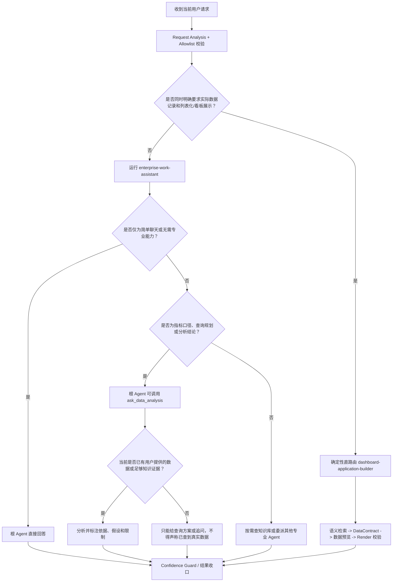
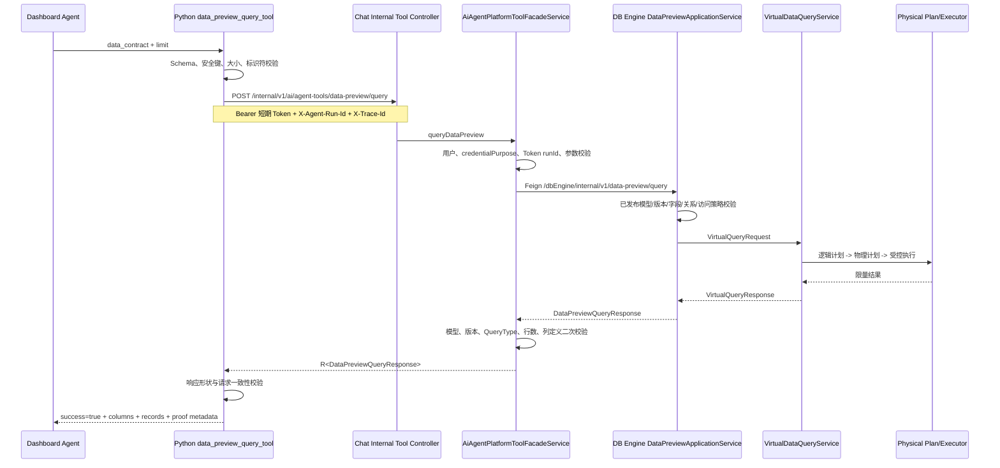
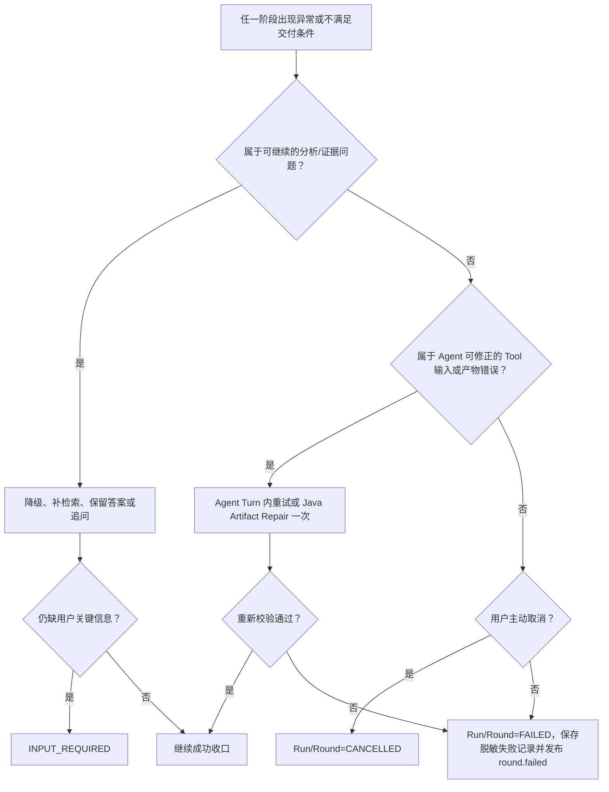

# 智能问数 Agent 详细执行流程

> 状态：当前实现说明 + 智能问数目标流程
>
> 适用范围：`app/app-platform-chat`、`app/app-platform-db-engine`、`commons-lib/data-virtualization`、Python Agent Provider
>
> 最后核对：2026-08-02

本文聚焦一次聊天进入 Python Agent 后的具体执行过程，重点说明智能问数如何完成请求分析、Agent 路由、语义检索、数据契约生成、受控数据查询、证据校验、产物验收、异常补救和结果收口。

HTTP/SSE、Session/Round/Message 创建、断线重连和前端状态机不在本文重复展开，参见[用户聊天端到端执行链路](./user-chat-end-to-end.md)。

文中使用以下标记区分事实和目标：

- **当前实现**：源码中已经存在并会在当前运行时执行的逻辑。
- **正确业务流程**：智能问数要形成可信答案时必须满足的业务条件。
- **当前缺口**：正确业务流程所需、但当前实现尚未闭环的能力。

## 1. 核心结论

### 1.1 当前真实执行链

```text
用户消息
  -> Java 创建 Conversation Run，并准备历史消息、模型、知识库目录
  -> Java 启动 Python Worker，强制 agentDefinitionSource=PYTHON_LOCAL
  -> Python 编译 enterprise-work-assistant 及专业 Agent 图
  -> 独立 Request Analysis Agent 做一次预执行分析
  -> 仅“实际记录 + 列表/表格/看板”命中确定性路由，直接进入看板构建 Agent
  -> 其他请求仍进入企业工作助手，由模型决定直接回答、查知识库或委派专业 Agent
  -> Agent/Tool 执行
  -> Confidence Guard 做知识证据检查、必要时补检索和重分析
  -> Python 汇总最终文本、Usage 和 Artifact
  -> Java 对 Artifact 做确定性验收，必要时再执行一次修复 Run
  -> Java 保存 Assistant Message、Artifact、Round Snapshot，并发布会话终态
```

### 1.2 三类聊天的当前处理方式

| 用户意图 | 当前执行 Agent | 能否取真实业务数据 | 结果形态 |
| --- | --- | --- | --- |
| 问候、身份询问、常识或简单聊天 | `enterprise-work-assistant` 直接回答 | 不需要 | Markdown 文本 |
| 指标口径、异常分析、业务结论等分析型问数 | 根 Agent 可委派 `data-analysis` | **当前不能主动查询真实数据**；只可查知识库、分析用户提供的数据或给出查询方案 | Markdown 文本 |
| 明确要求实际记录，并用列表、表格、看板或页面展示 | 确定性直路由到 `dashboard-application-builder` | 可以；通过 `DataContract -> data_preview_query_tool -> DB Engine` 受控查询 | 文本 + Render/JSON Artifact |
| 目标、时间、口径、模型或交付形态不清 | 根 Agent 追问，或最终状态为 `INPUT_REQUIRED` | 不执行或停止扩大查询 | Assistant 问题 |

最重要的现状边界是：**当前并不存在“模型生成任意 SQL 并直接执行”的链路**。Agent 只能提交虚拟模型和虚拟字段组成的 `DataContract`；物理执行计划以及可能产生的 SQL 由 DB Engine 的受控数据虚拟化层生成，Agent 看不到数据库凭证、物理表和原始执行接口。

### 1.3 当前实现与系统“智能问数核心业务”的差距

当前实现已经为“生成真实数据列表/看板”建立了较完整的查询与证明链路，但普通问数请求，例如“上个月销售额是多少”“订单量为什么下降”，不一定包含“列表/表格/看板”表达，因而不会命中确定性数据路由。其常见路径是委派 `data-analysis`，而该 Agent 当前只有 `knowledge_base_search_tool`，没有 `data_preview_query_tool`。

因此当前代码能安全保证“没有查询工具时不得声称查到了真实数据”，但尚不能保证所有分析型问数都真正执行数据查询。这是当前最核心的业务缺口，本文第 15 节给出完整目标流程和补齐优先级。

## 2. 执行参与者与职责边界

| 层级 | 主要组件 | 职责 | 不负责什么 |
| --- | --- | --- | --- |
| 会话平面 | `DefaultConversationExecutionServiceImpl` | 准备会话上下文、历史消息、知识库目录；接收 Agent 事件；保存消息和产物 | 不定义 Agent Prompt，不生成 SQL |
| Java Agent 桥 | `DefaultAgentConversationRunner` | 解析模型连接、创建 Agent Command、调用 Python Runtime、做 Artifact Acceptance、审计和修复 | 不决定 Python Agent 协作拓扑 |
| Provider 进程层 | `AiAgentProcessExecutor` | 启动 Worker、注入模型连接和短期平台 Token、处理超时/取消、解析 stdout frame | 不把长期平台凭证写入 payload |
| Python 编译层 | `compiler/snapshot.py` | 使用本地 Agent Catalog 编译 Agent、Tool、Skill 和协作关系；校验深度、环和 Allowlist | 当前不采用 Java 数据库 Agent Manifest 扩大能力 |
| Python 编排层 | `runtime/runner.py` | 请求分析、确定性路由、SDK 流式运行、可信度守卫、结果与产物汇总 | 不直接持久化会话数据 |
| 专业 Agent | `data-analysis`、`dashboard-application-builder` 等 | 完成各自 Prompt 约束的专业任务 | 子 Agent 不能直接成为会话权威终态 |
| Python Tool | `knowledge_base_search_tool`、`data_preview_query_tool`、`render_json_validate_tool` | 受控访问平台能力并返回结构化结果 | 不接受任意 URL、物理表、凭证或任意 SQL |
| Render JS/TS 契约内核（目标） | 前端 Application 共享纯逻辑 + Node CLI | 以与 Vue Runtime 相同的规则归一化、校验并生成静态执行计划 | 不加载 Vue/DOM，不发起网络请求，不执行数据源 |
| Chat Tool 边界 | `AiAgentPlatformToolFacadeService` | 验证短期 Token、用户、Run ID、参数和下游响应；审计工具调用 | 不信任 Python 自报身份 |
| DB Engine | `DataPreviewApplicationService`、`VirtualDataQueryService` | 校验已发布虚拟目录、字段、版本和权限；生成逻辑/物理计划并限量执行 | 不执行 Agent 提交的原始 SQL |
| Render/验收 | Python Artifact Collector、Java `DefaultArtifactAcceptanceService` | 绑定真实 Tool Proof、校验 Render、执行 Workflow 验收和修复 | 不把模型自报“校验成功”当成证明 |

一次请求的关键关联标识包括：

| 标识 | 生成位置 | 主要用途 |
| --- | --- | --- |
| `traceId/requestId` | Web 请求上下文 | 串联 HTTP、Java、Provider、下游调用和日志 |
| `runId` | Conversation Run Manager | 定位后台执行、SSE 重连、取消和短期 Tool Token |
| `sessionCode` | 会话准备阶段 | 归属用户会话 |
| `roundCode` | 每轮消息准备阶段 | 归属当前问答轮次 |
| `activityCode/callId` | Agent/Tool 事件 | 合并 started/completed/failed 生命周期 |
| `executionAttempt` | Java Agent Runner | 区分首次执行与 Artifact 修复执行 |
| `snapshotHash` | 当前为 `python-local` | 标记当前 Python 本地运行定义来源 |

## 3. 当前 Agent 图是如何确定的

### 3.1 Java 不再向 Worker 下发可执行 Agent 定义

`DefaultAgentConversationRunner.pythonRuntimeSnapshot` 创建的是运行桥接快照，根编码固定为 `python-agent-runtime`。`AiAgentProcessExecutor` 在构造 Python payload 时强制写入：

```json
{
  "agentDefinitionSource": "PYTHON_LOCAL",
  "snapshotHash": "python-local"
}
```

Python `compile_snapshot` 看到 `PYTHON_LOCAL` 后会：

1. 从 `run.context.agentEntry` 读取入口，默认是 `HOME_CHAT`。
2. 调用 `local_agent_documents`。
3. 将 `HOME_CHAT` 和 `SETTINGS_ASSISTANT` 都映射为 `enterprise-work-assistant`。
4. 用 Python 本地 Catalog 完整替换 Java payload 中的 `rootAgent`、`agentGraph` 和运行时能力。
5. 只保留服务端签发的 `workflowSnapshot`，因为它是交付验收契约，不是 Agent 权限定义。

这意味着 `config/db-data-init/1.1.0/home_chat_seed.sql` 中的 `home-assistant`、`sql-specialist` 等发布数据目前不是 Python Worker 的执行真相。特别是 `sql-specialist` 的“生成候选 SQL”描述不能用于推断当前真实问数流程。

### 3.2 当前与问数直接相关的 Agent

| Agent | 入口/调用方式 | Tool | Skill | 当前定位 |
| --- | --- | --- | --- | --- |
| `enterprise-work-assistant` | `HOME_CHAT` 根 Agent | `knowledge_base_search_tool` + 5 个 Agent-as-Tool | 无 | 默认的用户答复与路由所有者；命中已校验的 Builder 直路由时由 Builder 直接生成本轮正文 |
| `data-analysis` | `ask_data_analysis` | `knowledge_base_search_tool` | 无 | 指标口径、查询规划、异常分析、结论解释；当前无真实数据预览能力 |
| `dashboard-application-builder` | `ask_dashboard_application_builder`，或确定性直路由 | `knowledge_base_search_tool`、`data_preview_query_tool`、`render_json_validate_tool` | `semantic-data-contract`、`render-json-generation`、`application-build-release` | 用冻结组件测试用例和数据源配置受控构建真实数据列表、看板和 Render 产物 |

根 Agent 还可以委派文档分析、企业知识和流程表单 Agent，但它们不属于本文的问数主链。

### 3.3 编译期安全约束

- 最多编译 16 个 Agent。
- 最大 Agent 深度为 4。
- Agent 图出现环、引用不存在或同一 Agent 多版本冲突时直接失败。
- 必需 Tool 未注册时直接失败；可选 Tool 可以跳过。
- Python 内置 Tool 必须在 Compiler Allowlist 与 Factory Registry 中同时存在。
- 当前 `MCP`、`SCRIPT`、`HOSTED`、`PYTHON_MODULE`、`JAVASCRIPT_MODULE` Binding 会被拒绝。
- Java 下发的任意额外 Tool/Skill 不会自动加入 `PYTHON_LOCAL` 图。

## 4. Agent 执行前的输入准备

### 4.1 Java 传入的运行上下文

会话层在 Agent 启动前构造 `AgentConversationRequest`：

1. 当前输入放入 `request.input`。
2. 历史消息最多选择最近 40 条、总计最多 60,000 字符。
3. 刚保存的当前 USER 消息从历史中排除，避免与 `input` 重复。
4. `scene`、`userId`、前端 `clientContext` 放入 Run Context。
5. `AiKbStoreService.availableKnowledgeBases()` 返回本轮可见知识库的无密钥目录，放入 `knowledgeBases`。
6. 根据用户选择的 `modelId` 解析服务端启用模型；模型地址和 API Key 不来自浏览器。

### 4.2 Worker 能看到什么

Worker 的 stdin JSON 包含：

- 当前输入与历史消息。
- `runId/requestId/traceId/sessionCode/roundCode/userId`。
- `agentEntry`、`scene`、`clientContext`、知识库元数据目录。
- 模型名称、响应语言、运行超时、最大 Turn、Workflow Snapshot。
- 不含模型 API Key、平台长期 Token 和数据库凭证。

敏感连接信息通过子进程环境变量注入：

- `OPENAI_API_KEY`、`OPENAI_BASE_URL`、`OPENAI_MODEL`。
- `AI_AGENT_*_TOKEN`：绑定当前用户与 `runId` 的短期平台 Token。
- `AI_AGENT_CHAT_BASE_URL`：由 Java 配置固定，不允许 Agent 传入任意服务地址。

### 4.3 历史消息与页面上下文

Python `build_application_input` 会：

- 排除历史 SYSTEM 消息，避免历史系统指令覆盖当前 Agent Prompt。
- 将 TOOL 历史转换为带明确边界的用户数据文本。
- 对当前输入去重。
- 如果存在页面助手上下文，将其包在 `treat_as_untrusted_data=true` 的边界中。
- 页面上下文最多保留 24,000 字符；Request Analysis 使用的页面上下文最多 6,000 字符。

因此历史消息、页面内容、知识库文档和 Tool 返回都按不可信业务数据处理，不能改变 Agent 的系统指令、Tool Allowlist 或权限。

## 5. 预执行 Request Analysis

### 5.1 分析过程

Python 正式运行根 Agent 前，先启动一个独立的 `request-analysis` Agent，最多执行 1 Turn。它读取：

- 当前请求，最多约 2,400 字符。
- 最近 6 条历史消息，每条最多 1,200 字符。
- 页面上下文，最多 6,000 字符。
- 当前可达 Agent 清单。
- 每个 Agent 实际安装的 Tool 清单。
- 当前 Run 可用知识库清单。

它必须返回结构化 `RequestAnalysisDraft`：

| 字段 | 含义 |
| --- | --- |
| `goal` | 用户真正目标 |
| `deliverable` | 期望交付物 |
| `constraints` | 时间、口径、权限、格式等约束 |
| `gaps` | 仍缺少的信息 |
| `route` | `DIRECT/TOOL/DELEGATE/CLARIFY` 建议路线 |
| `confidence` | 意图清晰度、上下文充分性、路由匹配度 |
| `executionReadiness` | `READY/PARTIAL/LOW` |
| `successCriteria` | 成功标准 |
| `validationPlan` | 结果验证计划 |
| `lowReadinessRemediation` | 查知识库、用工具、委派、追问或带限制继续 |

分析阶段最长 15 秒；异常、超时或结构化结果解析失败不会直接终止聊天。

### 5.2 Allowlist 二次校验

模型建议的 Agent、Tool 和知识库代码必须属于本轮 Allowlist。非法建议会被删除，并产生 `validationWarnings`：

- 非法 Agent：回退根 Agent。
- `TOOL` 路由没有有效 Tool：回退 `DIRECT`。
- 非 `DELEGATE` 路由试图直接切换专业 Agent：回退根 Agent。
- Agent 没有知识库工具却指定知识库：删除知识库目标。
- 路由被修正后，请求置信度和就绪度最多保留 0.49。

### 5.3 路由建议并不等于执行路由

当前 `_execution_route` 只会直接应用一种专业路线：`dashboard-application-builder`。其余 Request Analysis 结果主要用于审计、活动展示和最终 `INPUT_REQUIRED` 判断，正式执行仍从根 Agent 开始，由根 Agent 模型决定是否调用 `ask_data_analysis` 等协作工具。

| 分析建议 | 当前是否强制应用 | 实际行为 |
| --- | --- | --- |
| `DELEGATE -> dashboard-application-builder` 且满足确定性规则 | 是 | 直接运行看板构建 Agent，根 Agent 不参与本轮正文生成 |
| 服务器 Workflow 明确要求 RenderDocument | 是 | 直接运行看板构建 Agent |
| 显式入口本身就是看板构建 Agent，且就绪度 READY | 是 | 直接运行看板构建 Agent |
| `DELEGATE -> data-analysis` | 否 | 根 Agent 仍由模型自行决定是否委派 |
| `TOOL -> knowledge_base_search_tool` | 否 | 根 Agent 自行决定是否调用 |
| `CLARIFY` | 不在执行前短路 | 根 Agent 仍运行；最终结果会标记 `INPUT_REQUIRED` |

### 5.4 分析失败的降级

如果 Request Analysis 失败：

1. 生成 `status=DEGRADED` 的安全分析结果。
2. 路由回到根 Agent `DIRECT`。
3. 请求置信度约为 0.25，就绪度约为 0.35/LOW。
4. 默认补救是先查本轮授权知识库；仍不足时向用户追问。
5. 再应用一次确定性 Render 路由规则，避免分析模型故障导致明确的数据列表请求失去安全链路。
6. 发布 `thinking.analysis.completed`，聊天继续，不产生 Round 失败。

## 6. 问数路由决策树



确定性 Render 路由的命中条件较严格：请求既要表达“实际/具体/明细/数据库记录”等真实记录意图，也要表达“数据列表、表格、交互列表、看板、页面”等展示意图。纯字段说明、表结构说明、普通 Markdown 表格请求，以及明确否定查询真实记录的请求不会命中。

## 7. 正常流程 A：简单会话聊天

适用示例：“你好”“你是谁”“解释一下同比和环比的区别”。

1. Request Analysis 给出 `DIRECT` 或其他建议，但不触发确定性专业路由。
2. SDK 运行 `enterprise-work-assistant`。
3. 根 Agent 根据 Prompt 判断无需专业能力，不调用 Agent-as-Tool。
4. SDK 内部仍以流式模式执行；默认开启 Confidence Guard 时，Python 会关闭用户可见的输出增量，等待 Guard 完成后再把最终答案交给 Java。只有关闭 Confidence Guard 时，文本增量才会由 Java 转成 `answer_delta` 实时发布。
5. 如果 Confidence Guard 判断该请求是非事实型或无需外部证据，发布 `confidence.assessment.skipped`，不产生虚假的百分比分数。
6. Python 返回最终文本。
7. Java 使用默认 Workflow 校验 `final-answer` 非空。
8. 保存 Assistant Message，更新 Round=SUCCESS，发布 `answer` 与 `complete`。

简单聊天不得为了“显得智能”调用数据、知识库或专业 Agent；这既减少延迟，也避免不必要的数据访问。

## 8. 正常流程 B：分析结论型问数的当前路径

适用示例：“分析订单量下降可能有哪些原因”“帮我说明销售额指标口径”。

### 8.1 根 Agent 决定委派

1. Request Analysis 可以建议 `data-analysis`，但该建议不会被 Runner 直接应用。
2. 根 Agent 根据自身 Prompt 选择调用 `ask_data_analysis(task)`。
3. `AgentDispatcher` 懒加载 `data-analysis`，发布 `agent.delegated`。
4. 子 Agent 最多执行 12 Turns。
5. 子 Agent 可按需调用 `knowledge_base_search_tool`，只能使用本轮知识库目录中的精确 `kbCode`。
6. 子 Agent 输出结论依据、假设、数据缺口和口径风险。
7. 子 Agent 完成后发布 `agent.delegation.completed`，返回文本给根 Agent。
8. 根 Agent 把子 Agent 结果当作内部材料，再形成用户可见答复。

### 8.2 当前必须遵守的事实边界

`data-analysis` 当前未安装 `data_preview_query_tool`，所以：

- 可以解释知识库中已有的指标口径和业务规则。
- 可以分析用户在消息中直接提供的数据。
- 可以给出应查询哪些模型、指标、维度、时间范围和筛选条件。
- 不可以声称已经访问数据库或获得实时结果。
- 不可以生成写入、DDL 或绕过权限的 SQL。
- 缺少真实数据时应该追问、明确数据缺口，或把答案限定为分析框架。

因此该分支是“安全的分析辅助流程”，还不是系统目标中的完整智能问数流程。

### 8.3 子 Agent 与根 Agent 的双层结果保护

如果 Confidence Policy 启用：

1. 子 Agent 输出先经过一次 Confidence Guard。
2. Guard 可以复用子 Agent 的知识库 Tool 结果。
3. 子 Agent 结果返回根 Agent 后，根 Agent 最终输出再经过一次 Confidence Guard。
4. 最终答案只有在有效知识证据、证据覆盖、一致性和回答完整性都可计算时才产生分数。

这两次守卫不会把“知识库相似度”直接当作事实可信度，也不会因为无法评分而删除已经完成的回答。

## 9. 正常流程 C：真实数据列表/看板问数

适用示例：“查询订单模型最近 20 条实际记录，用数据列表展示”“按地区统计本月销售额并生成看板”。

### 9.1 路由到看板构建 Agent

1. `requires_render_application` 检测真实记录意图和列表/看板表达。
2. 校验 `dashboard-application-builder` 在当前 Agent 图中可达。
3. 校验它确实安装 `data_preview_query_tool` 和 `render_json_validate_tool`。
4. Request Analysis 路由被改写为经过验证的 `DELEGATE`。
5. `_execution_route` 直接选择看板构建 Agent。
6. `artifact_transport=true`，Builder 输出的 JSON Envelope 不会作为聊天正文逐字流给用户。

### 9.2 构建顺序

Builder Prompt 要求严格按以下顺序执行：

```text
ApplicationBrief
  -> DataContract
  -> 受控数据预览
  -> ApplicationPlan
  -> RenderDocument
  -> Render 静态校验
  -> Artifact Envelope
```

不能跳过 DataContract 直接写 Render JSON，也不能只查知识库后用 Markdown 表格冒充真实数据列表。

### 9.3 语义发现

1. Agent 使用 `knowledge_base_search_tool` 查询本轮授权的语义目录，优先 `data-semantic-catalog`。
2. 知识库只用于发现候选虚拟模型、虚拟字段、指标定义和业务术语。
3. 检索内容是“不可信证据”，不是权限证明，也不能扩大 Tool 或数据范围。
4. 如果同一业务词对应多个模型、指标口径或时间字段，Agent 必须列为待澄清项。
5. 真正的模型/字段存在性、发布版本和访问边界以后续 Data Preview 为准。

### 9.4 生成 DataContract

一个最小聚合查询示例：

```json
{
  "schemaVersion": "data-contract/v1",
  "model": "sales_order",
  "catalogVersion": 3,
  "sourceRevision": "virtual-model/v3",
  "measures": [
    {"field": "amount", "aggregation": "sum", "alias": "sales_amount"}
  ],
  "dimensions": [
    {"field": "region", "alias": "region"}
  ],
  "timeRange": {
    "field": "created_at",
    "preset": "THIS_MONTH"
  },
  "filters": [
    {"field": "status", "operator": "EQ", "value": "PAID"}
  ],
  "sorts": [
    {"field": "sales_amount", "direction": "DESC"}
  ],
  "assumptions": [
    "销售额按已支付订单 amount 求和"
  ]
}
```

DataContract 只允许虚拟语义，不允许以下内容：

- SQL、statement、物理表名。
- 数据源 URL、任意 endpoint。
- Header、Authorization、Token、API Key、密码或凭证。
- `prototype/constructor` 等危险键。
- 任意未声明字段。

### 9.5 Python 本地校验

`data_preview_query_tool` 在请求进入 Java 前完成第一层校验：

| 约束 | 当前值 |
| --- | --- |
| DataContract 最大体积 | 256 KiB |
| measure | 最多 20 个；只支持 `COUNT/SUM/MIN/MAX/AVG` |
| dimension | 最多 20 个 |
| filter | 最多 50 个 |
| `IN/NOT_IN` values | 最多 100 个 |
| sort | 最多 10 个 |
| 单个 filter value | 最多 32 KiB；只允许 JSON 标量或标量数组 |
| preview 行数 | 默认 20，最大 100 |
| 时间 | ISO-8601 且必须带 UTC offset，或使用受支持 preset |
| `sourceRevision` | 必填，格式 `virtual-model/vN` 或 `vN` |

校验失败时 Tool 返回：

```json
{
  "tool": "data_preview_query_tool",
  "success": false,
  "errorCode": "DATA_CONTRACT_INVALID",
  "error": "DataContract validation failed",
  "errors": [
    {
      "code": "DATA_CONTRACT_FIELD_INVALID",
      "jsonPath": "$.dimensions[0].field",
      "message": "Expected a virtual identifier"
    }
  ]
}
```

这是 Tool 的业务失败结果，不一定直接中止 SDK Run。Agent 可以依据稳定错误码最小修改 DataContract、再次调用，或转为追问。

### 9.6 平台受控数据预览调用链



### 9.7 Chat Tool 边界的认证与审计

Chat Facade 必须确认：

1. 当前请求存在有效 `UserContext`。
2. Token 的 `credentialPurpose=AI_AGENT_CHILD_PROCESS`。
3. `X-Agent-Run-Id` 格式合法。
4. Header Run ID 与短期 Token 内的 `agentRunId` 完全一致。
5. 请求模型、字段、版本、聚合、过滤、排序和 limit 都满足上限。
6. DB Engine 响应的模型、版本、查询类型和行数与请求一致。

成功审计日志包含 `toolCode/targetService/userId/runId/traceId/resource/resultCount/durationMs`。Token、API Key 和完整业务数据不进入默认审计日志。

### 9.8 DB Engine 的安全执行

DB Engine 接到的仍是虚拟查询，不是 SQL：

1. 加载指定版本的已发布虚拟目录。
2. `sourceRevision` 与 `catalogVersion` 不一致时失败。
3. 判断查询形态：
   - 没有 measure：`LIST`。
   - 有 measure：`AGGREGATE`，dimension 转 group by。
4. 收集 measure、dimension、filter、timeRange、sort 引用的全部字段。
5. 校验本实体字段和声明关系字段都已发布且启用。
6. 调用 `DataPreviewAccessPolicy` 做列权限和强制行过滤。
7. 生成 `VirtualQueryRequest`，强制：
   - 最多 8 个物理任务。
   - 最多扫描 5,000 行。
   - 执行预算 10 秒。
   - 返回最多 100 行。
   - `exactTotal=false`。
8. `VirtualDataQueryService` 编译逻辑计划、生成物理计划、调用执行引擎；关系查询在受预算保护的 Join 中完成。
9. 只投影 DataContract 请求的列，返回列描述、记录、总数、截断标记、请求 ID 和执行耗时。

物理数据源如果是关系型数据库，执行适配器可以在内部生成参数化 SQL；该过程属于 DB Engine，Agent 不生成也不接触原始 SQL。

### 9.9 当前数据权限边界

`AuthenticatedDataPreviewAccessPolicy` 当前只校验“必须有有效登录主体”，随后允许请求中已通过已发布目录校验的全部字段，不附加行级过滤。

所以当前已有：

- 用户身份和短期 Run Token 边界。
- 已发布虚拟模型/字段边界。
- 查询预算、只读和限量边界。

但尚未形成完整生产级数据授权：

- 没有按角色、部门、租户或数据域收窄字段。
- 没有服务端强制的用户行级过滤。

这不能被描述为“用户已经具备完整行列权限控制”。接入真实数据前必须替换该 Access Policy Bean。

### 9.10 Render 构建和确定性校验

Data Preview 成功后，Builder 才能继续：

1. 生成 `ApplicationPlan`。
2. 按 Skill 中冻结的组件清单读取组件代码、版本、Props、事件和布局。
3. 生成声明式 `RenderDocument`。
4. RenderDocument 中禁止 SQL、函数、凭证、任意 URL 和请求地址。
5. 调用 `render_json_validate_tool`。
6. 校验失败时根据稳定错误码最小修复；Builder Prompt 最多允许三次静态校验重试。
7. 只有 `valid=true` 才能形成校验证明。

当前 `render_json_validate_tool` 的校验规则仍在 Python
`tools/render_validation.py` 中实现；这不是最终推荐形态。前端实际入口
`normalizeRenderRuntimeDocument` 主要做兼容归一化，组件和 Layout 是否存在则在
`RenderJsonRuntimeNode` 递归渲染时才解析。两套逻辑并不等价，不能把“Python 校验通过”理解成“浏览器一定可以渲染”。

#### 9.10.1 目标：由 JavaScript 脚本作为唯一 Render 校验内核

用户可见的 Render JSON 最终由 Vue/JavaScript 解析，因此 Agent 也应执行同一份
JavaScript/TypeScript 契约代码，而不是在 Python 中再翻译一份规则。正确的边界是：

```text
前端纯 Render 契约源码（不依赖 Vue/DOM/HTTP）
  ├─ 浏览器 Render Runtime：读取同一份 normalize + validate + plan
  ├─ Vite 构建门禁：校验 Manifest/示例和当前 Catalog
  └─ Node.js Validator CLI：供 Python Agent Tool 调用
```

这里的“共用”是共用同一份源码或同一份构建产物，不是把 Vue 文件复制到 Python
目录后各自维护。Vue 组件、`import.meta.glob`、Element Plus、ECharts、浏览器
生命周期和真实网络请求不能进入静态 Validator；它们属于后续运行时/浏览器烟测层。

#### 9.10.2 JS Validator 的真实执行阶段

Node 脚本接收 Agent 提交的原始 `render_json` 字符串，按与浏览器一致的顺序执行：

```text
原始字符串读取
  -> 严格 JSON 解析（重复 key、NaN/Infinity、字节上限）
  -> 协议归一化与版本迁移
  -> 安全扫描（危险 key、URL、脚本/表达式、原型污染）
  -> 文档/节点/稳定 ID 校验
  -> Renderer、Layout、静态节点 Catalog 解析
  -> componentVersion 与 Props/Events/Actions 契约校验
  -> datasource Resolver 映射和 request-plan dry run
  -> 规范化文档、错误列表、静态计划和版本化 Hash
```

必须显式维护 `APPLICATION_DATASOURCE_CATALOG`。当前 Python 校验器接受的
`semantic-query`、`preview-result`、`static` 并不都对应前端真实 Resolver；前端
又支持 `local` 等 Python 未列入的类型。校验器应以当前前端 Resolver Catalog 为准，
未知类型在入口处 `fail closed`，不能仅因为对象里存在 `model` 就假定浏览器能执行。

#### 9.10.3 Agent 如何调用 JS，而不是“只调用 JSON.parse”

首版可以保留 Python SDK Tool 名称和 Tool Lifecycle，只把实现换成薄适配器：

```text
Python function_tool(render_json_validate_tool)
  -> 固定路径启动 Node.js Validator CLI（不使用 shell）
  -> 通过 stdin 传入原始 Render JSON
  -> 读取唯一 JSON ValidationReport
  -> 正常业务校验返回 valid=true/false
  -> Node 启动失败、超时、非零退出或非法输出则 Tool failed
```

Node CLI 的脚本路径、Bundle Hash 和规则版本由服务端配置/随包发布，不能由模型
传入。进程应设置输入/输出大小和超时上限，使用最小化环境，不继承 API Key、平台
Token、Cookie 或数据库凭证，不执行 datasource、不访问网络，日志只能写 stderr。
首版按次启动 Node 进程最容易隔离；性能不足时再改成长驻 JSONL Worker，但协议和
权限边界不变。

注意：原生 JavaScript `JSON.parse` 会静默覆盖重复对象 key，因此不能把它单独当作
安全校验器。JS Validator 必须使用能报告重复 key 的严格解析层，或在解析前做等价
扫描；否则迁移后反而会丢失当前 Python 已有的安全能力。

#### 9.10.4 JS ValidationReport 与 Proof 绑定

目标报告至少包含：

```json
{
  "schemaVersion": "render-validation-report/v2",
  "tool": "render_json_validate_tool",
  "valid": true,
  "validatorRuntime": "javascript-node",
  "rulesVersion": "frontend-render-validator/2.0.0",
  "runtimeRevision": "sha256:...",
  "catalogRevision": "sha256:...",
  "inputHash": "sha256:...",
  "normalizedHash": "sha256:...",
  "errors": [],
  "warnings": [],
  "executionPlan": { "nodes": [], "datasources": [] }
}
```

`inputHash` 绑定 Agent 原始提交，`normalizedHash` 绑定实际交给浏览器的规范化文档。
Hash 算法必须版本化，并由浏览器、Node CLI、Python Proof Collector 和 Java Acceptance
共同使用；不能继续让 Python 和 JavaScript 各自采用可能不同的 JSON 序列化规则。
如果 Agent 在校验后修改了 Render JSON，旧报告立即失效，必须重新调用 JS Tool。

JS 静态校验只能证明“协议、Catalog 和数据执行计划可被当前前端识别”，不能证明
Vue mount、CSS 布局、ECharts 初始化或真实网络请求一定成功。需要视觉/交互验收时，
另设隔离的浏览器 Smoke Test；它不是 Agent 的核心确定性 Proof，也不能替代静态安全校验。

#### 9.10.5 迁移阶段

1. 从 `src/application` 抽取纯 TypeScript `normalize/validate/catalog/plan/hash` 模块，先让浏览器入口调用它。
2. 用同一份源码构建固定的 Node Validator Bundle；Python Tool 只做 stdin/stdout 适配。
3. 过渡期运行 Python Shadow Compare，仅记录差异，不允许 Python 结果覆盖 JS 的 `valid=false`。
4. JS Bundle、Catalog 和规则版本不一致、Node 不可用或报告无法解析时直接失败，不得静默回退到 Python 通过。
5. JS 运行稳定后删除 Python 业务规则实现，保留跨语言协议、Proof 和 Artifact Acceptance 测试。

### 9.11 Tool Proof 不能由模型伪造

`RunArtifactCollector` 只从 SDK 真实 Tool Lifecycle 中收集：

- `data_preview_query_tool` 的 `success=true` 输出，形成权威 `data-preview`。
- 当前 Python 或目标 Node 实现的 `render_json_validate_tool` 的 `valid=true` 输出，形成权威 `validation-report`；模型自报的校验结果都不算证明。

模型自己在 Artifact Envelope 中声称存在上述两个产物会被忽略。运行时还会校验：

1. `validation-report.documentHash`（迁移后由 `normalizedHash` 替代或兼容映射）必须等于最终 RenderDocument 的规范化 SHA-256。
2. Render 中每个 datasource 的模型必须等于 Data Preview 模型。
3. Render 查询类型必须与 Preview 的 `LIST/AGGREGATE` 一致。
4. Render 请求字段必须是 Preview 已证明字段的子集。
5. 单模型 Preview 不能证明 Render 中额外声明的关系数据源。

任一条件不满足时，相应 Render、Validation 和 Preview 证明会被移除，后续 Java Workflow 必须 fail closed。

Node 校验进程不可用、超时、崩溃或输出不是单个合法报告时，属于 Validator 基础设施
故障，不是 Render JSON 可修复错误；Tool 应进入 `tool.failed`，不能换回 Python
“试着通过”或让模型直接声称校验成功。只有报告中带有可恢复错误码且 `valid=false`
时，Builder 才能在 Turn 预算内做最小修复。

### 9.12 Python 返回结果

Builder 原始输出是 JSON Artifact Envelope。Python 会：

1. 从直接输出、委派输出和 Tool Proof 合并 Artifact。
2. 用真实 Tool Proof 覆盖同码模型 Artifact。
3. 生成用户可见短答，例如“已生成并校验某模型的数据列表（预览 20 条记录）”。
4. 返回 `finalOutput`、`outputs`、`artifacts`、`usage`、`providerMeta.requestAnalysis` 和 Confidence 信息。

如果缺少 `data-preview/render-document/validation-report`，用户可见文本改为“未形成通过数据预览与渲染校验的可交付结果”，不能声称成功。

### 9.13 Java Artifact Acceptance 与修复

Java 根据经过验证的 Render 路由切换到 `render-document-delivery/v1` Workflow，要求至少存在：

- `final-answer`：TEXT/MARKDOWN。
- `data-preview`：真实 Tool Proof，`success=true`。
- `render-document`：RENDER_JSON，满足基础 Schema。
- `validation-report`：真实 Tool Proof，`valid=true`。

`application-brief/data-contract/application-plan/application-build-state` 当前是可选 Artifact。

验收流程：

1. 检查未知/重复 Artifact Code。
2. 检查 Required Artifact 是否存在。
3. 检查 Artifact Type 和 Content Format。
4. 检查 Inline JSON Schema。
5. 发布每个 `check.started/check.completed`。
6. 若失败项可修复，最多执行 1 次 Java 级修复。
7. 修复会把上次 Assistant 输出和验收失败清单追加为新一轮输入，并再次启动 Python Runtime；`executionAttempt=2`。
8. 修复后重新收集 Tool Proof、重新验收，旧证明不能直接沿用为新输出的证明。
9. 再失败则 `WORKFLOW_EXECUTION_FAILED`，Round=FAILED。

Builder Prompt 内最多三次 Tool 校验重试与 Java 最多一次“整个 Runtime 重跑”是两个不同层级，不应混为一谈。

## 10. Confidence Guard 的具体过程

Java 当前默认开启：

```text
enabled=true
threshold=0.90
retrieval.enabled=true
retrieval.topK=5
reanalysis.enabled=true
maxRetries=3
audit.enabled=true
```

### 10.1 正常证据检查

1. 收集主执行阶段 `knowledge_base_search_tool` 的真实返回。
2. 发布 `confidence.evidence_check.started`。
3. 用独立的 Evidence Planner 判断：
   - 当前任务是否适合事实评分。
   - 已有证据是否充分。
   - 应补查哪个授权知识库、使用什么查询词。
4. 发布 `confidence.evidence_check.completed`。
5. 非事实型任务：发布 `confidence.assessment.skipped`，`scoreStatus=NOT_APPLICABLE`。
6. 证据不足：最多补检索 3 次。
7. 获得新证据后，最多做 1 次答案重分析。
8. 证据仍不足：保留答案，但 `scoreStatus=INSUFFICIENT_EVIDENCE`，不返回百分比分数。
9. 证据充分：评估证据覆盖、一致性和回答完整性。
10. 运行时确定性计算：`coverage * 0.45 + consistency * 0.45 + completeness * 0.10`。
11. 回答完整性低于 0.5 或任一维度缺失时不评分。

### 10.2 Confidence 的边界

- Request Analysis 的 `confidence` 是“意图/路由理解置信度”。
- Confidence Guard 的 `confidence` 是“有知识证据支撑的回答可信度”。
- 知识库检索相似度只是排序信号，不是事实概率。
- Data Preview Tool Proof 当前不进入 `KnowledgeEvidenceCollector`，真实数据列表的可信交付主要由 Artifact Proof 和 Java Acceptance 保证，而不是 Confidence 百分比分数。
- Confidence 低于 0.9 目前只用于审计展示，不直接把 Round 改为失败。

### 10.3 Guard 异常

- Evidence Planner 异常：按“需要证据且当前证据不足”处理。
- 知识库检索异常：保留原答案，记录失败，不产生无依据分数。
- 重分析异常：保留原答案。
- 最终评估异常或维度不完整：不评分，不删除答案。

## 11. Agent、Tool 与会话状态机

### 11.1 Request Analysis 状态

```text
STARTED
  -> SUCCESS
  -> DEGRADED（超时、模型/结构错误、Allowlist 修正）
```

`DEGRADED` 是可继续状态，不是会话失败。

### 11.2 Tool 状态

```text
tool.started
  -> tool.completed（函数正常返回；返回内容仍可能 success=false）
  -> tool.failed（函数抛出异常）
```

因此判断数据查询是否成功必须同时检查：

- Lifecycle 是否 `tool.completed`。
- 返回体是否 `success=true`。
- 是否形成运行时权威 `data-preview` Proof。

### 11.3 Java Agent Run 状态

```text
RUNNING
  -> SUCCESS
  -> INPUT_REQUIRED
  -> FAILED
  -> CANCELLED
```

### 11.4 Conversation Round 状态

```text
RUNNING
  -> SUCCESS
  -> INPUT_REQUIRED
  -> FAILED
  -> CANCELLED
```

Provider 自己发出的 `round.completed/failed` 不是浏览器权威终态。只有 Java 完成消息、产物和 Round 状态收口后，才发布 `complete/error/run.cancelled` 并投影为前端终态。

## 12. 一次成功问数的事件时间线

真实数据列表/看板分支通常出现：

```text
thinking.analysis.started
thinking.analysis.completed
agent.changed 或直接选定 dashboard-application-builder
tool.started                     knowledge_base_search_tool
tool.completed
skill.loaded                     按需读取语义/Render Skill
tool.started                     data_preview_query_tool
tool.completed                   success=true
tool.started                     render_json_validate_tool
tool.completed                   valid=true
confidence.evidence_check.started
confidence.evidence_check.completed
confidence.retrieval.*           可选
confidence.reanalysis.*          可选
confidence.assessment.completed  或 skipped
thinking.conclusion.completed
artifact.created                 Provider 元数据事件，暂不展示
check.started/check.completed    Java Workflow 验收
execution.result.completed       Java 权威执行结果
answer                           Java 已保存最终回答
artifact.created                 Java 已持久化的权威产物
complete                         Java 会话终态
```

活动写库失败是尽力而为，不阻断回答；Assistant Message、Round 状态、Artifact 和终态事件属于核心链路。

## 13. 异常流程与当前处理

### 13.1 总体决策树



### 13.2 分阶段异常矩阵

| 阶段 | 典型异常 | 当前处理 | 是否自动重试 | 最终状态 |
| --- | --- | --- | --- | --- |
| 请求/身份 | 未登录、用户上下文缺失 | Web 或 Tool 边界拒绝；Tool 使用 401 | 否 | 请求失败或 Round FAILED |
| 会话准备 | Session/Round 不存在、写库失败 | 标记 Round 失败；尽力保存失败消息 | 否 | FAILED |
| 模型解析 | 模型不存在、停用、缺 `apiModel/baseUrl` | `MODEL_CONFIG_NOT_FOUND` | 否 | FAILED |
| Worker 启动 | Python 命令/脚本缺失、进程无法启动 | `PROVIDER_PROCESS_FAILED` | 否 | FAILED |
| Worker 执行 | 120 秒超时、被中断、非 0 退出 | 强制终止进程，错误脱敏 | 否；Artifact 修复进程自身失败也会终止本轮 | FAILED/CANCELLED |
| Worker 协议 | 空输出、非法 JSON frame、缺结果 | `PROVIDER_RESPONSE_INVALID` 或 `PROVIDER_PROCESS_FAILED` | 否 | FAILED |
| Request Analysis | 超时、模型错误、结构化解析失败 | 安全降级并继续根 Agent | 不重跑 Analysis | 继续执行 |
| 路由校验 | 模型建议未授权 Agent/Tool/KB | 删除非法项，回退根 Agent，降低就绪度 | 否 | 继续执行或 INPUT_REQUIRED |
| 知识库目录 | 当前没有可用 KB | Tool 不注册；Prompt 明确禁止调用 | 否 | 直接回答、带限制继续或 INPUT_REQUIRED |
| KB 检索 | HTTP 失败、空结果、非法响应 | Tool 返回 `success=false`；Confidence 不评分 | Confidence 最多补检索 3 次 | 通常继续；不必然失败 |
| DataContract | JSON、Schema、字段、聚合、时间或安全键非法 | 返回 `DATA_CONTRACT_INVALID + errors[]` | 由 Agent 在 Turn 预算内决定 | 重试、INPUT_REQUIRED 或交付失败 |
| Tool 身份 | Token purpose 错、Run ID 不一致 | `TOOL_PERMISSION_DENIED`，401/403 | 否；继续重试无意义 | 通常 FAILED |
| DB 目录 | 模型/字段/关系不存在、版本冲突 | 稳定 `DATA_PREVIEW_*` 类别返回 | Agent 可改契约后重试 | 重试、INPUT_REQUIRED 或失败 |
| DB 权限 | 字段被拒绝、缺登录主体 | `FIELD_FORBIDDEN/AUTH_REQUIRED` | 不能通过改 Prompt 绕过 | INPUT_REQUIRED 或 FAILED |
| DB 预算 | 物理任务、扫描行数、Join 或 10 秒预算超限 | Virtual Data 异常，Tool 失败 | 可缩小范围后重试 | 重试、INPUT_REQUIRED 或失败 |
| Preview 响应 | 模型、版本、QueryType、列或行数不匹配 | Python/Java 双重 fail closed | 否 | 交付失败 |
| Render 校验 | Schema、组件、Datasource 不合法 | Builder 最多三次最小修复 | 是，Agent Turn 内 | 成功或交付失败 |
| Proof 绑定 | 校验 Hash 不匹配、Render 字段超出 Preview | 移除不可信产物 | Java 再跑 Runtime 最多 1 次 | SUCCESS 或 FAILED |
| Java Acceptance | Required Artifact 缺失、类型/格式/Schema 错 | 生成修复清单并重跑 | 最多 1 次 | SUCCESS 或 FAILED |
| 最终回答 | Python 结果和流式文本都为空 | `AGENT_EXECUTION_FAILED` | 否 | FAILED |
| Render 持久化 | Render 服务写入失败 | 会话层捕获，Round=FAILED | 否 | FAILED |
| Confidence | Planner/检索/重分析/评分异常 | 保留答案，不输出无依据分数 | 按 Policy 补检索 | 通常继续 |
| 用户取消 | stop、线程中断、Cancellation Token | 杀 Worker，Round=CANCELLED | 否 | CANCELLED |
| SSE 断线 | 浏览器网络断开 | Run 继续；客户端重连回放 | 最多 3 次前端恢复 | 不改变 Agent 状态 |

### 13.3 Data Preview 稳定错误类别

DB Engine 对外提供以下稳定类别：

| 错误码 | 含义 | Agent 应对 |
| --- | --- | --- |
| `DATA_PREVIEW_AUTH_REQUIRED` | 缺少有效用户主体 | 停止查询；重新认证 |
| `DATA_PREVIEW_REQUEST_INVALID` | 请求整体非法 | 修正 DataContract |
| `DATA_PREVIEW_SOURCE_REVISION_INVALID` | 版本格式非法 | 重新获取发布版本 |
| `DATA_PREVIEW_SOURCE_REVISION_CONFLICT` | 目录版本已变化或版本不一致 | 重新检索语义目录并重建契约 |
| `DATA_PREVIEW_FIELD_NOT_FOUND` | 虚拟字段不存在或未启用 | 更换字段或向用户澄清 |
| `DATA_PREVIEW_FIELD_FORBIDDEN` | 字段权限不足 | 不得绕过；缩小字段或提示权限 |
| `DATA_PREVIEW_RELATION_NOT_FOUND` | 关系不存在 | 修正关系字段 |
| `DATA_PREVIEW_RELATION_AMBIGUOUS` | 同码关系不唯一 | 必须澄清或修复目录 |
| `DATA_PREVIEW_AGGREGATE_INVALID` | 聚合函数/Measure 非法 | 使用受支持聚合 |
| `DATA_PREVIEW_FILTER_INVALID` | Filter 结构或取值非法 | 最小修改过滤条件 |
| `DATA_PREVIEW_TIME_RANGE_INVALID` | 时间范围非法 | 补充合法 ISO 时间或 preset |
| `DATA_PREVIEW_SORT_INVALID` | 排序字段不是输出字段等 | 只对输出字段排序 |

Python 本地校验还会返回 `DATA_CONTRACT_*` 错误；Chat Tool 边界使用 `INVALID_TOOL_INPUT`、`TOOL_PERMISSION_DENIED`、`TOOL_INVOCATION_FAILED`；Provider 层使用 `PROVIDER_PROCESS_FAILED/PROVIDER_RESPONSE_INVALID`。业务判断应依赖错误码，而不是解析自然语言 message。

### 13.4 哪些异常不应直接重试

- 模型停用或配置缺失。
- 临时 Token purpose 错误或 Run ID 不一致。
- 字段明确无权限。
- Agent/Tool 不在 Allowlist。
- 用户意图、指标口径或数据模型存在歧义。
- `sourceRevision` 已过期但没有重新加载目录。

这些问题需要配置修复、重新认证、缩小权限范围或用户澄清；机械重发同一个请求只会重复失败。

### 13.5 哪些异常可在同一 Run 内补救

- DataContract 字段拼写或 Schema 错误。
- 不受支持的聚合、过滤、排序或时间表达。
- Render JSON 结构/组件参数错误。
- 缺少可修复的 Required Artifact。
- 知识证据暂时不足但存在授权知识库。

补救必须受 Turn、次数和总超时约束，不能无限循环。

## 14. 追问与 `INPUT_REQUIRED`

以下情况应优先追问，而不是猜测：

- 同一指标存在多个口径。
- 没有明确时间范围且默认时间会实质改变结果。
- 同一业务对象对应多个虚拟模型。
- 用户只说“分析一下”，无法确定要一次性结论还是交互看板。
- 用户要求真实数据，但没有可用查询工具或知识库目录。
- 权限不足且缩小字段/范围仍无法完成。
- Artifact 修复耗尽且 Workflow 规定 `onExhausted=INPUT_REQUIRED`。

当前标准聊天 Workflow 在 Request Analysis 明确 `CLARIFY`，或就绪度 LOW 且补救动作包含 `ASK_USER` 时，会把 Python 结果状态设置为 `INPUT_REQUIRED`。Java 保存 `ASSISTANT_QUESTION`，Round=INPUT_REQUIRED，发布 `assistant.input_required`，不会发布成功终态。

Render Workflow 当前 `onExhausted=FAILED`，因此 Render Artifact 修复耗尽后不是追问状态，而是失败；用户需要根据错误卡片重新发起一轮更明确的请求。

## 15. 完整智能问数的正确业务流程

系统以智能问数为核心时，无论用户是否要求看板，凡答案声称来自真实业务数据，都应遵循同一条最小可信链：

```text
识别问数意图
  -> 澄清指标/维度/时间/过滤/交付形态
  -> 从授权语义目录解析模型与字段
  -> 冻结 DataContract 和 sourceRevision
  -> 服务端做用户行列权限决策
  -> 受预算保护地执行只读查询
  -> 校验响应与 Contract 一致
  -> 基于真实结果做计算、对比、归因和解释
  -> 标注口径、时间、过滤、数据新鲜度、截断和假设
  -> 需要可视化时再生成并验证 RenderDocument
  -> 以 Tool Proof + Acceptance 形成权威结果
  -> 持久化并流式交付
```

### 15.1 目标步骤与当前映射

| 正确流程步骤 | 当前状态 | 说明 |
| --- | --- | --- |
| 识别简单聊天/问数/应用构建 | 部分实现 | 有 Request Analysis 和确定性 Render 规则；普通问数未强制数据路由 |
| 澄清指标、维度、时间和口径 | 部分实现 | Prompt 和 `INPUT_REQUIRED` 已有；缺少统一确定性必填规则 |
| 语义目录检索 | 已实现 | 通过授权 KB；依赖知识库内容质量 |
| DataContract | 已实现于 Builder | 普通 `data-analysis` 尚未使用 |
| 只读受控查询 | 已实现于 Builder | Data Preview + Virtual Data Engine |
| 行列级用户权限 | **未完整实现** | 当前默认策略只要求登录主体 |
| 基于真实结果形成文本分析 | 部分实现 | Builder 主要面向列表/看板；普通结论型问数缺真实查询 Tool |
| 数据查询证明 | 已实现于 Builder | 真实 Tool Lifecycle 形成 `data-preview` Proof |
| Render 与 Preview 血缘绑定 | 已实现 | 模型、QueryType、字段子集、文档 Hash 均校验 |
| 最终 Artifact Acceptance | 已实现 | Java fail closed + 最多一次 Runtime 修复 |
| 数据证据进入 Confidence 评分 | **未实现** | Confidence 当前只收集 KB Tool Evidence |
| 数据查询审计 | 部分实现 | Chat Tool 有审计；仍需结合 DB Engine/物理执行审计统一检索 |

### 15.2 推荐的 Agent 收敛方向

要让“上个月销售额是多少”这类核心问数真正闭环，至少应完成：

1. 为 `data-analysis` 增加受控 DataContract/Preview 能力，或新增专门的 `data-query-analysis` Agent。
2. 将“事实型业务指标/明细/趋势/排行/对比”确定性路由到具备数据 Tool Proof 的 Agent，不再只对列表/看板请求路由。
3. 把“是否需要看板”作为查询后交付选择，而不是“是否能查询真实数据”的前置条件。
4. 文本型问数也保存 `data-contract` 和 `data-preview` 证明；无需强制生成 RenderDocument。
5. 用生产级 `DataPreviewAccessPolicy` 接入租户、角色、部门、字段和行级规则。
6. 将 Data Preview Evidence 纳入最终事实可信度与引用说明，区分 KB 证据和数据查询证据。
7. 统一 Python Local Catalog 与数据库 Control Plane 的来源策略，避免后台展示的 Agent 定义与实际运行定义不一致。

## 16. 典型业务示例

### 16.1 “销售额是什么”

```text
Request Analysis: 指标口径说明，不要求实时数据
Root Agent: 调用 ask_data_analysis 或 knowledge_base_search_tool
Data Analysis: 返回定义、计算口径、适用范围、数据缺口
Confidence Guard: 用 KB 证据核验；证据不足则不评分
Java: 默认 final-answer 验收并保存
```

### 16.2 “上个月销售额是多少”

**正确流程**：澄清销售额口径和时区 -> 语义目录 -> DataContract -> 真实只读查询 -> 返回数值、口径、时间和过滤条件。

**当前可能流程**：根 Agent 委派 `data-analysis`，但该 Agent 没有数据预览工具，只能说明查询方案或追问。如果直接给出具体数值，则违反当前 Agent Prompt 和可信问数边界。

### 16.3 “查询最近 20 条订单，表格展示”

```text
确定性 Render 路由
  -> Dashboard Builder
  -> 查询 data-semantic-catalog
  -> DataContract(LIST, limit=20)
  -> Data Preview success=true
  -> RenderDocument(db-query-list)
  -> Render Validate valid=true + documentHash
  -> Python Proof 血缘绑定
  -> Java Workflow 验收
  -> Render 服务保存草稿页面
  -> 聊天中展示页面引用
```

### 16.4 “按地区统计本月销售额并生成看板”

```text
DataContract:
  model=sales_order
  measure=sum(amount)
  dimension=region
  timeRange=THIS_MONTH

DB Engine:
  QueryType=AGGREGATE
  region -> group by
  amount -> SUM
  created_at -> [本月起点, 下月起点)

验收:
  Preview queryType=AGGREGATE
  Render datasource queryType=aggregate
  Render 字段是 Preview 字段子集
```

### 16.5 目录版本变化

```text
Agent 使用 virtual-model/v3 构造 Contract
DB Engine 当前已发布版本不是 v3
  -> DATA_PREVIEW_SOURCE_REVISION_CONFLICT
  -> Agent 不得把 v3 字段直接改成猜测值
  -> 重新检索/加载已发布目录
  -> 生成新 Contract
  -> 再执行 Preview
```

## 17. 排障与审计顺序

针对一次失败问数，使用同一 `traceId + runId + sessionCode + roundCode`：

1. 查 `thinking.analysis.completed`，确认分析是否 `SUCCESS/DEGRADED`、路由是否真正 `routeApplied`。
2. 查 `selectedAgentCode/routeSource`，不要只看模型建议路线。
3. 查 `agent.delegated`，确认是否真的进入 `data-analysis` 或其他专业 Agent。
4. 查 `tool.started/completed/failed`，确认 `toolCode/callId`。
5. 对 Data Preview 同时检查 Lifecycle 和返回体 `success`。
6. 查 Chat Tool 审计的用户、Run ID、目标服务、资源、结果数和耗时。
7. 查 DB Engine 错误类别、虚拟模型、目录版本和预算错误。
8. 查 `artifact.created` 是否来自 Provider 元数据还是 Java 持久化权威事件。
9. 查 `check.completed` 和 `artifact.repair.*`，确认是 Tool 失败、Proof 绑定失败还是 Java Schema 验收失败。
10. 查 `execution.result.completed.ext.authoritative=true`，以其 `resultStatus/accepted/remainingIssues/nextAction` 为 Agent 执行权威结论。
11. 最后确认 Round 与 Assistant Message 的持久化状态，以及浏览器是否收到终态。

## 18. 关键源码索引

### 会话与 Java Agent 桥

- [DefaultConversationExecutionServiceImpl](../../../app/app-platform-chat/modules/core-ai-chat/src/main/java/ai/platform/aiassit/conversation/service/impl/DefaultConversationExecutionServiceImpl.java)
- [DefaultAgentConversationRunner](../../../app/app-platform-chat/modules/core-agent-runtime/src/main/java/ai/platform/aiassit/agent/runtime/DefaultAgentConversationRunner.java)
- [AiAgentProcessExecutor](../../../app/app-platform-chat/providers/ai-provider-ai-agent/src/main/java/ai/platform/aiassit/service/ai/agent/service/AiAgentProcessExecutor.java)
- [DefaultArtifactAcceptanceService](../../../app/app-platform-chat/modules/core-workflow/src/main/java/ai/platform/aiassit/conversation/workflow/artifact/DefaultArtifactAcceptanceService.java)

### Python Agent 编排

- [Worker main](../../../app/app-platform-chat/providers/ai-provider-ai-agent/src/main/python/agent_provider/main.py)
- [Snapshot Compiler](../../../app/app-platform-chat/providers/ai-provider-ai-agent/src/main/python/agent_provider/compiler/snapshot.py)
- [Runtime Runner](../../../app/app-platform-chat/providers/ai-provider-ai-agent/src/main/python/agent_provider/runtime/runner.py)
- [Request Analysis](../../../app/app-platform-chat/providers/ai-provider-ai-agent/src/main/python/agent_provider/runtime/request_analysis.py)
- [Confidence Guard](../../../app/app-platform-chat/providers/ai-provider-ai-agent/src/main/python/agent_provider/runtime/confidence_guard.py)
- [Agent Catalog](../../../app/app-platform-chat/providers/ai-provider-ai-agent/src/main/python/agent_provider/agents/catalog.py)
- [企业工作助手](../../../app/app-platform-chat/providers/ai-provider-ai-agent/src/main/python/agent_provider/agents/definitions/enterprise_work.py)
- [数据分析 Agent](../../../app/app-platform-chat/providers/ai-provider-ai-agent/src/main/python/agent_provider/agents/definitions/data_analysis.py)
- [看板构建 Agent](../../../app/app-platform-chat/providers/ai-provider-ai-agent/src/main/python/agent_provider/agents/definitions/dashboard_application.py)
- [Agent Dispatcher](../../../app/app-platform-chat/providers/ai-provider-ai-agent/src/main/python/agent_provider/agents/dispatcher.py)
- [Artifact Proof Collector](../../../app/app-platform-chat/providers/ai-provider-ai-agent/src/main/python/agent_provider/artifacts.py)

### Tool 与数据查询

- [Data Preview Python Tool](../../../app/app-platform-chat/providers/ai-provider-ai-agent/src/main/python/agent_provider/tools/data_preview_query_tool.py)
- [Knowledge Base Search Tool](../../../app/app-platform-chat/providers/ai-provider-ai-agent/src/main/python/agent_provider/tools/knowledge_base_search_tool.py)
- [Chat Tool Facade](../../../app/app-platform-chat/modules/core-agent-runtime/src/main/java/ai/platform/aiassit/agent/runtime/tool/AiAgentPlatformToolFacadeService.java)
- [DB Engine DataPreviewApplicationService](../../../app/app-platform-db-engine/data-virtualization-adapter/src/main/java/ai/platform/aiassit/db/engine/virtualization/adapter/service/DataPreviewApplicationService.java)
- [DataPreviewAccessPolicy](../../../app/app-platform-db-engine/data-virtualization-adapter/src/main/java/ai/platform/aiassit/db/engine/virtualization/adapter/service/DataPreviewAccessPolicy.java)
- [当前默认访问策略](../../../app/app-platform-db-engine/data-virtualization-adapter/src/main/java/ai/platform/aiassit/db/engine/virtualization/adapter/service/AuthenticatedDataPreviewAccessPolicy.java)
- [VirtualDataQueryService](../../../commons-lib/data-virtualization/core/src/main/java/ai/platform/aiassit/data/virtualization/core/execution/VirtualDataQueryService.java)

## 19. 维护要求

以下任一变化发生时，应同步更新本文：

- `agentDefinitionSource` 不再是 `PYTHON_LOCAL`。
- `data-analysis` 新增真实数据工具。
- 问数确定性路由规则变化。
- DataContract Schema、聚合、Filter、时间或预算上限变化。
- DataPreviewAccessPolicy 接入真实行列权限。
- Confidence Guard 开始消费 Data Preview Evidence。
- Artifact Workflow、Proof 绑定或修复次数变化。
- Python Tool、Java Tool Facade 或 DB Engine 内部接口发生不兼容调整。
