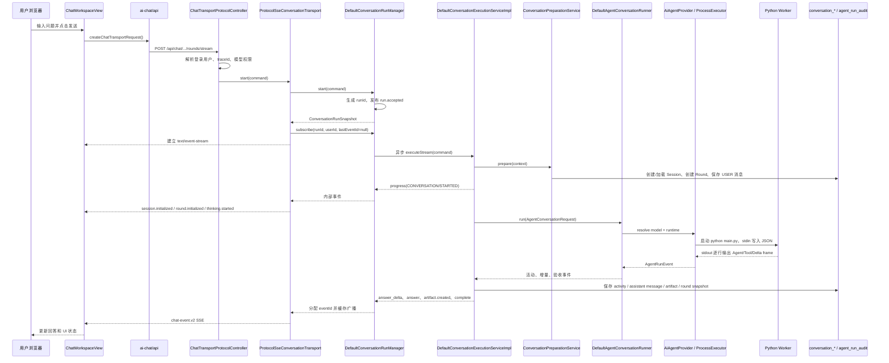

# 用户聊天端到端执行链路

> 状态：当前实现说明
>
> 适用范围：`ai-conversation-ui` 主聊天页面、`app/app-platform-chat` Chat 服务及 Python Agent Provider
>
> 最后核对：2026-08-01

本文按一次“用户输入问题并收到 AI 回复”的实际执行顺序，梳理前端、HTTP/SSE、会话数据、异步 Run、Agent Runtime、Python Worker、工具活动、产物持久化和错误恢复之间的关系。源码变化后，应以源码为准同步维护本文。

## 1. 一句话结论

当前用户聊天不是一次 HTTP 请求同步调用模型，而是下面这条链路：

```text
浏览器发送消息
  -> ChatTransportProtocolController 构造 ConversationQueryCommand
  -> ProtocolSseConversationTransport 创建异步 Run 并建立 SSE
  -> DefaultConversationRunManager 分配 runId、调度后台执行、缓存事件
  -> DefaultConversationExecutionServiceImpl 创建/加载 Session、Round，保存用户消息
  -> DefaultAgentConversationRunner 解析 Agent Snapshot 和模型连接
  -> AiAgentProvider 启动 Python Worker，通过 stdin/stdout 传输 protocol 2.0 frame
  -> Python OpenAI Agents Runtime 执行请求分析、Agent、Tool、Handoff 和产物验收
  -> Java 回流并持久化活动、Assistant Message、Artifact、Round Agent Snapshot
  -> ConversationRunManager 发布终态
  -> ChatTransportProtocolAdapter 投影为 chat-event.v2
  -> 浏览器更新回答、思考活动、产物和错误状态
```

因此，浏览器断线不等于 Agent 被取消：只要没有调用 stop 接口，Run 仍可能继续执行；浏览器可以用 `runId + lastEventId` 重连并补发遗漏事件。

## 2. 入口与边界

### 2.1 主聊天页面

路由 `/`、`/c/:sessionId`、`/g/:groupId/c/:sessionId` 都加载同一个 `ChatWorkspaceView.vue`。用户当前在已有会话页面时，发送消息走以下接口：

| 场景 | HTTP 接口 | 作用 |
| --- | --- | --- |
| 新会话 | `POST /api/chat/rounds/stream` | 不带 `sessionCode`，由服务端创建会话 |
| 已有会话 | `POST /api/chat/sessions/{sessionCode}/rounds/stream` | 在指定会话下创建新轮次 |
| SSE 重连 | `POST /api/chat/stream/reconnect` | 按 `runId` 或 `sessionCode + roundCode` 续订 |
| 查询 Run | `GET /api/chat/runs/{runId}` | 断线恢复前确认后台状态 |
| 停止 Run | `POST /api/chat/runs/{runId}/stop` | 请求取消后台执行 |
| 加载历史 | `POST /api/v1/chat/detail` | 加载会话、轮次、消息和产物 |
| 加载会话列表 | `POST /api/v1/chat/conversation/list` | 左侧会话列表 |
| 加载启用模型 | `GET /api/v1/chat/models/enable` | 选择可用模型，不返回凭证 |

关键代码：

- 路由：[ai.ts](../../../ai-conversation-ui/src/router/routes/ai.ts)
- 主页面：[ChatWorkspaceView.vue](../../../ai-conversation-ui/src/modules/ai-chat/views/ChatWorkspaceView.vue)
- 主聊天 API：[ai-chat/api/index.ts](../../../ai-conversation-ui/src/modules/ai-chat/api/index.ts)

### 2.2 其他入口

系统设置页助手复用同一套前端流消费和后端 Run/Execution/Agent 链路，但使用服务端固定的业务边界：

- 前端接口：`/api/chat/settings-assistant/rounds/stream`。
- 后端场景：`SETTINGS_ASSISTANT`。
- Agent 入口：`SETTINGS_ASSISTANT`。
- 会话业务类型：`PAGE_ASSISTANT`。
- 客户端不能通过该入口指定任意 Agent。

旧版或服务间兼容调用仍可以使用 `/api/v1/chat/completions` 和 `/api/v1/chat/completions/stream`。它们共享同一个执行内核，但传输对象不同：兼容入口直接输出内部 `ConversationQueryStreamEvent`，主聊天入口经过 `ChatTransportProtocolAdapter` 输出 `chat-event.v2`。本文后续协议、事件和重连章节统一说明两类入口的差异。

## 3. 一次成功请求的完整时序



### 3.1 前端准备与提交

`ChatWorkspaceView.vue` 初始化时加载模型列表、会话列表；如果 URL 含 `sessionId`，再调用会话详情并把轮次扁平化为消息展示。提交时：

1. 检查当前模型已加载且已选中。
2. 在本地先插入一条 USER 消息和一条“正在连接 AI...”的 Assistant 占位消息。
3. 清空 `currentRunId`、`lastEventId`，创建新的 `AbortController` 和事件去重集合。
4. `createChatTransportRequest` 生成 `type=chat.user_message` 请求，包含 `requestId`、会话编码、模型 ID、用户消息和 `clientContext`。
5. `clientContext` 会传递时区、语言、当前路由和前端支持的 Render 能力；它是运行上下文，不是模型凭证。
6. 根据是否已有会话选择两个 `rounds/stream` 接口。

请求结构的核心字段如下：

```json
{
  "type": "chat.user_message",
  "requestId": "uuid",
  "sessionCode": "可选",
  "modelId": 12,
  "message": {
    "id": "user-uuid",
    "role": "user",
    "createdAt": "2026-08-01T00:00:00.000Z",
    "content": [{"type": "text", "text": "用户问题"}]
  },
  "clientContext": {
    "timezone": "Asia/Shanghai",
    "locale": "zh-CN",
    "route": "/c/session-xxx",
    "renderCapabilities": ["markdown", "dashboardCanvas", "line-chart"]
  }
}
```

### 3.2 后端 Controller 与 Command

`ChatTransportProtocolController` 只做协议入口，核心动作是：

1. `ConversationRequestContextResolver.currentUserId()` 从登录上下文获取用户；没有登录上下文直接返回登录失败。
2. `traceId()` 优先读取 `traceId` 或 `X-Trace-Id`，没有则生成 UUID。
3. `ConversationCommandFactory.fromProtocol()` 把外部 DTO 转为 `ConversationQueryCommand`。
4. 路径中的 `sessionCode` 优先级高于请求体中的同名字段。
5. `modelOverrideId` 只有管理员或具备 `ai:chat:model-override`、`ai:agent:debug` 权限时允许使用。
6. 根据 `modelId` 查询服务端已启用模型配置，填入模型编码和实际 API 模型；Base URL、API Key 等连接信息不由浏览器提交。
7. 普通主聊天默认场景是 `ai-chat-query`、入口是 `HOME_CHAT`；设置助手由服务端强制设置专属场景和入口。

关键代码：

- [ChatTransportProtocolController.java](../../../app/app-platform-chat/web/src/main/java/ai/platform/aiassit/conversation/controller/ChatTransportProtocolController.java)
- [ConversationCommandFactory.java](../../../app/app-platform-chat/web/src/main/java/ai/platform/aiassit/conversation/support/ConversationCommandFactory.java)
- [ConversationRequestContextResolver.java](../../../app/app-platform-chat/web/src/main/java/ai/platform/aiassit/conversation/support/ConversationRequestContextResolver.java)

### 3.3 Run 受理、订阅与后台执行

`ProtocolSseConversationTransport.start` 的顺序很重要：先 `runManager.start`，再 `subscribe`。`start` 会：

- 生成 `run_<uuid>`。
- 记录用户、请求、会话和轮次定位信息。
- 立即发布 `run.accepted`。
- 把 `execute(entry, command)` 提交到异步任务线程池。
- 返回 `ConversationRunSnapshot`。

随后 SSE Transport 使用该 `runId` 订阅。即使后台已经先发布事件，Run Manager 也会从内存事件队列回放，再注册实时订阅者。Run 的状态通常经历：

```text
ACCEPTED -> RUNNING -> COMPLETED
                     -> FAILED
                     -> CANCELLING -> CANCELLED
```

本地模式下事件和订阅保存在 JVM；Redis 模式下由 `RedisConversationRunClusterCoordinator` 保存快照、事件列表并广播到其他节点。默认最多保留 512 个 Run 回放事件，终态 Run 默认保留 30 分钟。

关键代码：

- [ProtocolSseConversationTransport.java](../../../app/app-platform-chat/web/src/main/java/ai/platform/aiassit/conversation/transport/sse/ProtocolSseConversationTransport.java)
- [DefaultConversationRunManager.java](../../../app/app-platform-chat/modules/core-conversation-runtime/src/main/java/ai/platform/aiassit/conversation/runtime/impl/DefaultConversationRunManager.java)
- [ConversationRuntimeProperties.java](../../../app/app-platform-chat/modules/core-conversation-runtime/src/main/java/ai/platform/aiassit/conversation/runtime/config/ConversationRuntimeProperties.java)

## 4. 会话、轮次、消息和历史上下文

### 4.1 `prepare` 的写库顺序

`ConversationPreparationService.prepare` 在 Agent 执行前完成以下动作：

1. 校验 Command 和用户消息不能为空。
2. 新会话：生成 `session-<uuid>`，设置用户、业务类型、会话名称和未置顶状态。
3. 已有会话：按 `sessionCode + userId` 查询，并校验业务类型，避免普通聊天读取页面助手会话。
4. 读取当前会话消息，按 `sortNo` 排序。
5. 创建新轮次：生成或使用 `roundCode`，设置 `parentRoundCode` 为上一轮，写入模型快照字段，初始状态为 `RUNNING`。
6. 保存当前 USER 消息，`messageType=USER_INPUT`、`actorType=HUMAN`、`contentFormat=PLAIN_TEXT`、`status=SUCCESS`。
7. 将 Session、Round、当前消息放入 `ConversationRuntimeContext`，后续执行和事件发布都从这个上下文取关联标识。

当前新会话名称由用户输入截取前 20～24 个字符（不同入口的 Command/Preparation 层有不同截断值），展示名称不是模型请求的必填字段。

### 4.2 历史消息如何进入 Agent

`DefaultConversationExecutionServiceImpl.buildAgentRequest` 将会话消息转换为 `ChatMessage`：

- 支持 USER、ASSISTANT、SYSTEM、TOOL 角色。
- 排除刚刚保存的当前 USER 消息，避免当前输入重复拼接。
- 从最新消息向前选取最多 40 条。
- 累计内容最多 60,000 字符。
- 保持原始时间顺序交给 Agent。
- 运行上下文另外传入 `scene`、`userId`、`clientContext` 和可用知识库列表。

这意味着“数据库历史”与“本轮 input”在 Agent 请求中是两个来源：前者放在 `messages`，后者放在 `input`。

### 4.3 数据表职责

表结构位于 [chat_data_schema_init.sql](../../../app/app-platform-chat/config/db-schema/1.0.0/chat_data_schema_init.sql)。

| 表 | 写入时机 | 主要内容 |
| --- | --- | --- |
| `conversation_session` | 新会话准备阶段 | 用户、业务类型、会话名称、置顶状态 |
| `conversation_round` | 每次发送消息 | 父轮次、模型、实际模型、Run ID、Agent Snapshot、状态 |
| `conversation_message` | 用户消息、最终回答、失败快照 | USER/ASSISTANT 消息、正文、格式、显示级别、父/源消息、状态、扩展 JSON |
| `conversation_activity` | Agent/Tool/Handoff/验收事件 | 活动生命周期、关联码、输入/输出摘要、耗时、详情 |
| `conversation_artifact` | 产物通过筛选且保存成功 | 文件、图片、Render JSON 等非文本产物 |
| `agent_run_audit` | Agent 开始、结束或失败 | Agent Run 审计、状态、使用量和错误信息 |

`AgentConversationHistoryRecorder` 的设计要点：

- Assistant 最终回答先保存，再发布 `answer` 事件。
- Activity 是可观测数据，写库失败只记录告警，不阻断回答和实时事件。
- 同一个 `correlationCode` 的活动开始、更新、完成、失败会更新同一条记录。
- 失败消息正文保持为空，安全错误信息放入脱敏后的 `extJson.error`。
- Artifact 只有写库成功后才发布可展示的 `artifact.created`；Provider 预先发出的产物元数据不会直接冒充已落库产物。

## 5. Java Agent Runtime 到 Python Worker

### 5.1 Java Runtime 桥接

`DefaultAgentConversationRunner` 是 Conversation Plane 与 Agent/Provider Plane 的桥：

1. 要求 input 非空。
2. 生成 Python Agent Snapshot，解析 `OPENAI_AGENTS_PYTHON` Runtime。
3. 按请求模型 ID 查找已启用的 `AiModelConfig`；未指定时选择第一个启用模型。
4. 要求模型存在 `apiModel` 和 `baseUrl`。
5. 组装 `AgentRunCommand`：Run/请求/Trace/Session/Round/用户/历史消息/上下文、最大 12 turns、Java 层命令超时。
6. 记录 `agent_run_audit` 的 RUNNING 状态。
7. 调用 Runtime，并把 Python 事件增强上 `runId`、请求、会话、轮次和 Agent 身份。
8. Runtime 返回后做 Artifact Acceptance；若产物检查可修复且仍有次数，追加修复轮次重新调用 Runtime。
9. 产物验收通过时返回 SUCCESS；明确需要用户补充时返回 INPUT_REQUIRED；不可修复的验收失败转为异常。

Java 不在这里重新定义 Agent Prompt、协作拓扑和 Python Tool。它负责连接配置、请求上下文、事件转发、验收、审计和结果收口。

### 5.2 Provider 进程边界

`AiAgentProvider` 将 Agent Runtime 映射为 `AiAgentProcessExecutor`：

- 启动 `python agent_provider/main.py`。
- 通过标准输入写入一个 JSON payload。
- 通过标准输出按行读取 JSON frame。
- `type=event` 或 `type=activity` 的 frame 交给上层 observer。
- `type=result` 取 `data` 作为最终结果。
- `type=error` 转为 Provider 异常并触发失败活动。
- 超时、进程非 0 退出、空输出、读取失败都会转为 Provider Process/Response 异常。
- 子进程只接收 Java 解析后的 `OPENAI_API_KEY`、`OPENAI_BASE_URL`、`OPENAI_MODEL` 和短期平台 Token；日志和错误会做敏感信息脱敏。

关键代码：

- [DefaultAgentConversationRunner.java](../../../app/app-platform-chat/modules/core-agent-runtime/src/main/java/ai/platform/aiassit/agent/runtime/DefaultAgentConversationRunner.java)
- [AiAgentProvider.java](../../../app/app-platform-chat/providers/ai-provider-ai-agent/src/main/java/ai/platform/aiassit/service/ai/agent/service/AiAgentProvider.java)
- [AiAgentProcessExecutor.java](../../../app/app-platform-chat/providers/ai-provider-ai-agent/src/main/java/ai/platform/aiassit/service/ai/agent/service/AiAgentProcessExecutor.java)

### 5.3 Python Worker 内部

Python `main.py` 依次执行：

1. 记录启动环境是否存在（值脱敏）。
2. 从 stdin 读取 JSON 并标准化 payload。
3. 编译 Agent Snapshot，生成 Agent 图、Tools、Skills、Handoffs 和模型设置。
4. `runtime/runner.py` 先进行请求分析，再选择根 Agent 或满足约束的专用 Agent。
5. 使用 OpenAI Agents SDK 的 `Runner.run_streamed` 流式执行。
6. 把 SDK 原始事件映射为平台事件：文本增量、Tool 开始/完成/失败、Agent Handoff、思考分析、验收检查等。
7. 执行置信度/证据守卫和结果整理，汇总最终输出、使用量和 Artifact。
8. 输出 `type=result`；未捕获异常输出 `round.failed` error frame 后以非 0 退出。

工具和协作事件会带 `activityCode`、`activityType`、`toolCode`、`callId`、输入/输出摘要等扩展，Java 据此合并到 `conversation_activity`。

关键代码：

- [main.py](../../../app/app-platform-chat/providers/ai-provider-ai-agent/src/main/python/agent_provider/main.py)
- [runner.py](../../../app/app-platform-chat/providers/ai-provider-ai-agent/src/main/python/agent_provider/runtime/runner.py)
- [factory.py](../../../app/app-platform-chat/providers/ai-provider-ai-agent/src/main/python/agent_provider/agents/factory.py)
- [emitter.py](../../../app/app-platform-chat/providers/ai-provider-ai-agent/src/main/python/agent_provider/events/emitter.py)

### 5.4 Agent、Skill、Tool 和 MCP 的扩展边界

这些能力都在 Python Snapshot 编译阶段确定，不能通过浏览器请求临时扩大权限：

| 能力 | 当前实现 | 关键约束 |
| --- | --- | --- |
| Agent | Python 本地 Catalog 定义 Root Agent、专业 Agent、Agent-as-Tool 和 Handoff | 最多 16 个 Agent，最大协作深度 4，不允许环；引用的必需 Agent 不存在时编译失败 |
| Skill | 编译时只注入 Skill 元数据，运行时通过 `load_skill_resource` 按需加载 | 必须是当前 Agent 已授权的版本化 Skill；校验路径、Manifest、Hash 和大小，单资源最大 256 KiB；`scripts/` 只作为资源，不会被自动执行 |
| 内置 Tool | Python `tools/` 实现，并同时加入 Compiler Allowlist、Factory Registry 和 Agent `tool_refs` | 只注册未授权不会生效；只实现函数但未加入 Allowlist 会在编译期失败；需要覆盖参数、权限、超时、取消、脱敏和幂等 |
| 平台 Tool Gateway | 由冻结 Capability 构造成版本化 FunctionTool，携带 `runId`、`snapshotHash`、临时 Token 和幂等 Key | Java Gateway 校验权限、参数和 Tool 身份，响应只能是 `SUCCESS` 或 `FAILED`；`PYTHON_LOCAL` 不会自动合并 Java 下发的全部 Capability |
| MCP | 当前 Python Runtime 不支持直接 MCP Binding | Snapshot Compiler 会拒绝 `MCP` 等不支持的 Binding；不能仅修改 Tool 元数据声明 MCP。若接入，应先收敛到受控 Java Gateway，由平台负责 Allowlist、审批、凭证、超时和审计 |

主 Agent 委派专业 Agent 时，子 Agent 输出仍须回到主 Agent 核验，不能绕过 Java Acceptance 直接成为会话终态。扩展指南中的 Agent/Skill/Tool/MCP 章节保留了逐文件注册步骤和未来 MCP 直连的设计要求，本文只保留它们对一次聊天执行链路有影响的边界。

## 6. 事件如何从 Worker 变成前端 UI

### 6.1 内部事件收口

`ConversationRuntimeContext` 为每个事件补齐 `requestId`、`sessionCode`、`roundCode`、状态和扩展信息，然后交给 Run Manager。`DefaultConversationExecutionServiceImpl` 的处理规则：

| Worker/内部事件 | Java 处理 | 前端协议 |
| --- | --- | --- |
| `assistant.message.delta` / `answer_delta` | 累加完整回答，发布 `answer_delta` | `assistant.message.delta`，`append=true` |
| Tool、Handoff、Thinking、分析事件 | 尽力保存 Activity，再继续发布 | `thinking.updated` 或同名活动事件 |
| `artifact.created` 元数据 | 暂不直接展示，等持久化 | 保存成功后再次发布权威 `artifact.created` |
| Agent 最终结果 | 保存 Assistant Message，更新 Round Agent Snapshot | `answer`，随后 `round.completed` |
| INPUT_REQUIRED | 保存 `ASSISTANT_QUESTION` | `assistant.input_required` |
| 异常 | Round=FAILED，保存脱敏失败消息 | `round.failed` |
| 取消 | Round=CANCELLED | `round.cancelled` |

### 6.2 `ChatTransportProtocolAdapter` 的主要投影

| 内部事件 | `chat-event.v2` 事件 | 前端动作 |
| --- | --- | --- |
| `run.accepted` | `run.accepted` | 进入 connecting |
| `run.started` | `run.started` | 进入 thinking |
| 初始 `progress(CONVERSATION/STARTED)` | `session.initialized`、`round.initialized`、`assistant.started`、`thinking.started` | 建立会话/轮次和 Assistant 占位 |
| 普通 progress | `thinking.updated` | 更新思考摘要或活动 |
| `answer_delta` | `assistant.message.delta` | 追加或替换回答文本 |
| `answer` | `assistant.message.delta`（append=false）及可能的 `artifacts.build` | 写入最终回答快照/产物引用 |
| `complete` | `thinking.completed`、`round.completed` | Assistant=COMPLETED |
| `clarification` | `assistant.input_required` | Assistant=WAITING_INPUT，聚焦输入框 |
| `error` | `round.failed` | 结构化错误卡片 |
| `run.cancelled` | `round.cancelled` | Assistant=CANCELLED |

Adapter 不把 Provider 自己产生的 `round.completed`、`round.failed`、`round.cancelled` 直接当作浏览器终态；必须等待会话层完成持久化和收口后，统一生成 `complete`、`error` 或 `run.cancelled`。

### 6.3 `chat-event.v2` Envelope 与活动事件

主聊天前端实际消费的是下面这种 Envelope，而不是旧版内部事件对象：

```json
{
  "eventId": "5",
  "eventType": "assistant.message.delta",
  "schemaVersion": "chat-event.v2",
  "runId": "run_xxx",
  "requestId": "trace_xxx",
  "sessionCode": "session_xxx",
  "roundCode": "round_xxx",
  "timestamp": "2026-08-01T00:00:00Z",
  "payload": {
    "message": {
      "id": "assistant-message-round_xxx",
      "role": "assistant",
      "append": true,
      "content": [{"type": "text", "text": "订单量"}]
    }
  }
}
```

除核心会话事件外，以下活动会保留原始 `eventType`，通过 `payload` 和 `ext` 进入前端时间线：

| 活动族 | 典型事件 | 语义 |
| --- | --- | --- |
| Agent 协作 | `agent.changed`、`agent.delegated`、`agent.delegation.completed` | Agent 路由或子 Agent 协作生命周期 |
| Tool | `tool.started`、`tool.completed`、`tool.failed` | 工具调用开始、完成或失败 |
| Handoff | `handoff.requested`、`handoff.completed` | SDK Handoff 生命周期；当前本地定义主要使用 Agent-as-Tool |
| Skill | `skill.loaded` | 按需加载了已授权 Skill 资源 |
| Acceptance | `check.started`、`check.completed` | Artifact 验收检查 |
| Repair | `artifact.repair.requested`、`artifact.repair.completed`、`artifact.repair.failed` | 产物修复尝试，不代表修复后已验收通过 |
| Thinking/Confidence | `thinking.analysis.*`、`thinking.conclusion.completed`、`confidence.*` | 请求分析、结论和证据/可信度检查 |

前端 Activity 合并依赖 `activityCode`/`callId` 等稳定关联字段；后端 Activity 持久化也按相同关联码合并 started/completed 生命周期。`message` 只用于展示和诊断，业务判断应使用 `eventType`、`status`、`payload` 和 `ext`。

### 6.4 Confidence 与最终结果的权威层级

Confidence Guard 采用“先确认证据条件，再决定是否评分”的时序：

```text
confidence.evidence_check.started/completed
  -> 证据不足：confidence.retrieval.*，必要时 confidence.reanalysis.*
  -> 证据充分：confidence.assessment.started/completed
  -> 不适用或证据不足：confidence.assessment.skipped
```

只有 `confidence.assessment.completed` 且 `scoreStatus=SCORED` 时才允许携带数值 `confidence`；`assessment.skipped` 必须省略分数，不能把“未评分”写成 `0`。这些事件用于审计和前端思考时间线，不直接决定浏览器是否收到 `round.completed`。

产物验收还有一层更高的内部权威结果：`DefaultAgentConversationRunner` 在所有 Check、Repair 和 Acceptance 完成后发布 `execution.result.completed`，其 `ext.authoritative=true`，包含 `resultStatus`、`accepted`、`artifactCount`、检查统计、修复次数、剩余问题和 `nextAction`。Python `result.data.finalOutput/artifacts` 在此之前只是候选结果；会话层收到 Acceptance 结果后才持久化 Artifact、Assistant Message 并继续发布 `answer`/`complete`。

### 6.5 浏览器状态机

`ChatWorkspaceView.handleStreamEvent` 主要状态变化：

```text
connecting
  -> thinking       session.initialized / round.initialized / thinking.started
  -> streaming      assistant.message.delta
  -> completed      round.completed
  -> waiting_input  assistant.input_required
  -> failed         round.failed
  -> cancelled      round.cancelled
  -> reconnecting   SSE 中断但没有收到终态
```

收到首个带 `sessionCode` 的事件时，新会话页面会自动跳转到 `/c/{sessionCode}`。回答、Activity 和 Artifact 使用不同的本地合并逻辑，避免重连回放造成重复显示。

## 7. 重连、去重和取消

### 7.1 浏览器断线恢复

前端 `consumeChatTransportStream`：

- 解析 SSE 的 `id`、`event`、多行 `data`。
- 以 `data.eventId` 优先作为事件 ID。
- `seenEventIds` 去重，保存最后的 `runId`、`sessionCode`、`roundCode`、`lastEventId`。
- 30 秒没有任何数据则取消当前 Reader。
- 流结束但没有收到 `round.completed`、`round.failed`、`round.cancelled` 或 `assistant.input_required` 时，抛出 `ChatStreamInterruptedError`。

`streamWithRecovery` 最多尝试 3 次，每次先：

1. 等待 `attempt * 500ms`。
2. `GET /api/chat/runs/{runId}` 查看后台 Run 是否已经终态。
3. 若终态已知，直接更新 UI，不再重复订阅。
4. 否则调用 `/api/chat/stream/reconnect`，携带 `runId`、`lastEventId`、会话和轮次编码。
5. 继续使用同一个事件去重集合。

### 7.2 服务端重连

`ProtocolSseConversationTransport.reconnect`：

- 有效 `runId` 或 `sessionCode + roundCode` 时，优先查本机/集群运行时。
- 找到活跃 Run：按 `lastEventId` 过滤并回放缓存事件，然后继续订阅新事件。
- Run 已从运行时清理或无法定位：调用 `ConversationExecutionService.replayStream` 从数据库恢复会话、轮次、最新 Assistant 内容和终态。
- 持久化回放不是完整的历史事件重建，只能恢复初始化、当前答案快照和终态事件。
- 兼容 `/api/v1/chat/stream/reconnect` 的持久化回放是合成快照，不按 `lastEventId` 过滤；`chat-event.v2` 则通过 `ChatProtocolEventCursor` 处理一个内部事件投影为多个 `.1/.2` 子事件的游标。
- 查找、订阅和持久化回放都校验当前 `userId`，不能用别人的 `runId`、会话或轮次重连。

SSE 连接使用无限超时；协议 Transport 每 15 秒发送 heartbeat comment，防止网关把长时间无业务事件的连接判定为空闲。

### 7.3 用户主动停止

前端点击停止后先进入 `stopping`，调用 `POST /api/chat/runs/{runId}/stop`。Run Manager：

1. 校验 Run 所属用户。
2. 将状态改为 `CANCELLING`。
3. 设置 `ConversationCancellationToken`。
4. 取消异步 Future，并发布 `run.cancelled`。
5. Execution Service 和 Agent Provider 在事件处理/进程等待处检查取消信号，必要时强制终止 Python 子进程。
6. 会话层将当前 Round 标记为 `CANCELLED`，完成订阅者。

如果 Run 已经是终态，停止请求不会把已完成结果改成取消。

### 7.4 三个典型场景

**新会话首次回答**：首个初始化事件带回新 `sessionCode`，前端把 `/` 替换为 `/c/{sessionCode}`；最终 `round.completed` 的完整回答快照可以校正中间丢失的 Delta。

**主 Agent 委派专业 Agent**：Python 先发布 Agent 协作活动，子 Agent 使用自己的 Tool/Skill 执行，完成后回到主 Agent；子 Agent 输出不会绕过主 Agent 直接成为会话终态。

**网络中断但 Run 仍执行**：SSE 关闭后 Run 不会自动取消；前端携带上次 `lastEventId` 重连，Run Manager 先回放遗漏事件再继续实时订阅，`seenEventIds` 防止边界事件重复应用。

## 8. 成功、补充输入与失败分支

### 8.1 成功

Agent 返回非空最终回答后，Java 按顺序执行：

1. 保存 `ASSISTANT + FINAL_ANSWER + SUCCESS` 消息。
2. 保存已通过筛选的 Artifact；Render JSON 先写入 Render 服务并生成引用。
3. 更新 Round 的模型、实际模型、Agent Run、Snapshot 等字段，Round=SUCCESS。
4. 发布 `answer`。
5. 发布内部 `complete`，Adapter 转成 `round.completed`。
6. 前端刷新会话列表；已有会话再加载详情合并持久化消息。

### 8.2 需要用户补充输入

Agent 返回 `INPUT_REQUIRED` 时：

- Assistant 消息类型为 `ASSISTANT_QUESTION`，状态为 `INPUT_REQUIRED`。
- Round 状态为 `INPUT_REQUIRED`。
- 发布 `clarification`，Adapter 转成 `assistant.input_required`。
- 前端进入 `waiting_input`，保留问题并聚焦输入框。
- 不发布成功 `round.completed`。

### 8.3 失败

任意一层抛出异常时：

- 会话层把 Round 标记为 `FAILED`。
- `AgentConversationHistoryRecorder.saveFailureMessage` 尽力保存空正文的失败 Assistant 消息。
- 失败信息写入脱敏后的 `extJson.error`，不覆盖原始异常。
- 发布 `error`，Adapter 转成 `round.failed`。
- Run Manager 将 Run 标记为 FAILED，并保留 `error` 供状态查询和重连恢复。

例如日志中的：

```text
503 upstream_error: auth_unavailable: no auth available
```

表示 Java 已经进入 Provider 进程失败分支：上游模型服务返回 503，且 Provider 没有可用认证。它不是会话表插入失败，也不是 SSE 解析失败。协议层会将包含 `503`、`connection` 或 `service unavailable` 的错误归类为：

```json
{
  "code": "MODEL_CONNECTION_FAILED",
  "userMessage": "模型服务连接失败，请稍后重试",
  "retryable": true,
  "traceId": "...",
  "detail": "已脱敏的上游错误"
}
```

排查时应优先检查：模型配置解析结果、Provider 注入的 API Key/临时 Token、Base URL、上游服务可达性和模型服务认证策略；仅重试前端请求不能修复“没有可用认证”本身。

## 9. 关键代码索引

### 前端

- [路由](../../../ai-conversation-ui/src/router/routes/ai.ts)
- [主聊天页面](../../../ai-conversation-ui/src/modules/ai-chat/views/ChatWorkspaceView.vue)
- [聊天 API、SSE 解析、重连和停止](../../../ai-conversation-ui/src/modules/ai-chat/api/index.ts)
- [页面助手 API](../../../ai-conversation-ui/src/modules/ai-assistant/api/index.ts)
- [页面助手 Store](../../../ai-conversation-ui/src/modules/ai-assistant/store/assistant.ts)

### Java Web 与协议

- [ChatTransportProtocolController](../../../app/app-platform-chat/web/src/main/java/ai/platform/aiassit/conversation/controller/ChatTransportProtocolController.java)
- [ChatTransportProtocolAdapter](../../../app/app-platform-chat/web/src/main/java/ai/platform/aiassit/conversation/protocol/ChatTransportProtocolAdapter.java)
- [ProtocolSseConversationTransport](../../../app/app-platform-chat/web/src/main/java/ai/platform/aiassit/conversation/transport/sse/ProtocolSseConversationTransport.java)
- [ConversationCommandFactory](../../../app/app-platform-chat/web/src/main/java/ai/platform/aiassit/conversation/support/ConversationCommandFactory.java)
- [兼容 ConversationController](../../../app/app-platform-chat/web/src/main/java/ai/platform/aiassit/conversation/controller/impl/ConversationController.java)
- [兼容 SseConversationTransport](../../../app/app-platform-chat/web/src/main/java/ai/platform/aiassit/conversation/transport/sse/SseConversationTransport.java)

### 会话运行时与持久化

- [DefaultConversationRunManager](../../../app/app-platform-chat/modules/core-conversation-runtime/src/main/java/ai/platform/aiassit/conversation/runtime/impl/DefaultConversationRunManager.java)
- [DefaultConversationExecutionServiceImpl](../../../app/app-platform-chat/modules/core-ai-chat/src/main/java/ai/platform/aiassit/conversation/service/impl/DefaultConversationExecutionServiceImpl.java)
- [ConversationPreparationService](../../../app/app-platform-chat/modules/core-ai-chat/src/main/java/ai/platform/aiassit/conversation/service/impl/ConversationPreparationService.java)
- [ConversationRuntimeContext](../../../app/app-platform-chat/modules/core-workflow/src/main/java/ai/platform/aiassit/conversation/workflow/context/ConversationRuntimeContext.java)
- [AgentConversationHistoryRecorder](../../../app/app-platform-chat/modules/core-workflow/src/main/java/ai/platform/aiassit/conversation/workflow/support/AgentConversationHistoryRecorder.java)
- [聊天数据表结构](../../../app/app-platform-chat/config/db-schema/1.0.0/chat_data_schema_init.sql)

### Agent Runtime 与 Provider

- [DefaultAgentConversationRunner](../../../app/app-platform-chat/modules/core-agent-runtime/src/main/java/ai/platform/aiassit/agent/runtime/DefaultAgentConversationRunner.java)
- [AiAgentProvider](../../../app/app-platform-chat/providers/ai-provider-ai-agent/src/main/java/ai/platform/aiassit/service/ai/agent/service/AiAgentProvider.java)
- [AiAgentProcessExecutor](../../../app/app-platform-chat/providers/ai-provider-ai-agent/src/main/java/ai/platform/aiassit/service/ai/agent/service/AiAgentProcessExecutor.java)
- [Python Worker main](../../../app/app-platform-chat/providers/ai-provider-ai-agent/src/main/python/agent_provider/main.py)
- [Python Runtime Runner](../../../app/app-platform-chat/providers/ai-provider-ai-agent/src/main/python/agent_provider/runtime/runner.py)
- [SDK 事件映射](../../../app/app-platform-chat/providers/ai-provider-ai-agent/src/main/python/agent_provider/events/emitter.py)

## 10. 按一次请求排障的推荐顺序

拿到一条失败日志后，使用同一条 `traceId/requestId`，再结合 `runId`、`sessionCode`、`roundCode`，按以下顺序检查：

1. **请求是否进入正确入口**：浏览器 Network 中确认是 `/api/chat/.../rounds/stream`，不是误用旧接口或页面助手入口。
2. **身份和模型是否解析成功**：确认当前用户、模型 ID、服务端启用状态和模型 `apiModel/baseUrl`。
3. **Run 是否受理并启动**：查 `run.accepted`、`run.started`；没有 `run.started` 多半是调度/取消/请求校验问题。
4. **会话是否准备完成**：查 `session.initialized`、`round.initialized` 以及 `conversation_session/round/message` 写入情况。
5. **Provider 是否启动 Worker**：查 `AiAgentProcessExecutor` 的进程启动、环境注入、退出码、stderr 和 `type=error` frame。
6. **上游模型是否可认证和可达**：对 `503`、`auth_unavailable`、`401/403`、超时分别检查认证、地址、网络和超时配置。
7. **是否在 Artifact 验收阶段失败**：查 `check.started/check.completed`、`artifact.repair.*` 和验收结果。
8. **SSE 是否只是断线**：若数据库已有终态且 Run 已完成，优先调用重连/详情接口，不要直接重复发送用户消息。
9. **前端是否收到终态**：确认 `round.completed`、`round.failed`、`round.cancelled` 或 `assistant.input_required` 是否到达；只有没有终态且 Reader 结束，才进入重连逻辑。

## 11. 当前实现与边界提醒

- 主聊天使用 `chat-event.v2`；`/api/v1/chat/completions/stream` 是兼容入口，不应把两种事件格式混为一谈。
- Run 事件缓存是运行时回放缓存，不是完整审计日志；完整历史应查询会话表和 Agent 审计表。
- Activity 持久化是尽力而为，活动写库失败不会阻断回答；消息、Round 状态和终态事件是核心链路。
- Provider 产生的事件不能直接等同于浏览器终态，必须经过会话层收口。
- Java 负责连接和编排边界，Python 负责 Agent Prompt、工具、Skill 和协作拓扑；新增能力应先确认属于哪一侧。
- 页面助手和主聊天共享执行内核，但通过场景、入口和业务类型隔离会话，不能仅凭 URL 判断业务上下文。
