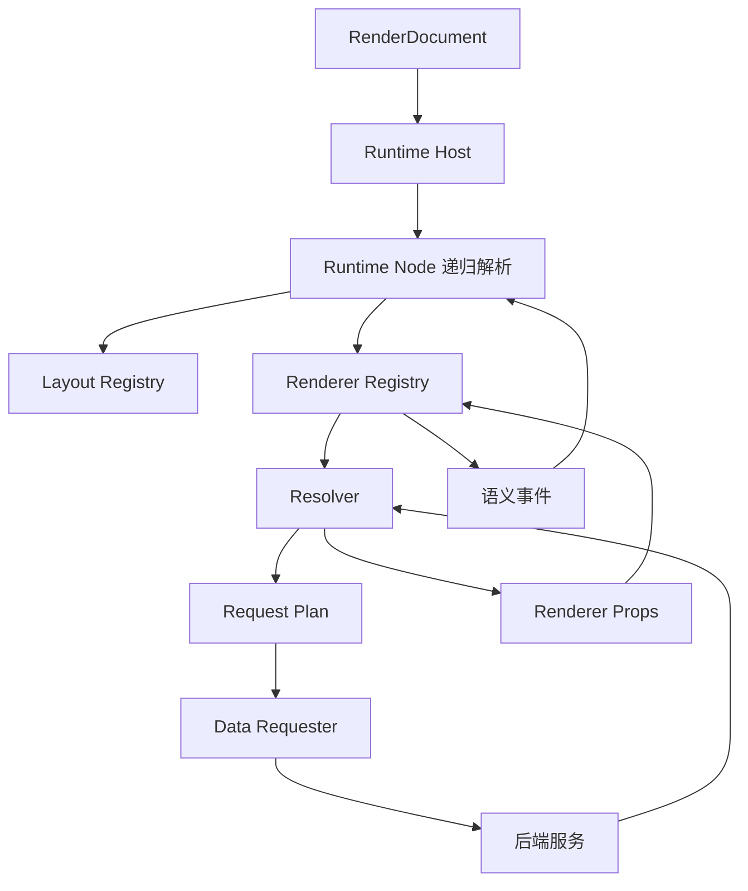

# Render JSON 技术文档

> 状态：演进中  
> 适用协议：`render-json` 1.x，当前实现主要使用 `1.0.0`  
> 主要模块：`ai-conversation-ui`、`app/app-platform-render`、`app/app-platform-db-engine`、`app/app-platform-chat`  
> 最后核对：2026-07-20

## 1. 文档目的

Render JSON 是本项目的声明式页面协议。它用可序列化 JSON 描述页面树、组件、布局、数据源和动作意图，前端 Runtime 再把稳定的配置
key 解析成真实 Vue 组件和后端请求。

本专题回答四个问题：

1. Render JSON 从哪里产生、保存在哪里、如何加载。
2. 前端怎样把 JSON 转成组件树并请求后端数据。
3. AI Agent 怎样生成和校验 Render JSON，聊天页面怎样展示产物。
4. 当前实现已经支持什么，哪些规范能力尚未完整接入。

## 2. 文档索引

- [架构与前后端交互](./architecture-and-interaction.md)
    - 正式动态应用加载、元数据保存、数据查询、事件与刷新、聊天产物回放。
- [配置参考](./configuration-reference.md)
    - RenderDocument、节点、布局、组件、数据源、查询字段和示例。
- [AI 生成、校验与聊天产物](./ai-generation-and-validation.md)
    - Agent 构建流程、组件 Skill、确定性校验、Artifact 持久化与展示。

关联文档：

- [Application 开发规范](../../dev-spec/detail/frontend/application.md)
- [前端主题与容器响应式开发规范](../../dev-spec/detail/frontend/responsive-theme.md)
- [DbQueryApi 接口实现说明](../../api/db-query-api.md)
- [聊天流协议](../../api/chat-stream-protocol.md)
- [AI 数据应用构建方案](../../plans/202607/designs/ai-data-application-construction-design.md)

## 3. 核心定位

Render JSON 只表达声明，不保存可执行实现：

```text
Render JSON
  = 页面结构
  + 稳定组件 key
  + 受控 props
  + 布局参数
  + 数据查询意图
  + 事件/动作 key
```

Render JSON 不应包含：

- Vue Component、动态 import、回调函数或运行时实例。
- SQL、数据库连接、凭据、认证头或任意请求地址。
- `eval`、函数文本、脚本、任意 URL 或绕过平台权限的执行信息。
- 浏览器测量结果、瞬时 loading、弹窗开关等临时状态。

这些执行能力分别由 Registry、Resolver、Data Requester、Runtime、页面 Action Executor 和后端服务提供。

## 4. 当前存在的三种入口

项目当前有三个消费 Render JSON 的入口，它们复用部分 Runtime，但装载和校验方式不同。

| 入口     | 内容来源              | 前端入口                         | 是否写入 Render 页面表 |
|--------|-------------------|------------------------------|-----------------|
| 正式动态应用 | Render 服务中的页面当前内容 | `/app/{mode}/{pageCode}`    | 是               |
| 元数据预览  | 正式内容的内存副本，可替换预览模型 | 同上，带 `preview=1&model=...`   | 否               |
| 聊天生成产物 | Artifact 中的 `{pageCode, layout}` 引用 | `GeneratedArtifactWorkspace` | 是，由 Chat 写入草稿页面 |

需要特别注意：聊天中生成的完整 Render JSON 会写入 Render 服务的草稿页面，但不会自动发布。会话 Artifact 只保存
`{pageCode, layout}`，页面内容和快照仍由 Render 服务负责。

## 5. 分层模型



各层职责：

| 层              | 当前职责                                       |
|----------------|--------------------------------------------|
| RenderDocument | 保存稳定、可传输的声明式页面结构                           |
| Runtime Host   | 处理文档级 loading/error/root 入口                |
| Runtime Node   | 递归识别静态节点、Layout、Renderer，维护节点数据状态          |
| Registry       | 将组件或布局 key 映射为真实 Vue 实现                    |
| Resolver       | 把 datasource、schema 和运行时 query 转成请求计划与渲染数据 |
| Data Requester | 统一执行受支持的后端请求                               |
| Renderer       | 展示数据、处理局部交互、抛出语义事件                         |
| Render 服务      | 保存页面主数据、当前 JSON 内容和快照                      |
| DB Engine      | 根据虚拟模型执行受控数据查询                             |
| Chat/Agent     | 生成、校验并持久化会话级 Render Artifact               |

## 6. 当前实现边界摘要

以下内容容易被规范描述误认为已经全部实现，维护时必须以真实代码为准：

- 正式页面前端会检查协议主版本、`root` 和页面模式，但 Render 服务保存接口目前只校验页面存在与 code 非空，没有调用完整
  Render JSON 校验器。
- Agent 的 `render_json_validate_tool` 校验更严格，会检查协议、节点、组件版本格式、数据源和安全规则；完整文档由 `render-json-generation` Skill 的冻结组件测试用例物化，模型只提供数据源配置。
- Agent 校验器当前允许的文档顶层字段比正式页面 Runtime 更少；正式页面使用的 `presentation`、`title` 尚未进入 Agent
  校验器的顶层白名单。
- `createRuntimeEventDispatcher` 已提供通用事件与 Hook 抽象，但正式 `RenderJsonRuntimeNode` 当前仍直接处理 `queryChange`、
  `reload` 和 `action`，通用 Dispatcher 尚未完整接入节点执行链。
- 当前只有通用列表 Renderer 注册了 `resolveData`；表单和图表主要消费内联 props/data，尚未统一接入远程数据 Resolver。
- Dashboard 自动刷新当前通过重建 Runtime 节点重新请求数据，不会重新 GET Render Meta，因此远端元数据变更不会仅靠自动刷新被加载。

## 7. 关键源码索引

### 前端

- 路由：`ai-conversation-ui/src/router/routes/app.ts`
- 正式页面入口：`ai-conversation-ui/src/modules/render/views/RenderRuntimeView.vue`
- 文档归一化：`ai-conversation-ui/src/modules/render/model/render-app.ts`
- Runtime Host：`ai-conversation-ui/src/application/runtime/RenderJsonRuntimeHost.vue`
- Runtime Node：`ai-conversation-ui/src/application/runtime/RenderJsonRuntimeNode.vue`
- Renderer Registry：`ai-conversation-ui/src/application/registry/`
- Resolver：`ai-conversation-ui/src/application/resolver/`
- Data Requester：`ai-conversation-ui/src/application/data-requester/index.ts`
- 聊天产物归一化：`ai-conversation-ui/src/modules/ai-chat/utils/renderArtifact.ts`

### 后端

- Render Meta 接口：`app/app-platform-render/data-render/.../controller/RenderMetaController.java`
- Render 页面数据：`app/app-platform-render/data-render/.../entity/RenderPage*.java`
- DB Query 入口：`app/app-platform-db-engine/data-virtualization-adapter/.../controller/DbQueryController.java`
- DB Query 虚拟表兼容门面：
  `app/app-platform-db-engine/data-virtualization-adapter/.../compat/DbQueryCompatibilityFacade.java`
- Agent Render 校验：
  `app/app-platform-chat/providers/ai-provider-ai-agent/src/main/python/agent_provider/tools/render_validation.py`
- 会话 Artifact 持久化：`app/app-platform-chat/modules/core-ai-chat/.../DefaultConversationExecutionServiceImpl.java`
