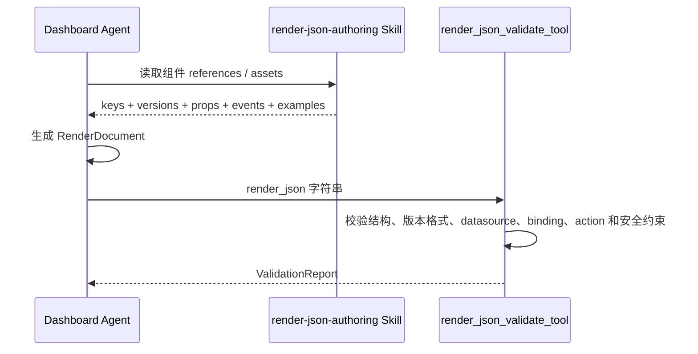
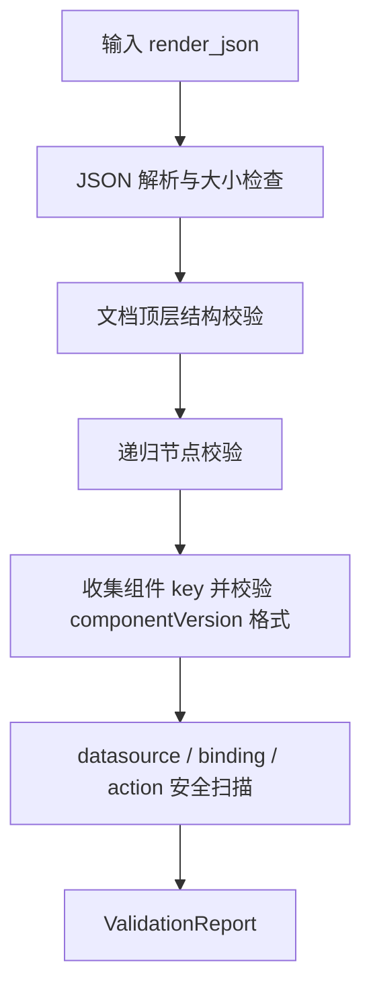

# AI 生成、校验与聊天 Render Artifact

> 状态：演进中  
> 适用运行时：OpenAI Agents Python Provider  
> 校验规则版本：`render-validator/1.0.0`  
> 最后核对：2026-07-20

## 1. 定位

AI Agent 不直接执行或发布 Render JSON。当前看板与应用构建 Agent 的职责是生成一组可审计构建产物，其中 RenderDocument 必须经过确定性校验；最终结果作为会话 Artifact 保存和预览。

当前标准过程：

```text
ApplicationBrief
  -> DataContract
  -> 受控数据预览
  -> ApplicationPlan
  -> RenderDocument
  -> ValidationReport
  -> 会话 Artifact
```

Agent 不允许跳过数据契约直接生成最终页面，也不允许把未通过校验的内容描述成成功结果。

## 2. Agent 能力组合

`dashboard-application-builder` 当前使用：

| 能力 | 作用 |
| --- | --- |
| `knowledge_base_search_tool` | 检索业务语义和知识文档 |
| `data_preview_query_tool` | 用真实虚拟模型与字段验证数据契约和受控预览 |
| `render_json_validate_tool` | 对完整 RenderDocument 做结构、数据源和安全确定性校验 |
| `semantic-data-contract` Skill | 构造业务和数据契约 |
| `render-json-authoring` Skill | 提供冻结的组件信息并按组件契约生成 RenderDocument |
| `render-json-repair` Skill | 根据稳定错误码做最小修复 |
| `application-build-release` Skill | 描述构建状态；当前不代表已经发布页面 |

模型负责理解与生成，Skill 提供当前阶段的组件契约，Tool 负责可以确定性判断的协议、数据和安全约束。

## 3. 组件 Skill 链路

组件信息不依赖在线查询工具，也不能来自模型记忆。Agent 必须读取 `render-json-authoring` Skill 中冻结的组件说明、版本、参数、事件和模板：



当前组件 Skill 必须提供：

- 唯一的 component key。
- 固定的 componentVersion。
- 参数和事件契约。
- 可复制的节点模板和完整示例。
- 稳定来源引用 `skill://render-json-authoring/v6`。

`ValidationReport.catalogRevision` 暂时作为兼容字段，值为上述 Skill 来源引用。当前校验器不会在线验证组件是否发布，也不会检查具体 props/events 是否属于组件；这些信息由 Skill 负责，正式发布前仍需与前端 Registry 做一致性校验。

## 4. 确定性校验过程

`render_json_validate_tool` 调用 `validate_render_document`，按以下阶段执行：



### 4.1 JSON 与资源限制

- 最大文档大小：1 MiB。
- 禁止非标准 `NaN`、`Infinity` 等数字常量。
- 禁止重复对象 key。
- 最大节点数：1000。
- 最大深度：32。

### 4.2 文档协议

当前 Agent 校验器顶层只允许：

```text
protocol
protocolVersion
pageId
revision
root
```

并要求：

- `protocol = render-json`。
- `protocolVersion` 精确为 `1.0` 或 `1.0.0`。
- `pageId` 是稳定标识。
- `root` 是对象。

正式页面 Runtime 支持的 `title`、`presentation` 当前不在该白名单内。这是现有两个入口的契约差异，不应通过关闭校验规避；后续应通过协议演进统一。

### 4.3 节点与组件

节点仅允许：

```text
id, component, componentVersion, props, layout, datasource,
bindings, events, actions, children
```

校验器检查：

- 节点 id 的稳定性和唯一性。
- component key 是否是稳定标识。
- componentVersion 是否存在并符合版本格式。
- props、events 和 actions 是否具有合法 JSON 结构。
- children 是否是合法节点数组。

组件是否受支持、具体 props/events 契约和精确版本由 `render-json-authoring` Skill 定义，当前静态校验器不重复维护一份组件目录。

### 4.4 Datasource 与安全

允许的数据源类型：

- `direct-json`
- `db-query-list`
- `semantic-query`
- `preview-result`
- `static`

校验器会拒绝或扫描：

- SQL、statement、queryText。
- URL、endpoint、baseUrl、headers。
- token、API key、password、secret、cookie、私钥。
- function、eval、箭头函数、脚本和表达式。
- `javascript:`、危险 data URL、任意网络协议字符串。
- prototype、constructor 等对象原型相关 key。

Render JSON 的安全模型是“只允许声明稳定意图，由平台可信代码映射执行”，而不是“把任意代码放进 JSON 再做沙箱执行”。

## 5. ValidationReport

校验结果包含：

- `valid`：是否通过。
- `errors`：错误列表。
- `warnings`：警告列表。
- 稳定错误码。
- `jsonPath`：问题字段路径。
- `nodeId`：可定位时返回节点 id。
- `recoverable`：Agent 是否可以尝试最小修复。
- 文档摘要、规则版本和组件 Skill 来源引用。

Agent 提示要求校验失败后最多修复三次，并且只针对稳定错误码做最小修改。不可恢复错误应停止并说明阻塞原因。

## 6. Artifact 生成与 Provider 输出

Agent 最终输出使用 JSON Artifact Envelope。至少应包含：

- `application-brief`
- `data-contract`
- `application-plan`
- `render-document`
- `validation-report`
- `application-build-state`

单个 Artifact 采用：

```json
{
  "artifactCode": "render-document",
  "artifactType": "RENDER_JSON",
  "contentFormat": "JSON",
  "title": "账户看板",
  "status": "SUCCESS",
  "visible": true,
  "content": {
    "protocol": "render-json",
    "protocolVersion": "1.0.0",
    "pageId": "account-dashboard",
    "root": {
      "id": "account-dashboard-root",
      "component": "zg-list-main-layout",
      "componentVersion": "1.0.0",
      "props": {
        "schema": {
          "id": "account-list",
          "title": "账户列表"
        }
      },
      "datasource": {
        "key": "account-query",
        "type": "db-query-list",
        "model": "ods_trade_user_account"
      }
    }
  }
}
```

Provider 从最终输出中提取 artifacts。Provider 阶段的不完整元数据只用于内部执行记录；Chat 服务完成持久化后再发送权威 `artifact.created`，事件携带数据库 artifactCode、stage、title、content、contentFormat、seqNo 和 extJson，前端可直接展示。

## 7. Chat 服务持久化

Agent Run 完成后，`DefaultConversationExecutionServiceImpl`：

1. 保存 Assistant 最终消息。
2. 遍历 `AgentConversationOutcome.artifacts`。
3. 只接受 `FILE`、`IMAGE`、`RENDER_JSON` 三类成功且可见的非文本产物。
4. 对 `RENDER_JSON` 提取完整 pageCode，将 RenderDocument upsert 到 Render 服务。
5. 在会话 Artifact 表中只保存 `{pageCode, layout}`；layout 缺失或非法时使用 `standard`。
6. 调用 `AgentConversationHistoryRecorder.saveArtifact` 保存精简后的产物记录。

平台会重新生成持久化 `artifactCode`，因此 Provider Artifact 中的逻辑 code 主要用于标题和输出识别，不能假设与数据库 artifactCode 相同。

文本、Markdown、`final-answer`、查询计划和校验报告等内容不进入 Artifact 表；需要进入聊天记录的文本由
`ConversationMessageEntity` 承载。Artifact 表只负责文件、图片和 Render 页面引用。

## 8. SSE 与前端回放

前端同时处理实时事件和历史详情：

1. SSE 中的 `artifact.*` 事件通过 `artifactsFromTransportEvent` 归一化并 upsert。
2. 如果事件已经携带可见 `RENDER_JSON`，界面可以打开生成产物工作区。
3. 权威 `artifact.created` 到达后，前端立即从事件恢复完整 Artifact content 并直接展示。
4. 收到 `round.completed` 后，前端查询会话详情，并按 messageCode、roundCode、artifactCode、activityCode 幂等合并校准。
5. `normalizeHistoricalArtifacts` 继续用于页面刷新、重连丢包和历史轮次恢复。

会话产物预览链：

```text
ConversationArtifact.content
  -> normalizeRenderArtifact
  -> {pageCode, layout}
  -> loadRenderMetaContent(pageCode)
  -> normalizeRenderRuntimeDocument
  -> RenderModeHost(layout)
  -> RenderJsonRuntimeHost
  -> RenderJsonRuntimeNode
```

聊天产物工作区按 layout 选择宿主并提供全屏操作；非 dashboard 模式还提供缩放和适应空间，参考尺寸默认是
`1200 x 720`，也可以从 `root.layout.referenceSize` 读取。pageCode 是完整编码，加载时不会添加或移除 `.json` 后缀。

## 9. 与正式页面发布的边界

当前会话 Artifact 和正式 Render 页面之间没有自动发布接口：

| 能力 | 当前状态 |
| --- | --- |
| Agent 生成 RenderDocument | 已实现 |
| 确定性静态校验 | 已实现 |
| 聊天内预览 | 已实现 |
| 保存到会话 Artifact | 已实现 |
| 自动创建 `render_page` | 未实现 |
| 自动写入 `render_page_content` | 未实现 |
| 运行时截图/交互预览 Tool | 未实现 |
| 审核后发布与回滚流程 | 未实现 |

后续发布流程至少应包含：

1. 选择目标页面或创建页面草稿。
2. 重新读取目标版本的组件 Skill，并与前端 Registry 做一致性校验。
3. 使用与正式 Runtime 一致的协议校验器。
4. 执行受控数据预览和权限检查。
5. 显式用户确认。
6. 写入当前内容并生成快照。
7. 运行时冒烟验证，失败时可回滚。

## 10. 当前差异与演进建议

### 10.1 统一协议模型

目前正式页面、聊天 Artifact 和 Agent Validator 分别定义 RenderDocument 类型。建议后续形成单一 JSON Schema，并由前后端和 Python 校验器共同生成或消费。

### 10.2 保存接口接入服务端校验

Render Meta POST 当前没有深度校验。建议把协议、组件 Registry 一致性和安全规则封装为服务端能力，在任何内容落库前执行，不能只依赖开发者页面的 TypeScript 检查。

### 10.3 统一组件资产与前端 Registry

Agent 读取的是冻结的组件 Skill，Runtime 使用的是前端静态 Registry。两者若不同步，可能出现“Skill 允许但前端未注册”或“前端已支持但 Skill 尚未更新”。组件变更时应同步更新 Skill，并验证双方 key、版本和契约一致。

### 10.4 接入通用 Event Dispatcher

只有通用事件链真实接入节点执行后，Render JSON 中的 events/actions 才能形成稳定能力。接入时仍需白名单 Action Executor 和权限判断，不能执行配置中的任意函数。
