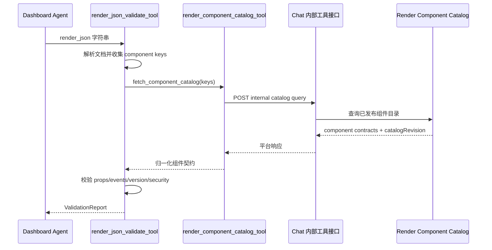
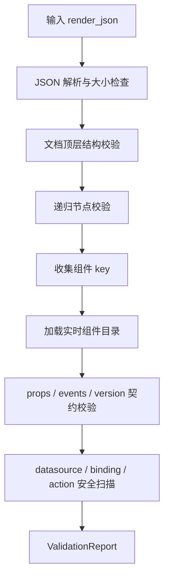

# AI 生成、校验与聊天 Render Artifact

> 状态：演进中  
> 适用运行时：OpenAI Agents Python Provider  
> 校验规则版本：`render-validator/1.0.0`  
> 最后核对：2026-07-20

## 1. 定位

AI Agent 不直接执行或发布 Render JSON。当前看板与应用构建 Agent 的职责是生成一组可审计构建产物，其中 RenderDocument 必须经过确定性校验；最终结果作为会话 Artifact 保存和预览。

当前标准过程：

```text
ApplicationBrief
  -> DataContract
  -> 受控数据预览
  -> ApplicationPlan
  -> RenderDocument
  -> ValidationReport
  -> 会话 Artifact
```

Agent 不允许跳过数据契约直接生成最终页面，也不允许把未通过校验的内容描述成成功结果。

## 2. Agent 能力组合

`dashboard-application-builder` 当前使用：

| 能力 | 作用 |
| --- | --- |
| `knowledge_base_search_tool` | 检索业务语义和知识文档 |
| `data_preview_query_tool` | 用真实虚拟模型与字段验证数据契约和受控预览 |
| `render_component_catalog_tool` | 查询当前已发布组件及机器可读契约 |
| `render_json_validate_tool` | 对完整 RenderDocument 做确定性校验 |
| `semantic-data-contract` Skill | 构造业务和数据契约 |
| `render-json-authoring` Skill | 按组件契约生成 RenderDocument |
| `render-json-repair` Skill | 根据稳定错误码做最小修复 |
| `application-build-release` Skill | 描述构建状态；当前不代表已经发布页面 |

模型负责理解与生成，Tool 负责可以确定性判断的协议、组件、数据和安全约束。

## 3. 组件目录链路

Render JSON 校验不会信任模型记忆中的组件信息，而是读取实时已发布组件目录：



组件目录结果必须提供：

- 唯一的 component key。
- 可验证的 componentVersion。
- `sha256:` 格式的 sourceRevision。
- 参数和事件契约。
- `sha256:` 格式的 catalogRevision。

目录不可用或组件没有机器可读契约时，校验失败，不能降级为“仅检查 JSON 语法后成功”。

## 4. 确定性校验过程

`render_json_validate_tool` 调用 `validate_render_document`，按以下阶段执行：



### 4.1 JSON 与资源限制

- 最大文档大小：1 MiB。
- 禁止非标准 `NaN`、`Infinity` 等数字常量。
- 禁止重复对象 key。
- 最大节点数：1000。
- 最大深度：32。
- 单次最多引用 100 个不同组件 key。

### 4.2 文档协议

当前 Agent 校验器顶层只允许：

```text
protocol
protocolVersion
pageId
revision
root
```

并要求：

- `protocol = render-json`。
- `protocolVersion` 精确为 `1.0` 或 `1.0.0`。
- `pageId` 是稳定标识。
- `root` 是对象。

正式页面 Runtime 支持的 `title`、`presentation` 当前不在该白名单内。这是现有两个入口的契约差异，不应通过关闭校验规避；后续应通过协议演进统一。

### 4.3 节点与组件

节点仅允许：

```text
id, component, componentVersion, props, layout, datasource,
bindings, events, actions, children
```

校验器检查：

- 节点 id 的稳定性和唯一性。
- component key 是否存在于实时已发布目录。
- componentVersion 是否符合目录契约。
- props 是否符合参数契约。
- events 是否属于组件声明事件。
- children 是否是合法节点数组。

### 4.4 Datasource 与安全

允许的数据源类型：

- `direct-json`
- `db-query-list`
- `semantic-query`
- `preview-result`
- `static`

校验器会拒绝或扫描：

- SQL、statement、queryText。
- URL、endpoint、baseUrl、headers。
- token、API key、password、secret、cookie、私钥。
- function、eval、箭头函数、脚本和表达式。
- `javascript:`、危险 data URL、任意网络协议字符串。
- prototype、constructor 等对象原型相关 key。

Render JSON 的安全模型是“只允许声明稳定意图，由平台可信代码映射执行”，而不是“把任意代码放进 JSON 再做沙箱执行”。

## 5. ValidationReport

校验结果包含：

- `valid`：是否通过。
- `errors`：错误列表。
- `warnings`：警告列表。
- 稳定错误码。
- `jsonPath`：问题字段路径。
- `nodeId`：可定位时返回节点 id。
- `recoverable`：Agent 是否可以尝试最小修复。
- 文档摘要、规则版本和组件目录 revision。

Agent 提示要求校验失败后最多修复三次，并且只针对稳定错误码做最小修改。不可恢复错误或组件目录不可用时应停止并说明阻塞原因。

## 6. Artifact 生成与 Provider 输出

Agent 最终输出使用 JSON Artifact Envelope。至少应包含：

- `application-brief`
- `data-contract`
- `application-plan`
- `render-document`
- `validation-report`
- `application-build-state`

单个 Artifact 采用：

```json
{
  "artifactCode": "render-document",
  "artifactType": "RENDER_JSON",
  "contentFormat": "JSON",
  "title": "账户看板",
  "status": "SUCCESS",
  "visible": true,
  "content": {
    "protocol": "render-json",
    "protocolVersion": "1.0.0",
    "pageId": "account-dashboard",
    "root": {
      "id": "account-dashboard-root",
      "component": "zg-list-main-layout",
      "componentVersion": "1.0.0",
      "props": {
        "schema": {
          "id": "account-list",
          "title": "账户列表"
        }
      },
      "datasource": {
        "key": "account-query",
        "type": "db-query-list",
        "model": "ods_trade_user_account"
      }
    }
  }
}
```

Provider 从最终输出中提取 artifacts，并为每项发送 `artifact.created` 运行事件。该事件主要用于执行时间线和产物可用性提示，完整 Artifact 仍以最终 Provider 结果为准。

## 7. Chat 服务持久化

Agent Run 完成后，`DefaultConversationExecutionServiceImpl`：

1. 保存 Assistant 最终消息。
2. 遍历 `AgentConversationOutcome.artifacts`。
3. 解析 artifactType、contentFormat、content、title、status 和 visible。
4. 调用 `AgentConversationHistoryRecorder.saveArtifact`。
5. 将 content 序列化后保存到会话 Artifact 数据表。

平台会重新生成持久化 `artifactCode`，因此 Provider Artifact 中的逻辑 code 主要用于标题和输出识别，不能假设与数据库 artifactCode 相同。

如果 `final-answer` Artifact 与 Assistant 最终文本重复，持久化逻辑会将其隐藏，避免聊天界面重复展示同一答案。`RENDER_JSON` 等独立产物保持可见。

## 8. SSE 与前端回放

前端同时处理实时事件和历史详情：

1. SSE 中的 `artifact.*` 事件通过 `artifactsFromTransportEvent` 归一化并 upsert。
2. 如果事件已经携带可见 `RENDER_JSON`，界面可以打开生成产物工作区。
3. 收到 `round.completed` 后，前端重新加载会话详情。
4. `normalizeHistoricalArtifacts` 从历史轮次中恢复完整 Artifact content。
5. 用户点击 Render Artifact 后，由 `GeneratedArtifactWorkspace` 展示。

会话产物预览链：

```text
ConversationArtifact.content
  -> normalizeRenderArtifact
  -> RenderJsonDocument
  -> ResponsiveViewport
  -> RenderJsonRuntimeHost
  -> RenderJsonRuntimeNode
```

聊天产物工作区提供缩放、适应空间和全屏操作；参考尺寸默认是 `1200 x 720`，也可以从 `root.layout.referenceSize` 读取。

## 9. 与正式页面发布的边界

当前会话 Artifact 和正式 Render 页面之间没有自动发布接口：

| 能力 | 当前状态 |
| --- | --- |
| Agent 生成 RenderDocument | 已实现 |
| 确定性静态校验 | 已实现 |
| 聊天内预览 | 已实现 |
| 保存到会话 Artifact | 已实现 |
| 自动创建 `render_page` | 未实现 |
| 自动写入 `render_page_content` | 未实现 |
| 运行时截图/交互预览 Tool | 未实现 |
| 审核后发布与回滚流程 | 未实现 |

后续发布流程至少应包含：

1. 选择目标页面或创建页面草稿。
2. 重新读取最新组件目录并校验。
3. 使用与正式 Runtime 一致的协议校验器。
4. 执行受控数据预览和权限检查。
5. 显式用户确认。
6. 写入当前内容并生成快照。
7. 运行时冒烟验证，失败时可回滚。

## 10. 当前差异与演进建议

### 10.1 统一协议模型

目前正式页面、聊天 Artifact 和 Agent Validator 分别定义 RenderDocument 类型。建议后续形成单一 JSON Schema，并由前后端和 Python 校验器共同生成或消费。

### 10.2 保存接口接入服务端校验

Render Meta POST 当前没有深度校验。建议把协议、组件目录、安全规则封装为服务端能力，在任何内容落库前执行，不能只依赖开发者页面的 TypeScript 检查。

### 10.3 统一组件资产与前端 Registry

Agent 读取的是后端已发布组件目录，Runtime 使用的是前端静态 Registry。两者若不同步，可能出现“校验通过但前端未注册”或“前端能渲染但 Agent 目录不可用”。组件发布过程应验证双方 key、版本和契约一致。

### 10.4 接入通用 Event Dispatcher

只有通用事件链真实接入节点执行后，Render JSON 中的 events/actions 才能形成稳定能力。接入时仍需白名单 Action Executor 和权限判断，不能执行配置中的任意函数。

