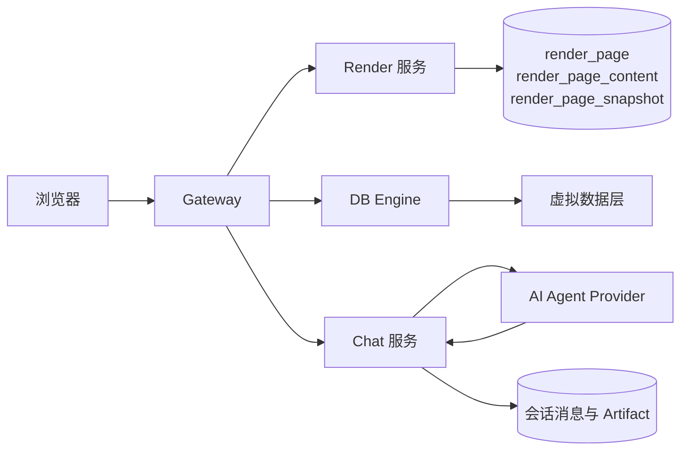
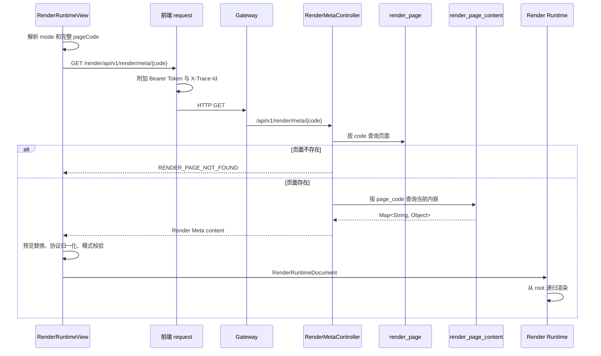
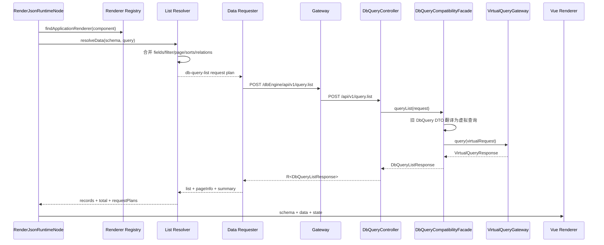
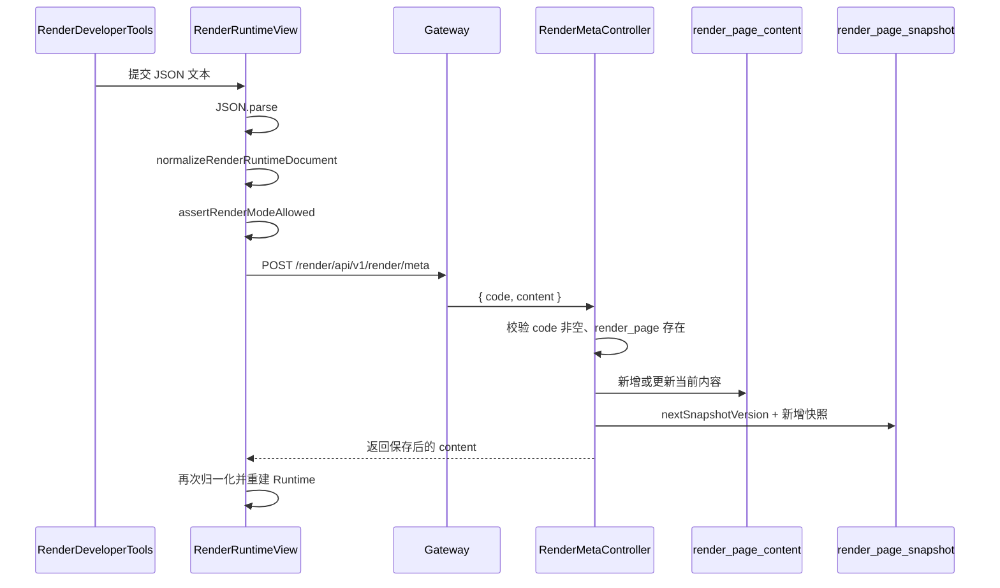
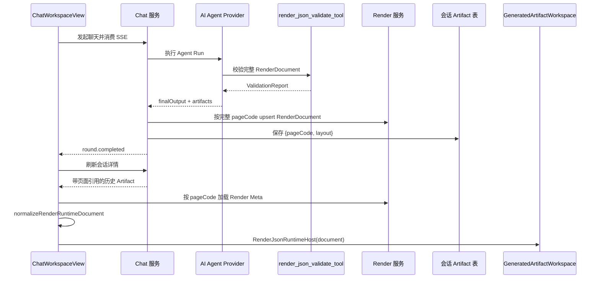

# Render JSON 架构与前后端交互

> 状态：演进中  
> 适用范围：正式动态应用、元数据编辑、运行时数据查询、聊天 Render Artifact  
> 最后核对：2026-07-20

## 1. 总体架构

Render JSON 的完整链路跨越四类服务：



- Render 服务管理正式页面、当前 Render JSON 内容和历史快照。
- DB Engine 执行 Runtime 根据 datasource 生成的数据查询。
- Chat 服务管理 AI 生成过程、SSE 事件和会话级 Artifact。
- AI Agent Provider 负责生成 RenderDocument，并调用确定性工具校验。

完整 Render JSON 由 Render 服务保存；聊天 Artifact 只保存页面引用和展示布局。

## 2. 正式动态应用加载

### 2.1 路由解析

正式入口为：

```text
/app/{mode}/{pageCode}
```

前端路由实际匹配 `/app/:mode/:code`。`normalizeRenderAppCode` 会：

1. 保留完整 pageCode，不添加或裁剪 `.json` 等后缀。
2. 限制 code 只能包含字母、数字、点、下划线和短横线。
3. 检查 mode 是否属于 `standard`、`dashboard`、`report`、`embedded`。

pageCode 直接用于查询 Render Meta。

### 2.2 加载时序



前端请求封装统一：

- 通过 `GATEWAY_BASE_URL` 组合 URL。
- 携带登录 Token 和每次请求生成的 `X-Trace-Id`。
- 识别平台 `R<T>` 包装，只有 `code = 0` 才返回 `data`。
- HTTP 401 会清理登录态并跳转登录页。

### 2.3 文档归一化

加载到的内容不会直接传给 Vue 组件。`normalizeRenderRuntimeDocument` 先完成：

1. `protocol` 为空时按 `render-json` 处理，非 `render-json` 时拒绝。
2. `protocolVersion` 为空时补成 `1.0.0`，只允许主版本 `1`。
3. 解析标准 `root` 节点。
4. 兼容历史裸 Renderer Schema，将其包装为 `root.props.schema`。
5. 从 `presentation` 或历史 `page` 字段读取页面模式配置。
6. 校验当前路由 mode 是否在 `allowedModes` 中。

兼容逻辑只位于 Loader/Normalizer。Layout 和 Renderer 不承担历史协议判断。

## 3. 预览模型替换

元数据预览支持：

```text
/app/{mode}/{pageCode}?preview=1&model={virtualEntityCode}
```

当且仅当 `preview=1` 且 model 非空时，`applyRenderPreviewModel` 会在内存副本中：

- 递归把字符串中的 `:model` 替换为本次 model。
- 把 `db-query-list` 和 `semantic-query` datasource 的 `model` 改成本次 model。
- 忽略 `__proto__`、`prototype`、`constructor` 等不安全对象 key。

它不会修改服务端保存的 Render Meta，也不会自动 POST 保存。

## 4. Runtime 渲染原理

### 4.1 Host 与节点递归

`RenderJsonRuntimeHost` 负责文档级状态：

- loading、error 和空文档提示。
- 从 `document.root` 启动渲染。
- 汇总节点 SCOPE 事件和开发者动作。

`RenderJsonRuntimeNode` 对每个节点按以下优先级识别：

1. Layout Registry 中存在的容器节点。
2. Renderer Registry 中存在的内容节点。
3. 内置 `text`、`heading`、`title` 静态节点。
4. 未知组件，显示“不支持组件”错误。

Layout 和 Renderer 节点都会继续递归渲染 `children`。

### 4.2 Registry 解析

Render JSON 只保存 `component` 字符串。Registry 使用稳定 key 找到：

- Vue component。
- 组件版本和元信息。
- 别名。
- 默认 props。
- 可选 `resolveData`。

当前 Renderer Registry 包括：

- 通用列表：`zg-list-main-layout` 及兼容别名。
- 通用表单：`form-main-layout` 及兼容别名。
- 折线图、柱线组合图、雷达图。

当前只有通用列表配置了 `resolveData`，因此只有它会通过通用 Resolver 自动执行 datasource 请求。

### 4.3 节点状态

每个 Runtime Node 独立维护：

- `queryState`：筛选、分页等查询状态。
- `resolvedData`：归一化后的 records、treeData、total。
- `requestPlans`：Resolver 生成的可观测请求计划。
- `rendererLoading` 和 `rendererError`。
- 开发者模式下最近的节点事件。

节点使用递增 `requestSequence` 丢弃过期响应，避免较早请求覆盖较晚查询结果。这不是请求取消，而是响应落地时的竞态保护。

## 5. Runtime 到 DB Engine 的数据交互

### 5.1 请求计划生成

当列表 Renderer 同时满足以下条件时，Runtime 执行远程数据解析：

- Registry 定义了 `resolveData`。
- 节点能解析出 schema。
- schema 中存在对象形式的 datasource。

Resolver 把 schema 与运行时 query 组合成 `RuntimeDataRequestPlan`。当前支持：

- `direct-json`：本地数据，不发起 HTTP 请求。
- `db-query-list`：调用 DB Engine 的 `query.list`。

### 5.2 DB Query 时序



### 5.3 请求字段映射

Resolver 当前构造的请求形态：

```json
{
  "title": "用户账户",
  "model": "ods_trade_user_account",
  "filter_dict": {
    "status": "ACTIVE"
  },
  "filterExpr": "status",
  "page": 1,
  "page_size": 20,
  "ext": {
    "fields": ["user_id", "account_name"],
    "relations": [],
    "sorts": []
  }
}
```

重要规则：

- `model` 是虚拟实体编码，不是任意物理表名。
- datasource 的固定 `filter_dict` 与用户运行时筛选合并，运行时同名字段覆盖固定值。
- filter 可以通过 `query.field` 改写后端字段，通过 `query.op` 声明操作符。
- 如果配置已有 `filterExpr`，Resolver 会把未出现在表达式中的运行时 filter key 追加为 `and`。
- 请求字段是 `datasource.ext.fields` 与 Renderer `fields` 路径的并集。
- 后端结果中的 `list` 转成 `data.records`，`pageInfo.total` 转成 `data.total`。

完整 DbQuery 语义见 [DbQueryApi 接口实现说明](../../api/db-query-api.md)。

## 6. 事件、重载和动作

当前正式 Runtime Node 直接监听 Renderer 的：

- `query-change`：更新节点 query 并记录事件，不立即请求。
- `reload`：更新 query 后重新执行 Resolver 和 Data Requester。
- `action`：记录动作；如果属于开发者内置动作，则向上转发。

通用的 `createRuntimeEventDispatcher` 已定义 `beforeEvent`、`afterEvent`、`beforeLoad`、`afterLoad`、`beforeAction`、`afterAction` 等 Hook，但尚未被 `RenderJsonRuntimeNode` 采用。因此配置中的任意 `events/actions` 目前不等价于已经具备完整业务动作执行能力。

页面级新增、保存、删除、跳转等操作仍需要显式 Action Executor 或页面 service 接入。

## 7. 自动刷新

只有 `dashboard` 模式会读取 `presentation.refreshInterval`：

1. 最小间隔被限制为 5 秒。
2. 定时器调用 `refreshRuntime`。
3. `runtimeKey` 递增，使 Runtime Host/Node 重建。
4. 节点初始化 watcher 再次执行数据加载。

该流程重新获取业务数据，但不重新调用 `loadRenderMetaContent`，所以它不是元数据热更新机制。

## 8. Render Meta 保存与快照

开发者模式的元数据编辑器保存时：



后端在同一事务中更新当前内容并新增快照：

| 表 | 作用 | 关键约束 |
| --- | --- | --- |
| `render_page` | 页面身份、名称、分类和状态 | `code` 唯一 |
| `render_page_content` | 页面当前 Render JSON | `page_code` 唯一 |
| `render_page_snapshot` | 每次保存生成的历史快照 | 按 `page_code + snapshot_version` 查询 |

当前保存接口的服务端校验边界仅包括：

- code 必填。
- 对应 `render_page` 必须存在。
- null content 归一化为空 Map。

它目前不会在服务端检查协议版本、组件是否存在、datasource 安全或 props 合法性。前端编辑器的归一化不能替代服务端可信校验，因为接口仍可被其他客户端直接调用。

## 9. 聊天 Render Artifact 交互

聊天 Artifact 不复制完整 Render JSON；Chat 服务先把完整文档写入 Render 服务，再保存最小引用：

```json
{
  "pageCode": "完整页面编码",
  "layout": "standard"
}
```

`layout` 缺失或无效时归一为 `standard`，`pageCode` 全链路原样传递。



Provider 运行期间发出的 `artifact.created` 事件主要携带 artifactCode、artifactType、contentFormat 等元数据。当前前端在 `round.completed` 后刷新会话详情，从历史 Artifact 取得 `{pageCode, layout}`，再从 Render 服务加载完整内容。

聊天预览先通过 `normalizeRenderArtifact` 解析引用，再复用正式页面的 `normalizeRenderRuntimeDocument`：

- 会检查 Artifact 类型是否为 `RENDER_JSON`。
- 支持 content 是 JSON 字符串或对象。
- 新结构只接受 `{pageCode, layout}`，layout 默认 `standard`。
- pageCode 原样传给 Render Meta 接口。
- 历史内联完整文档仍可直接归一化展示。
- 根据 layout 选择 `standard`、`dashboard`、`report` 或 `embedded` 宿主，并校验页面允许的 mode。

两者最终都进入 `RenderJsonRuntimeHost`，因此组件递归和数据请求能力可以复用。

## 10. 故障边界

| 阶段 | 典型失败 | 当前表现 |
| --- | --- | --- |
| 页面加载 | mode/code 非法、页面不存在、网络失败 | `RenderRuntimeState` 展示页面级错误，可重试 |
| 文档归一化 | 协议主版本不支持、缺少 root | 页面级错误，不进入 Runtime |
| 节点解析 | 组件 key 未注册 | 对应节点显示不支持组件 |
| 数据请求 | DB Query 失败、虚拟模型无效 | 节点 `rendererError`，保留页面其他节点 |
| 保存 | JSON 解析失败、模式不允许、接口失败 | Element Plus 消息提示，不替换当前文档 |
| Agent 校验 | JSON、协议、组件、安全校验失败 | Agent 根据稳定错误码有限修复，失败则不应声称成功 |
| 聊天预览 | 引用非法、页面不存在或文档缺少 root | 产物工作区显示加载/归一化错误 |
